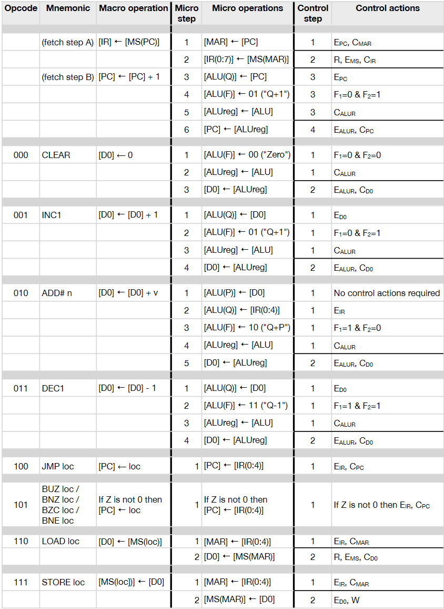

# Microprocessor Architecture

- Computer architecture concerns the structure and properties of a computer system, from the perspective of a software engineer
- Computer organisation concerns the structure and properties of a computer system, from the perspective of a hardware engineer

## The PATP

The Pedagogically Advanced Teaching Processor is a very simple microprocessor. The specifics of it are **not examinable**, but it is used to build an understanding of microprocessor architecture.

### Programmer's model

The PATP has 8 instructions. Each instruction is 1 8-bit word, with the first 3 bits as the opcode and last 5 as the operand, if applicable.

| Opcode | Mnemonic    | Macro Operation                    | Description                                             |
| ------ | ----------- | ---------------------------------- | ------------------------------------------------------- |
| 000    | `CLEAR`     | `[D0] <- 0`                        | Set D0 to 0 (and set `Z`)                               |
| 001    | `INC`       | `[D0] <- [D0] + 1`                 | Increment the value in D0 (and set `Z` if result is 0)  |
| 010    | `ADD #v`    | `[D0] <- [D0] + v`                 | Add the literal v to D0 (and set `Z` if result is 0)    |
| 011    | `DEC`       | `[D0] <- [D0] - 1`                 | Decrement the value in D0 (and set `Z` if result is 0)  |
| 100    | `JMP loc`   | `[PC] <- loc`                      | Jump unconditionally to address location `loc`          |
| 101    | `BNZ loc`   | If `Z` is not 0 then `[PC] <- loc` | Jump to address location `loc` if `Z` is not set        |
| 110    | `LOAD loc`  | `[DO] <- [MS(loc)]`                | Load the 8 bit value from address location `loc` to D0  |
| 111    | `STORE loc` | `[MS(loc)] <- [D0]`                | Write the 8 bit value from D0 to address location `loc` |

This is not many instructions, but it is technically Turing-complete. The other specs of the PATP are:

- An address space of 32 bytes (the maximum address is `11111`)
- A single 8-bit data register/accumulator `D0`
- A CCR with only 1 bit (`Z`, set when an arithmetic operation has a result of zero)
- A 5-bit program counter (only 5 bits needed to address whole memory)

### Internal Organisation

There are several building blocks that make up the internals of the PATP:

- The data register `D0`
  - An 8 bit register constructed from D-type flip-flops
  - Has parallel input and output
  - Clocked

- The ALU
  - Built around an [8-bit adder/subtractor](./logic.md#n-bit-addersubtractor)
  - Has two 8-bit inputs `P` and `Q`
  - Capable of
    - Increment (+1)
    - Decrement (-1)
    - Addition (+n)
  - Two function select inputs `F1` and `F2` which choose the operation to perform
    - 00: Zero output
    - 01: Q + 1
    - 10: Q + P
    - 11: Q - 1
  - An output `F(P, Q)` which outputs the result of the operation
  - A `Z` output for the CCR

- The main system bus
  - Uses 3-state buffers to enable communication

- The control unit
  - Controls:
    - The busses (enables)
    - When registers are clocked
    - ALU operation
    - Memory acccess
  - Responsible for decoding instructions and issuing micro-instructions
  - Inputs
    - Opcode
    - Clock
    - `Z` register
  - Outputs
    - Enables
      - Main store
      - Instruction register `IR`
      - Program counter
      - Data register `D0`
      - ALU register
    - Clocks
      - Memory address register `MAR`
      - Instruction register `IR`
      - Program counter
      - Data register `D0`
      - ALU register
    - `F1` and `F2` on the ALU
    - `R`/`W` to control bit for main store

All the components come together like so:

## Micro and Macro Instructions

There are several steps internally that are required to execute a single instruction. For example, to execute an `INC` operation:

- D0 need to be put on the system bus
  - CU enables the three-state buffer for D0
  - `[ALU(Q)] <- D0`
- The correct ALU function must be selected
  - `F1 = 0`, `F2 = 1`
  - Signals asserted by CU
  - `[ALU(F)] <- 01`
- The output from the ALU must be read into the ALU register
  - ALUreg clocked by CU
  - `[ALUreg] <- [ALU]`
- D0 reads in the ALU output from the ALU register
  - CU enables the three-state buffer for ALUreg
  - D0 is clocked by CU

Macro instructions are the assembly instructions issued to the processor (to the CU, specifically), but micro instructions provide a low level overview of how data is moved around between internals of the CPU and what signals are asserted internally. The PATP can execute all instructions in 2 cycles. The table below gives an overview of the micro operations required for each macro instruction, along with the macro operations for fetching from main store.

### Control Signals

The control unit asserts control signals at each step of execution, and the assertion of these control signals determine how data moves internally. For the PATP:

- Enable signals are level-triggered
- Clock signals are falling edge-triggered
- An output can be enabled onto the main bus and then clocked elsewhere in a single time step
- ALU timings assume that, if values are enabled at P and Q at the start of a cycle, then the ALU register can be clocked on the falling edge of that cycle
- MS timings assume that if MAR is loaded during one cycle, then R, W and EMS can be used in the next cycle

The diagram below shows the timing for a fetch taking 4 cycles, and which components are signalled when. Notice which things happen in the same cycle, and which must happen sequentially.

| cycle | Micro-Op            | Control Signals                       |
| ----- | ------------------- | ------------------------------------- |
| 1     | `[MAR] <- [PC]`     | Enable PC, Clock MAR                  |
| 2     | `[IR] <- [MS(MAR)]` | Set read for MAR, Enable MS, Clock IR |
| 3     | `[ALU(Q)] <- [PC]`  | Enable PC                             |
| 3     | `[ALU(F) <- 01]`    | F1 = 0, F2 = 1                        |
| 3     | `[ALUreg] <- [ALU]` | Clock ALUreg                          |
| 4     | `[PC] <- [ALUreg]`  | Enable ALUreg, Clock PC               |

## Control Unit Design

The task of the control unit is to coordinate the actions of the CPU, namely the Fetch-Decode-Execute cycle. It generates the fetch control sequence, takes opcode input, and generates the right control sequence based on this. It can be designed to do this in one of two ways:

- Hardwired design (sometimes called "random logic")
  - The CU is a combinatorial logic circuit, transforming input directly to output
- Microprogrammed
  - Each opcode is turned into a sequence of microinstructions, which form a microprogram
  - Microprograms stored in ROM called microprogram memory

### Hardwired

- A sequencer is used to sequence the clock cycles
  - Has clock input and n outputs `T1 ... Tn`
  - First clock pulse is output from `T1`
  - Second is output from `T2`
  - Clock pulse n output from `Tn`
  - Pulse n+1 output from `T1`
- This aligns the operation of the circuit with the control steps
- Advantages
  - Fast
- Disadvantages
  - Complex, difficult to design and test
  - Inflexible, cant change design to add new instructions
  - Takes a long time to design
- This technique is most commonly used in RISC processors and has been since the 80s

- The control signal generator maps each instruction to outputs
- The sequencer sequences the outputs appropriately
- The flip-flop is used to regulate control rounds

### Microprogrammed

- The microprogram memory stores the required control actions for each opcode
- The CU basically acts as a mini CPU within the CPU
  - **Microaddress** is a location within microprogram memory
  - **MicroPC** is the CU's internal program counter
  - **MicroIR** is the CU's internal microinstruction register
- The microPC can be used in different ways depending upon implementation
  - Holds the next microaddress
  - Holds the microaddress of microroutine for next opcode
- When powered initially holds microaddress 0
  - The fetch microprogram
- Each microinstruction sets the CU outputs to the values dictated the instruction
  - As the microprogram executes, the CU generates control signals
- After each microinstruction, the microPC is typically incremented, so microinstructions are stepped through in sequence
- After a fetch, the microPC is not incremented, but is set to the output from the opcode decoding circuit (labelled OTOA in the diagram)
- After a normal opcode microprogram, the microPC is set back to 0 (fetch)
- When executing the microprogram for a conditional branch instruction, the microPC value is generated based upon whether the CU's Z input is set

- Advantages
  - Easy to design and implement
  - Flexible design
  - Simple hardware compared to alternative
  - Can be reprogrammed for new instructions
- Disadvantages
  - Slower than hardwired
- Most commonly used for CISC processors

## RISC and CISC

In the late 70s-early 80s, it was shown that certain instructions are used far more than others:

- 45% data movement (move, store, load)
- 29% control flow (branch, call, return)
- 11% arithmetic (add, sub)

The overhead from using a microprogram memory also became more significant as the rest of the processor became faster. This caused a shift towards RISC computing. Right now, ARM is the largest RISC computing platform. Intel serve more for backwards compatibility with a CISC instruction set. In an modern intel processor, simplest instructions are executed by a RISC core, more complex ones are microprogrammed.

- RISC has simple, standard instructions whereas CISC has lots of more complex instructions
  - x86 is often criticised as bloated
- RISC allows for simpler, faster, more streamlined design
- RISC instructions aim to be executed in a single cycle
- CISC puts the focus on the hardware doing as much as possible, whereas RISC makes the software do the work

## Multicore Systems

- The performance of a processor can be considered as the rate at which it executes instructions: clock speed x IPC (instructions per clock).
- To increase performance, increase clock speed and/or IPC
- An alternative way of increasing performance is parallel execution
- Multithreading separates the instruction stream into threads that can execute in parallel
- A **process** is an instance of a program running on a computer
  - A process has **ownership** of resources: the program's virtual address space, i/o devices, other data that defines the process
  - The process is **scheduled** by the OS to divide the execution time of the processor between threads
  - The processor **switches** between processes using the stack
