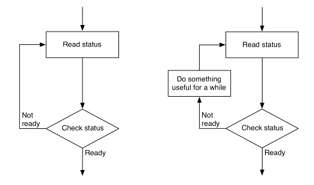

# I/O

## Memory Mapped I/O

- With memory mapped I/O, the address bus is used to address both memory and I/O devices
- Memory on I/O devices is mapped to values in the main address space
- When a CPU accesses a memory address, the address may be in physical memory (RAM), or the memory of some I/O device
- Advantages
  - Very simple
  - CPU requires less internal logic
  - Can use general purpose memory instructions for I/O
- Disadvantages
  - Have to give up some memory
    - Less of a concern on 64-bit processors
    - Still relevant in smaller 16 bit CPUs

## Polled I/O

- Polling is a technique for synchronising communication between devices.
- Most I/O devices are much slower than the CPU
- Busy-wait polling involves constantly checking the state of the device
  - Usually the device replies with nothing
  - Can interleave polls with something else useful

- Advantages
  - Still relatively simple
- Disadvantages
  - Wastes CPU time and power
  - Interleaving can lead to delayed responses from CPU

Synchronisation methods also need some way to transfer the data, so are sometimes used in conjunction with memory-mapped I/O. Methods for synchronising devices and methods for reading/writing data are not directly comparable.

## Handshaking

Another form of synchronisation

- Computer responds to the printer being ready by placing data on the data bus and signalling `DATA_VALID`
  - Can do this either in hardware or in software
- Timing diagram shows data exchange
- During periods where both signals are at a logical 0, data is exchanged

### Handshaking Hardware

Handshaking is usually done using an external chip, such as the 6522 VIA (Versatile Interface Adapter)

Setting bit values in the PCR (Peripheral Control Register) on the VIA allows to control the function.

- Use PORT B as output
- CB1 control line as `PRINTER_READY`
- CB2 control line as `DATA_VALID`
- For CB1 and CB2 control, 8 bit register is set to 1000xxxx
  - Last 4 bits not used, don't care

## Interrupts

- Asynchronous I/O
- Two kinds of interrupts (in 6502 processor)
  - Interrupt Request (IRQ)
    - Code can disable response
    - Sent with a priority
    - If priority lower than that of current task, will be ignored
    - Can become non-maskable if ignored for long enough
  - Non-Maskable Interrupt (NMI)
    - Cannot be disabled, must be serviced
- An interrupt forces the CPU to jump to an Interrupt Service Routine (ISR)
  - Switches context, uses stack to store state of registers
- ISRs can be nested
- Interrupts usually generated by some external device
  - Hard drive can generate an interrupt when data is ready
  - A timer can generate an interrupt repeatedly at a fixed interval
  - A printer can generate an interrupt when ready to receive data
- Advantages
  - Fast response
  - No wasted CPU time
- Disadvantages
  - All data transfer still CPU controlled
  - More complex hardware/software

## Direct Memory Access (DMA)

- The CPU is a bottleneck for I/O
- All techniques shown so far are limited by this bottleneck
- DMA is used where large amounts of data must be transferred quickly
- Control of system busses surrendered from CPU to a DMA Controller (DMAC)
  - DMAC is a dedicated device optimised for data transfer
- Can be up to 10x faster than CPU-driven I/O

### DMA Operation

- DMA transfer is requested by I/O
- DMAC passes request to CPU
- CPU initialises DMAC
  - Input or Output?
  - Start address is put into DMAC address register
  - Number of words is put into DMAC count register
  - CPU enables DMAC
- DMAC requests use of system busses
- CPU responds with DMAC ack when ready to surrender busses
- DMAC can operate in different modes
  - Cycle stealing
    - Uses system busses when they're not being used by CPU
  - Burst mode
    - Requires busses for extended period of time, locks the CPU out for a fixed time, until transfer complete, or until CPU receives interrupt from device of higher priority

### DMA Organisation

There are multiple ways a DMA can be incorporated into a system:

- Single bus, detached DMA
  - All modules (DMA, I/O devices, memory, CPU) share system bus
  - DMA uses programmed I/O to exchanged data between memory and I/O device
  - Straightforward, as DMA can just mimic processor
  - Inefficient
- Separate I/O bus
  - Only one interface to DMA module
  - The bus the DMA shares with processor and memory is only used to transfer data to and from memory

## Summary

- **Memory-mapped **deviced are accessed in the same way as RAM, at fixed address locations
- **Polled I/O** is for scheduling input and output, where the CPU repeatedly checks for data
- I/O devices are slow, so **handshaking techniques** coordinate CPU and device for transfer of data
- **Interrupts** avoid polled I/O by diverting the CPU to a special I/O routine when necessary
- A **DMA** controller can be used instead of the CPU to transfer data into and out of memory, faster than the CPU but at additional hardware cost
