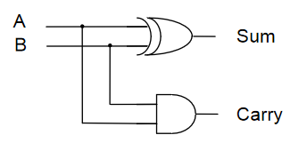
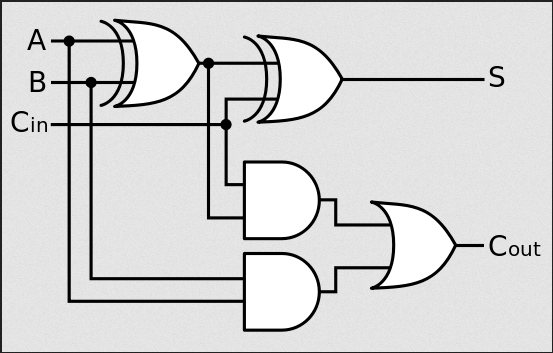
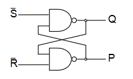
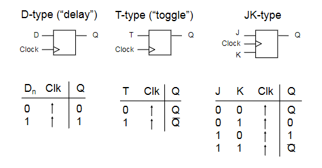

# Digital Logic

Digital logic is about reasoning with systems with two states: on and off (0 and 1 (binary)).

## Basic Logic Functions

Some basic logic functions, along with their truth tables.

#### NOT

$$f = \bar A$$

| A   | f   |
| --- | --- |
| 0   | 1   |
| 1   | 0   |

#### AND

$$f = A \cdot B$$

| A   | B   | f   |
| --- | --- | --- |
| 0   | 0   | 0   |
| 0   | 1   | 0   |
| 1   | 0   | 0   |
| 1   | 1   | 1   |

#### OR

$$f = A + B$$

| A   | B   | f   |
| --- | --- | --- |
| 0   | 0   | 0   |
| 0   | 1   | 1   |
| 1   | 0   | 1   |
| 1   | 1   | 1   |

#### XOR

$$f = A \oplus B$$

| A   | B   | f   |
| --- | --- | --- |
| 0   | 0   | 0   |
| 0   | 1   | 1   |
| 1   | 0   | 1   |
| 1   | 1   | 0   |

#### NAND

$$f = \overline{A \cdot B}$$

| A   | B   | f   |
| --- | --- | --- |
| 0   | 0   | 1   |
| 0   | 1   | 1   |
| 1   | 0   | 1   |
| 1   | 1   | 0   |

#### NOR

$$f = \overline{A + B}$$

| A   | B   | f   |
| --- | --- | --- |
| 0   | 0   | 1   |
| 0   | 1   | 0   |
| 1   | 0   | 0   |
| 1   | 1   | 0   |

#### X-NOR

$$f = \overline{A \oplus B}$$

| A   | B   | f   |
| --- | --- | --- |
| 0   | 0   | 1   |
| 0   | 1   | 0   |
| 1   | 0   | 0   |
| 1   | 1   | 1   |

### Logic Gates

Logic gates represent logic functions in a circuit. Each logic gate below represents one of the functions shown above.

### Logic Circuits

Logic circuits can be built from logic gates, where outputs are logical functions of their inputs. Simple functions can be used to build up more complex ones. For example, the circuit below implements the XOR function.

$$f = \bar A \cdot B + A \cdot \bar B$$

Another example, using only NAND gates to build XOR. NAND (or NOR) gates can be used to construct _any_ logic function.

Truth tables can be constructed for logic circuits by considering intermediate signals. The circuit below has 3 inputs and considers 3 intermediate signals to construct a truth table.

$$
P = A \cdot B \\
Q = A \cdot B\\
R = A \cdot C \\
$$

$$f = P + Q + R = A \cdot B + A \cdot B +  A \cdot C$$

| A   | B   | C   | P   | Q   | R   | f   |
| --- | --- | --- | --- | --- | --- | --- |
| 0   | 0   | 0   | 0   | 0   | 0   | 0   |
| 0   | 0   | 1   | 0   | 0   | 0   | 0   |
| 0   | 1   | 0   | 0   | 0   | 0   | 0   |
| 0   | 1   | 1   | 0   | 1   | 0   | 1   |
| 1   | 0   | 0   | 0   | 0   | 0   | 0   |
| 1   | 0   | 1   | 0   | 0   | 1   | 1   |
| 1   | 1   | 0   | 1   | 0   | 0   | 1   |
| 1   | 1   | 1   | 1   | 1   | 1   | 1   |

Truth tables of circuits are important as they enumerate all possible outputs, and help to reason about logic circuits and functions.

## Boolean Algebra

- Logic expressions, like normal algebraic ones, can be simplified to reduce complexity
  - This reduces the number of gates required for their implementation
  - The less gates, the more efficient the circuit is
    - More gates is also more expensive
- Sometimes, only specific gates are available too and equivalent expressions must be found that use only the available gates
- Two main ways to simplify expressions
  - Boolean algebra
  - Karnaugh maps
- The truth table for the expression before and after simplifying _must_ be identical, or you've made a mistake

### Expressions from Truth Tables

A sum of products form of a function can be obtained from it's truth table directly.

| A   | B   | C   | f   |
| --- | --- | --- | --- |
| 0   | 0   | 0   | 1   |
| 0   | 0   | 1   | 1   |
| 0   | 1   | 0   | 0   |
| 0   | 1   | 1   | 0   |
| 1   | 0   | 0   | 1   |
| 1   | 0   | 1   | 0   |
| 1   | 1   | 0   | 1   |
| 1   | 1   | 1   | 1   |

Taking only the rows that have an output of 1:

- The first row of the table: $\bar A \cdot \bar B \cdot \bar C$
- The second row: $\bar A \cdot \bar B \cdot C$
- Fifth: $ A \cdot \bar B \cdot \bar C$
- Seventh: $ A \cdot B \cdot \bar C$
- Eight: $A \cdot B \cdot C$

Summing the products yields:

$$f = (\bar A \cdot \bar B \cdot \bar C) + (\bar A \cdot \bar B \cdot C) + (A \cdot \bar B \cdot \bar C) + (A \cdot B \cdot \bar C) + (A \cdot B \cdot C)$$

### Boolean Algebra Laws

There are several laws of boolean algebra which can be used to simplify logic expressions:

| Name             | AND form                                | OR form                                  |
| ---------------- | --------------------------------------- | ---------------------------------------- |
| Identity Law     | $1A = A$                                | $0 + A = A$                              |
| Null Law         | $0A = 0$                                | $1 + A = 1$                              |
| Idempotent Law   | $AA = A$                                | $A + A = A$                              |
| Inverse Law      | $A\bar A = 0$                           | $A + \bar A = 1$                         |
| Commutative Law  | $AB = BA$                               | $A + B = B + A$                          |
| Associative Law  | $(AB)C = A(BC) = ABC$                   | $(A + B) + C = A + (B+C) = A + B + C$    |
| Distributive Law | $A + BC = (A+B)(A+C)$                   | $A(B+C) = AB + AC$                       |
| Absorption Law   | $A(A+B) = A$                            | $A + AB = A$                             |
| De Morgan's Law  | $\overline{A\cdot B} = \bar A + \bar B$ | $\overline{A + B} = \bar A \cdot \bar B$ |

- Can go from AND to OR form (and vice versa) by swapping AND for OR, and 0 for 1

Most are fairly intuitive, but some less so. The important ones to remember are:

- $A + BC = (A+B)(A+C)$
- $A(B+C) = AB + AC$
- $A(A+B) = A$
- $A + AB = A$

### De Morgan's Laws

De Morgan's Laws are very important and useful ones, as they allow to easily go from AND to OR. In simple terms:

- Break the negation bar
- Swap the operator

### Example 1

When doing questions, all working steps should be annotated.

$$f = (\overline{X + Y}) \cdot (\overline{\bar X + Y}) $$
$$f = (\bar X \cdot \bar Y) \cdot (\overline{\bar X + Y}) \quad \text{De Morgan OR form}$$
$$f = (\bar X \cdot \bar Y) \cdot (X \cdot \bar Y) \quad \text{De Morgan AND form}$$
$$f = \bar X \cdot \bar Y \cdot X \cdot \bar Y \quad \text{Remove brackets (associative law)}$$
$$f = \bar X \cdot X \cdot \bar Y \cdot \bar Y \quad \text{Re-order (commutative law)}$$
$$f = 0 \cdot \bar Y \quad \text{Inverse and idempotent laws}$$
$$f = 0 \quad \text{Null law}$$

### Example 2

$$f = X + \bar Y + \bar X \cdot Y + (X + \bar Y) \cdot \bar X \cdot Y $$
$$f = X + \bar Y + \bar X \cdot Y + X \cdot \cdot \bar X \cdot Y + \bar Y \cdot \bar X \cdot Y \quad \text{Distributive law}$$
$$f = X + \bar Y + \bar X \cdot Y + 0 + 0 \quad \text{Inverse AND law}$$
$$f = X + (\bar Y + \bar X)(\bar Y + Y) \quad \text{Distributive law}$$
$$f = X + (\bar Y + \bar X)\cdot 1 \quad \text{Inverse law}$$
$$f = X + \bar Y + \bar X \quad \text{Removing 1 and brackets (identity and associative laws)}$$
$$f = \bar Y + 1 \quad \text{Inverse OR law}$$
$$f= 1 \quad \text{Null law}$$

## Karnaugh Maps

- Karnaugh Maps (k-maps) are sort of like a 2D- truth table
- Expressions can be seen from the location of 1s in the map

| A   | B   | f   |
| --- | --- | --- |
| 0   | 0   | a   |
| 0   | 1   | b   |
| 1   | 0   | d   |
| 1   | 1   | c   |

- Functions of 3 variables can used a 4x2 or 2x4 map (4 variables use a 4x4 map)

- Adjacent squares in a k-map differ by exactly 1 variable
  - This makes the map _gray coded_
- **Adjacency also wraps around**

The function $f = AB\bar C D + A \bar B \bar C D + \bar A \bar B C D + \bar A B C D$ is shown in the map below.

### Grouping

- Karnaugh maps contain groups, which are rectangular clusters of 1s -
- To simplify a logic expression from a k-map, identify groups from it, making them as large and as few as possible
- The number of elements in the group **must be a power of 2**
- Each group can be described by a singular expression
- The variables in the group are the ones that are constant within the group (ie, define that group)

Sometimes, groups overlap which allow for more than one expression

The function for the map is therefore either $f =\bar A \bar B \bar C + \bar A B D + B C D $ or $ f = \bar A \bar B \bar C + \bar A \bar C D + B C D $ (both are equivalent)

Sometimes it is not possible to minimise an expression. the map below shows an XOR function $f = (A \oplus B) \oplus (C \oplus D)$

### Don't Care Conditions

Sometimes, a certain combination of inputs can't happen, or we dont care about the output if it does. An `X` is used to denote these conditions, which can be assumed as either 1 or 0, whichever is more convenient.

## Combinatorial Logic Circuits

Some useful circuits can be constructed using logic gates, examples of which are shown below. Combinatorial logic circuits operate as fast as the gates operate, which is theoretically zero time (realistically, there is a nanosecond-level tiny propagation delay).

### 1-Bit Half Adder

- Performs the addition of 2 bits, outputting the result and a carry bit.

| A   | B   | Sum | Carry |
| --- | --- | --- | ----- |
| 0   | 0   | 0   | 0     |
| 0   | 1   | 1   | 0     |
| 1   | 0   | 1   | 0     |
| 1   | 1   | 0   | 1     |

### 1-Bit Full Adder

- Adds 2 bits plus carry bit, outputting the result and a carry bit.

| Carry in | A   | B   | Sum | Carry out |
| -------- | --- | --- | --- | --------- |
| 0        | 0   | 0   | 0   | 0         |
| 0        | 0   | 1   | 0   | 1         |
| 0        | 1   | 0   | 0   | 1         |
| 0        | 1   | 1   | 1   | 0         |
| 1        | 0   | 0   | 0   | 1         |
| 1        | 0   | 1   | 1   | 0         |
| 1        | 1   | 0   | 1   | 0         |
| 1        | 1   | 1   | 1   | 1         |

### N-Bit Full Adder

- Combination of a number of full adders
- The carry out from the previous adder feeds into the carry in of the next

### N-Bit Adder/Subtractor

- To convert an adder to an adder/subtractor, we need a control input $Z$ such that:
  - $Z = 0 \Rightarrow S = A + B$
  - $Z = 1 \Rightarrow S = A - B$
- $-B$ is calculated using two's complement
  - Invert the N bit binary number B by doing $Z \oplus B$
  - Add 1 (make the starting carry in a 1)

### Encoders & Decoders

- A decoder has binary input pins, and one output pin per possible input state
- eg 2 inputs has 4 unique states so has 4 outputs
  - 3 inputs has 8 outputs
- Often used for addressing memory
- The decoder shown below is _active low_
  - Active low means that 0 = active, and 1 = inactive
    - Converse to what would usually be expected
  - Active low pins sometimes labelled with a bar, ie $\overline{\text{enable}}$
- It is important to be aware of this, as ins and outs must comform to the same standard

| $X_0$ | $X_1$ | $Y_0$ | $Y_1$ | $Y_2$ | $Y_3$ |
| ----- | ----- | ----- | ----- | ----- | ----- |
| 0     | 0     | 0     | 1     | 1     | 1     |
| 0     | 1     | 1     | 0     | 1     | 1     |
| 1     | 0     | 1     | 1     | 0     | 1     |
| 1     | 1     | 1     | 1     | 1     | 0     |

- Encoders are the opposite of decoders, encoding a set of inputs into outputs
- Multiple input pins, only one should be active at a time
- Active low encoder shown below

| $Y_0$ | $Y_1$ | $Y_2$ | $Y_3$ | $X_0$ | $X_1$ |
| ----- | ----- | ----- | ----- | ----- | ----- |
| 0     | 1     | 1     | 1     | 0     | 0     |
| 1     | 0     | 1     | 1     | 0     | 1     |
| 1     | 1     | 0     | 1     | 1     | 0     |
| 1     | 1     | 1     | 0     | 1     | 1     |

### Multiplexers & De-Multiplexers

Multiplexers have multiple inputs, and then selector inputs which choose which of the inputs to put on the output.

| $S_0$ | $S_1$ | Y     |
| ----- | ----- | ----- |
| 0     | 0     | $X_0$ |
| 0     | 1     | $X_1$ |
| 1     | 0     | $X_2$ |
| 1     | 1     | $X_3$ |

$$Y = X_0 \bar S_0 \bar S_1 + X_1 \bar S_0 S_1 + X_2 S_0 \bar S_1 + X_3 S_0 S_1$$

De-Multiplexers are the reverse of multiplexers, taking one input and selector inputs choosing which output it appears on. The one shown below is active low

| $S_0$ | $S_1$ | $Y_0$ | $Y_1$ | $Y_2$ | $Y_3$ |
| ----- | ----- | ----- | ----- | ----- | ----- |
| 0     | 0     | A     | 1     | 1     | 1     |
| 0     | 1     | 1     | A     | 1     | 1     |
| 1     | 0     | 1     | 1     | A     | 1     |
| 1     | 1     | 1     | 1     | 1     | A     |

$$Y_0 = A + \bar S_0 S_1 + S_0 \bar S_1 + S_0 S_1 = A + S_1 + S_0$$

Multiplexers and De-Multiplexers are useful in many applications:

- Source selection control
- Share one communication line between multiple senders/receivers
- Parallel to serial conversion
  - Parallel input on X, clock signal on S, serial output on Y

## Sequential Logic Circuits

A logic circuit whose outputs are logical functions of its inputs _and_ it's current state

### Flip-Flops

Flip-flops are the basic elements of sequential logic circuits. They consist of two nand gates whose outputs are fed back to the inputs to create a bi-stable circuit, meaning it's output is only stable in two states.

- $\bar S$ and $\bar R$ are active low **set** and **reset** inputs
- $Q$ is set high when $\bar S = 0$ and $\bar R = 1$
- $Q$ is reset (to zero) when $\bar R = 0$ and $\bar S = 1$
- If $\bar S = \bar R = 1$ then $Q$ does not change
- If both $\bar S$ and $\bar R$ are zero, this is a hazard condition and the output is invalid

| $\bar S$ | $\bar R$ | Q   | P   |
| -------- | -------- | --- | --- |
| 0        | 0        | X   | X   |
| 0        | 1        | 1   | 0   |
| 1        | 0        | 0   | 1   |
| 1        | 1        | X   | X   |

The timing diagram shows the operation of the flip flop

### D-Type Latch

A D-type latch is a modified flip-flop circuit that is essentially a 1-bit memory cell.

- Output can only change when the enable line is high
- $D=Q$ when enabled, otherwise $Q$ does not change ($Q=Q$)
- When enabled, data on $D$ goes to $Q$

| Enable | $D$ | $Q$ | $\bar Q$ |
| ------ | --- | --- | -------- |
| 0      | 0   | $Q$ | $\bar Q$ |
| 0      | 1   | $Q$ | $\bar Q$ |
| 1      | 0   | 0   | 1        |
| 1      | 1   | 1   | 0        |

### Clocked Flip-Flop

There are other types of clocked flip-flop whose output only changes on the rising edge of the clock input.

- $\uparrow$ means rising edge responding

### N-bit Register

- A multi-bit memory circuit built up from d-type latches
- The number on $A_{N-1}\, A_{N-2}\,...\, A_1\, A_0$ is stored in the registers when the clock rises
- The stored number appears on the outputs $Q$
- $Q$ cannot change unless the circuit is clocked
- Parallel input, parallel output

### N-bit Shift Register

- A register that stores and shifts bits taking one bit input at a time
- Serial input, parallel output
- When a clock transition occurs, each bit in the register will be shifted one place
- Useful for serial to parallel conversion

### N-bit Counter

- The circles on the clock inputs are inverted on all but the first
- Each flip-flop is triggerd on a high -> low transition of the previous flip-flop
- Creates a counter circuit

Output is 0000, 1000, 0100, 1100, 0010, etc...

- The first bit swaps every clock
- 2nd bit swaps every other clock
- 3rd bit swaps every fourth clock
- etc...

## Three State Logic

- Three state logic introduces a third state to logic - **unconnected**
- A three-state buffer has an enable pin, which when set high, disconnects the output from the input
- Used to prevent connecting outputs to outputs, as this can cause issues (short circuits)

This can be used to allow different sources of data onto a common bus. Consider a 4-bit bus, where 2 4-bit inputs are connected using 3-state buffers. Only one of the buffers should be enabled at any one time.

- When $\overline{E1} = 0$, A will be placed on the bus
- When $\overline{E2} = 0$, B will be placed on the bus

## Physical Implementations

Logic gates are physical things with physical properties, and these have to be considered when designing with them. Typical voltage values for TTL (Transistor-Transistor Logic):

- 5v - max voltage
- 2.8v - minimum voltage for a logical 1
- 2.8-0.8v - "forbidden region", ie voltages in this region are undefined
- 0.8-0v - voltage range for a logical 0

### Propagation Delay

- Logic gates have a propagation delay, the amount of time it takes for the output to reflect the input
  - Typically a few nanoseconds or less
- This limits the speed at which logic circuits can operate
- Delay can be reduced by increasing density of gates on an IC

### Integrated Circuits

- Elementary logic gates can be obtained in small ICs
- Programmable deviced allow large circuits to be created inside a single chip
  - **PAL** - Programmable Array Logic
    - One-time programmamble
  - **PLA** - Programmable Logic Array
    - Contains an array of AND and OR gates to implement any logic functions
  - **FPGA** - Field Programmable Gate Array
    - Contains millions of configurable gates
    - More modern

#### PLA example

A PLA allows for the implementation of any sum-of-products function, as it has an array of AND gates, then OR gates, with fuses that can be broken to implement a specific function.

