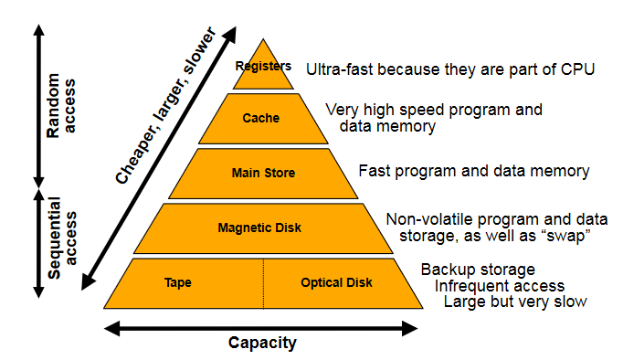

# Memory Systems

## The Memory Hierarchy

- Memory systems must facilitate the reading and writing of data
- Many factors influence the choice of memory technology
  - Frequency of access
  - Access time
  - Capacity
  - Cost
- Memory wants to be low cost, high capacity, and also fast
- As a tradeoff, we organise memory into a hierarchy
  - Allows for some high speed, some high capacity

- Data has to be dragged up the hierarchy
- Memory access is somewhat predictable
- Temporal locality - when a location accessed, likely the same location will be accessed again in the near future
- Spatial locality - when a location accessed, likely that nearby locations will be referenced in the near future
  - 90% of memory access is within 2Kb of program counter

### Semiconductor Memory Types

| Memory Type                         | Category      | Erasure                       | Write Mechanism        | Volatility   |
| ----------------------------------- | ------------- | ----------------------------- | ---------------------- | ------------ |
| Random Access Memory (RAM)          | Read-Write    | Electronically, at byte-level | Electronically written | Volatile     |
| Read Only Memory (ROM)              | Read only     | Not possible                  | Mask Written           | Non-volatile |
| Programmable ROM (PROM)             | Read only     | Not possible                  | Electronically written | Non-volatile |
| Erasable PROM (EPROM)               | Read (mostly) | UV light at chip level        | Electronically written | Non-volatile |
| Electrically Erasable PROM (EEPROM) | Read (mostly) | Electronically, at byte-level | Electronically written | Non-volatile |
| Flash Memory                        | Read (mostly) | Electronically, at byte-level | Electronically written | Non-volatile |

- Particularly interested in random access
- RAM is most common - implements main store
  - nb that all types shown here allow random access, name is slightly misleading
- RAM is also volatile, meaning it is erased when de powered

## Cache

- If 90% of memory access is within 2Kb, store those 2Kb somewhere fast
- Cache is small, fast memory right next to CPU
- 10-200 times faster
- If data requested is found in cache, this is a "cache hit" and provides a big speed improvement
- **We want things to be in cache**

### Cache Concepts

## Memory Organisation

## Error Correction
