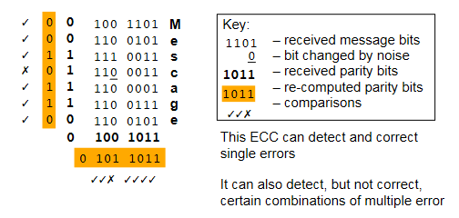

# Memory Systems

## The Memory Hierarchy

- Memory systems must facilitate the reading and writing of data
- Many factors influence the choice of memory technology
  - Frequency of access
  - Access time
  - Capacity
  - Cost
- Memory wants to be low cost, high capacity, and also fast
- As a tradeoff, we organise memory into a hierarchy
  - Allows for some high speed, some high capacity

- Data has to be dragged up the hierarchy
- Memory access is somewhat predictable
- Temporal locality - when a location accessed, likely the same location will be accessed again in the near future
- Spatial locality - when a location accessed, likely that nearby locations will be referenced in the near future
  - 90% of memory access is within 2Kb of program counter

### Semiconductor Memory Types

| Memory Type                         | Category      | Erasure                       | Write Mechanism        | Volatility   |
| ----------------------------------- | ------------- | ----------------------------- | ---------------------- | ------------ |
| Random Access Memory (RAM)          | Read-Write    | Electronically, at byte-level | Electronically written | Volatile     |
| Read Only Memory (ROM)              | Read only     | Not possible                  | Mask Written           | Non-volatile |
| Programmable ROM (PROM)             | Read only     | Not possible                  | Electronically written | Non-volatile |
| Erasable PROM (EPROM)               | Read (mostly) | UV light at chip level        | Electronically written | Non-volatile |
| Electrically Erasable PROM (EEPROM) | Read (mostly) | Electronically, at byte-level | Electronically written | Non-volatile |
| Flash Memory                        | Read (mostly) | Electronically, at byte-level | Electronically written | Non-volatile |

- Particularly interested in random access
- RAM is most common - implements main store
  - nb that all types shown here allow random access, name is slightly misleading
- RAM is also volatile, meaning it is erased when de powered

## Cache

- If 90% of memory access is within 2Kb, store those 2Kb somewhere fast
- Cache is small, fast memory right next to CPU
- 10-200 times faster
- If data requested is found in cache, this is a "cache hit" and provides a big speed improvement
- **We want things to be in cache**
- Cache speed/size is often a bigger bottleneck to performance than clock speed

### Moore's Law

- As said by the co-founder of intel, Gordon Moore, the number of transistors on a chip will double roughly every 18 months
  - Less true in recent years
- Cost of computer logic and circuitry has fallen dramatically in the last 30 years
- ICs become more densely paced
- CPU clock speed is also increasing at a similar rate
- Memory access speed is improving much more slowly however

### Cache Concepts

- Caching read-only data is relatively straightforward
  - Don't need to consider the possibility data will change
  - Copies everywhere in the memory hierarchy remain consistent
- When caching mutable data, copies can become different between cache/memory
- Two strategies for maintaining parity
  - **Write through** - updates cache and then writes through to update lower levels of hierarchy
  - **Write back** - only update cache, then when memory is replaced copy blocks back from cache

### Cache Performance

Cache performance is generally measured by its _hit rate_. If the processor requests some block of memory and it is already in cache, this is a hit. The hit rate is calculated as

$$h = \frac{\text{total number of cache hits}}{\text{total number of memory accesses}}$$

Cache misses can be categorised:

- **Compulsory** - misses that would occur regardless of cache size, eg the first time a block is accessed, it will not be in cache
- **Capacity** - misses that occur because cache is not large enough to contain all blocks needed during program execution
- **Conflict** - misses that occur as a result of the placement strategy for blocks not being fully associative, meaning a block may have to be discarded and retrieved
- **Coherency** - misses that occur due to cache flushes in multiprocessor systems

Measuring performance solely based upon cache misses is not accurate as it does not take into factor the cost of a cache miss. Average memory access time is measured as hit time + (miss rate $\times$ miss penalty).

### Cache Levels

Cache has multiple levels to provide a tradeoff between speed and size.

- Level 1 cache is the fastest as it is the closest to the cpu, but is typically smallest
  - Sometimes has separate instructions/data cache
- Level 2 cache is further but larger
- Level 3 cache is slowest (but still very fast) but much larger (a few megabytes)
- Some CPUs even have a level 4 cache

Different levels of cache exist as part of the memory hierarchy.

## Semiconductors

- RAM memory used to implement main store
- Static RAM (SRAM) uses a flip-flop as the storage element for each bit
  - Uses a configuration of flip-flops and logic gates
  - Hold data as long as power is supplied
  - Provide faster read/write than DRAM
  - Typically used for cache
  - More expensive
- Dynamic RAM (DRAM) uses a capacitor, and the presence to denote a bit
  - Typically simpler design
  - Can be packed much tighter
  - Cheaper to produce
  - Capacitor charge decays so needs refreshing by periodically supplying charge
- The interface to main memory is a critical performance bottleneck

## Memory Organisation

The basic element of memory is a one-bit cell with two states, capable of being read and written. Cells are built up into larger banks with combinatorial logic circuits to select which cell to read/write. The diagram shows an example of a 16x8 memory IC (16 words of 8 bytes).

For a 16x8 memory cell:

- 4 address inputs
  - $\log_2 \,16$
- 8 data lines
  - word size

Consider alternatively a 1Kbit device with 1024 cells

- Organised as a 128x8 array
  - 7 address pins
  - 8 data pins
- Or, could organise as 1024x1 array
  - 10 address pins
  - 1 data pins
- Less pins but very poorly organised
- Best to keep memory cells square to make efficient use of space

## Error Correction

Errors often occur within computer systems in the transmission of data dude to noise and interference. This is bad. Digital logic already gives a high degree of immunity to noise, but when noise is at a high enough level, this collapses.

Two common ways in which errors can occur:

- Isolated errors
  - Occur at random due to noise
  - Usually singular incidences
- Burst errors
  - Errors usually occur in bursts
  - A short period of time over which multiple errors occur
  - For example, a 1ms dropout of a connection can error many bits

### Majority Voting

- A simple solution to correcting errors
- Just send every bit multiple times (usually 3)
  - The one that occurs the most is taken to be the true value
- Slow & expensive

### Parity

- Parity adds an extra _parity bit_ to each byte
- Two types of parity system
  - Even parity
    - The value of the extra bit is chosen to make the total number of 1s an even number
  - Odd parity
    - The value of the extra bit is chosen to make the total number of 1s an odd number
- 7 bit ascii for `A` is `0100 0001`
  - With even parity - `0100 0001`
  - Odd parity - `1100 0001`
- Can be easily computed in software
- Can also be computed in hardware using a combination of XOR gates
  - Usually faster than in software
- Allows for easy error detection without the need to significantly change the model for communication
- Parity bit is computed and added before data is sent, parity is checked when data is received
- Note that if there is more than one error, the parity bit will be correct still and the error won't be detected
  - Inadequate for detecting bursts of error

### Error Correcting Codes

- ECCs or checksums are values computed from the entire data
- If any of the data changes, the checksum will also change
- The checksum is calculated and broadcast with the data so it can be checked on reception
- Can use row/column parity to compute an checksum
  - Calculate parity of each row and of each column
  - Diagram shows how parity bits detect an error in the word "Message"

