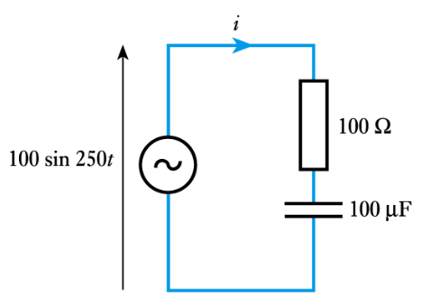

# AC Circuits

- AC current is the dominant form of electricity
- Current changes direction at a fixed frequency (usually 50~60Hz)
- AC voltage is generated by a rotating electromagnetic field
  - The angular velocity of this rotation determines the frequency of the current

An instantaneous voltage $V$ in a sine wave is described by:

$$V = V_p \, \sin(\omega t + \phi)$$

Where:

- $V_p$ is the peak voltage
- $\omega$ is the angular frequency (rad/s)
- $\phi$ is the phase shift (radians)
- The period of the wave is given by $T = \frac{ 2\pi}{f}$

**$V_p$, $\omega$ and $\phi$ define a waveform**

As current and voltage are proportional, AC current is defined in a similar way:

$$I = I_p \, \sin(\omega t + \phi)$$

## Euler's Identity and Phasors

A phasor is a vector that describes a point in a waveform. A vector has a magnitude and a direction, which describe the amplitude $V_p$ and the phase $\phi$ of the signal, respectively. The rate at which the phasor "rotates" is the frequency of the signal.

An AC phasor can be represented as a complex number.

$$A \sin (\omega t + \phi) = A \cos \phi + jA \sin \phi = e^{j\phi}$$

This formula can be used to go from anywhere on a waveform to a phasor, for example:

$$V = 5 \sin(\omega t + 30) = 5 e ^{30j} = 5 \;\angle 30^{\circ}$$

## Reactance and Impedance

- The ratio of voltage to current is a measure of how a component opposes the flow of electricity
- In a resistor, this is resistance
- In inductors and capacitors, this property is _reactance_, $X$, measure in ohms $\Omega$
- Can still be used in a similar way to resistance
- Ohm's law still applies, $V = IX$
- Capacitative reactance $X_C = \frac{1}{\omega C}$
- Inductive reactance $X_L = \omega L$
  - $\omega$ is the angular frequency of the AC current
- Both reactance and resistance are _impedances_
- Impedance $Z$ is also measured in ohms
- The impedance of a component is how hard it is for current to flow through it
  - Impedance represents not only the magnitude of the current, but the phase

## Inductance

The voltage accross an inductor is:
$$V_L = L \frac{d}{dt}I_L$$

In an AC circuit:
$$I_L = I_p \sin(\omega t + \phi) = I_p \;\angle \phi = I_p e^{j \phi}$$
$$V_L = L \frac{d}{dt}I_L = L \omega I_p \cos(\omega t) =  \omega L I_p \sin(\omega t + \phi + 90^{\circ}) = \omega L I_p \;\angle (\phi + 90^{\circ})$$

When an AC current flows through an inductor, an impedance applies

$$Z_L = \frac{V_L}{I_L} = \frac{\omega L I_p \;\angle (\phi + 90^{\circ})}{I_p \;\angle \phi } = \omega L \;\angle 90^{\circ}  = j \omega L$$

**The impedance of an inductor is $j$ times its reactance:**
$$Z_L = j X_L = j \omega L$$

## Capacitance

Capacitors have a similar property:
$$I_C = C \frac{d}{dt} V_c$$
$$V_C = V_p \sin(\omega t + \phi) = V_p e^{j \phi}$$
$$I_C = C \frac{d}{dt} V_p \sin(\omega t + \phi) = \omega C V_p \sin(\omega t + \phi + 90^{\circ}) $$
$$Z_C = \frac{V_L}{I_L} = \frac{V_p e^{j \phi}}{\omega C V_p e^{j(\phi + 90)}} = \frac{1}{\omega C j}$$

**Capacitive Impedance:**

$$Z_C = - j X_c  =\frac{1}{j\omega C} $$

## Complex Impedance

Impedance not only changes the magnitude of an AC current, it also changes its phase.

- In a capacitor, voltage leads current by a phase of 90 degrees
- In an inductor, current leads voltage by a phase of 90 degrees
  - CIVIL: Capacitor I leads V, V leads I in inductor

The diagram below shows the effect of reactance on phase shift.

Consider the circuit below, containing an inductor and resistor in series. The phasor diagram shows the effect of the impedances on the voltage. The inductor introduces a phase shift of 90 degrees into the voltage.

The magnitude of the voltage accross both components is:
$$V = \sqrt{(V_R)^2 + (V_L)^2} = \sqrt{(IR)^2 + (IX_L)^2} = I \sqrt{R^2 + (X_L)^2} = IZ$$
where Z is the magnitude of the impedance, $Z = |\mathbf{Z}|$

From the phasor diagram, the phase shift of the impedance is:
$$\phi = \tan^{-1} \frac{V_L}{R_L} = \tan^{-1} \frac{IX_L}{IR} = \tan^{-1} \frac{X_L}{R}$$

**Complex impedances sum in series and parallel in the exact same way as normal resistance.**

## Example 1

Determine the complex impedance of the following combination at 50 Hz

$$Z_T = Z_C + Z_R + Z_L = R + jX_L - jX_C = R + j(\omega L - \frac{1}{\omega C})$$
At 50Hz, the angular frequency $\omega = 2 \pi f = 314$ rad/s
$$= 200 + j(314 \times 400m - \frac{1}{314 \times 50 \mu}) = 200 + 62j \Omega$$

## Example 2

Determine the complex impedance and therefore the current in the following combination

Since $V = 100 \sin(250t)$, $\omega = 250$

$$Z_T = R - jX_C = 100 - \frac{j}{\omega C} = 100 - j\frac{1}{250 \times 10^{-4}} = 100 - 40j$$

The current can be calculated from the impedance using ohm's law:
$$I = \frac{V}{Z} = \frac{100}{100 - 40j} = 0.86 + 0.34j = 0.93 \,\angle 21.8^{\circ}$$
