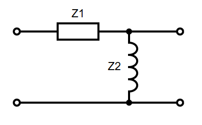
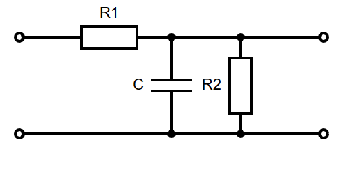

# Passive Filters

Op amps are _active filters_ because they require power. Passive filters use passive components (Resistors, Inductors, Capacitors) to achieve a similar effect. They are constructed using a potential divider with reactive components. The diagram below shows a potential divider with two impedances, $Z_1$ and $Z_2$:

$$\frac{V_{out}}{V_{in}} = \frac{Z_2}{Z_1 + Z_2}$$

## Transfer Functions

The transfer function is the ratio of input to output (see [ES197 - Transfer Functions](../es197/transfer.md) for more details.). For a passive filter, this is the ratio of output voltage to input voltage, as shown above. For a filter, this will be a function of the input waveform, $H(j \omega)$. When $Z_1$ and $Z_2$ are both identical resistors $R$:

$$H(j \omega) = \frac{R}{R + R} = \frac{1}{2}$$

However, if $Z_2$ was a capacitor $C$, $Z_2 = \frac{1}{j \omega C}$:

$$H(j \omega) = \frac{Z_2}{Z_1 + Z_2} = \frac{1}{1 + j \omega R C}$$

The gain and phase of the output are then the magnitude and argument of the transfer function, respectively:
$$|H(j \omega)| = \frac{1}{\sqrt{(1 + \omega R C)^2}}$$
$$\angle H(j \omega) = \frac{\angle 0^{\circ}}{\tan^{-1}(\omega R C)} = -\tan^{-1}(\omega R C)$$

## Cutoff Frequency

Similar to active filters, passive filters also have a cutoff frequency $f_c$. This is the point at which the power output of the circuit falls by $\frac{1}{2}$, or the output gain falls by -3dB, a factor of $\frac{1}{\sqrt{2}}$. Using the above example again (a low pass RC filter):

$$|H(j \omega)| = \frac{1}{\sqrt{(1 + \omega R C)^2}} = \frac{1}{\sqrt{2}}$$
$$2 = 1 + (\omega R C)^2$$
$$\omega^2 = \frac{1}{R^2C^2}$$
$$\omega = \frac{1}{RC}$$
$$f_c = \frac{1}{2\pi RC}$$

This is also the point at which $H(j\omega) = 1 + j$

The filter bandwith is the range of frequencies that get through the filter. This bandwith is 0 to $f_c$ for low pass filters, or $f_c$ and upwards for high pass.

## RC High Pass

$$H(j \omega) = \frac{j \omega R C}{1 + j \omega R C}$$
$$|H(j \omega)| = \frac{\omega R C}{\sqrt{(1 + \omega R C)^2}}$$
$$\angle H(j \omega) = \frac{\angle 90^{\circ}}{\tan^{-1}(\omega R C)} = 90 -\tan^{-1}(\omega R C)$$
$$f_c = \frac{1}{2\pi RC}$$

## RC Low Pass

$$H(j \omega) =  \frac{1}{1 + j \omega R C}$$
$$|H(j \omega)| = \frac{1}{\sqrt{(1 + \omega R C)^2}}$$
$$\angle H(j \omega) = \frac{\angle 0^{\circ}}{\tan^{-1}(\omega R C)} = -\tan^{-1}(\omega R C)$$
$$f_c = \frac{1}{2\pi RC}$$

## RL High Pass

$$H(j \omega) =  \frac{j \omega L }{j \omega L + R}$$
$$|H(j \omega)| = \frac{\omega L }{\sqrt{R^2 + (\omega L)^2}}$$
$$\angle H(j \omega) = 90 -\tan^{-1}(\frac{\omega L}{R})$$
$$f_c = \frac{R}{2 \pi L}$$

## RL Low Pass

$$H(j \omega) =  \frac{R}{j \omega L + R}$$
$$|H(j \omega)| = \frac{R}{\sqrt{R^2 + (\omega L)^2}}$$
$$\angle H(j \omega) =  -\tan^{-1}(\frac{\omega L}{R})$$
$$f_c = \frac{R}{2 \pi L}$$

## 2nd Order Circuits

For circuits more complex than those above, to find the transfer function, either:

- Find a thevenin equivalent circuit, as seen from the element
- Combine multiple elements into single impedances

Note that any of the above techniques only work for _simple first order circuits_.

### Example

Using $H(j \omega) = \frac{Z_2}{Z_1 + Z_2}$, where $Z_1 = R_1$, and $Z_2 = R_2 || jX_C$:

$$Z_2 = \frac{\frac{R_2}{j \omega C}}{R_2 + \frac{1}{j \omega C}} = \frac{R_2}{1 + j \omega R_2 C}$$
$$H(j \omega) = \frac{Z_2}{Z_2 + Z_1} = \frac{\frac{R_2}{1 + j \omega R_2 C}}{R_1 + \frac{R_2}{1 + j \omega R_2 C}} = \frac{R_2}{R_1 + j \omega R_1 R_2 C + R_2}$$
$$|H(j \omega)| = \frac{R_2}{\sqrt{(R_1 + R_2)^2 + (\omega R_1 R_2 C)^2}}$$
$$\angle H(j \omega) = - \tan^{-1} \frac{\omega R_1 R_2 C}{R_1 + R_2}$$
