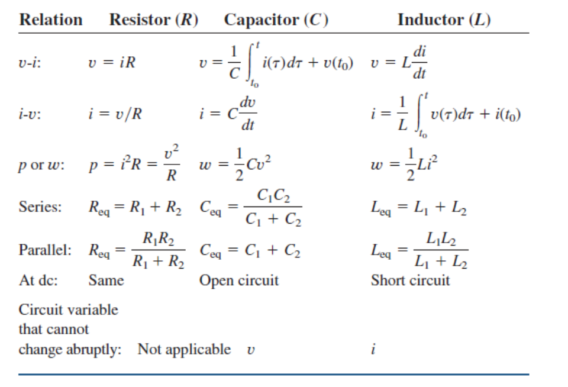

# ES191

A (yet incomplete) collection of notes for ES191 Electrical and Electronic Circuits.  
This one aims to be fairly comprehensive, so let me know if you think anything is missing.
If you're looking for notes on digital logic, see [CS132](../cs132/logic.md)

## Other Useful Resources

- <https://www.khanacademy.org/science/electrical-engineering/ee-circuit-analysis-topic/circuit-elements/a/ee-sign-convention>
- <https://spinningnumbers.org/>
- <https://www.electronics-tutorials.ws/opamp/opamp_1.html>

