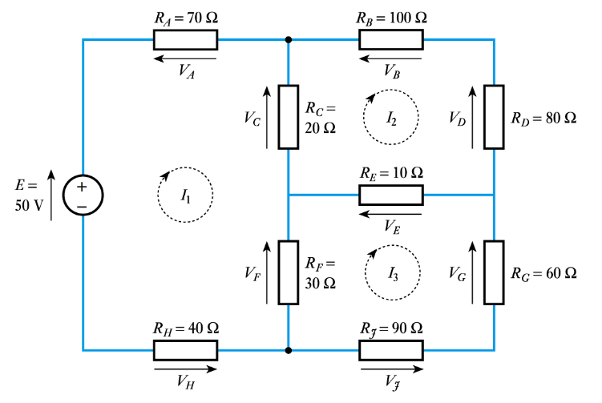

# Mesh Analysis

Achieves a similar thing to nodal analysis, using Kirchhoff's voltage law, and meshes instead of nodes.

## Kirchhoff's Voltage Law

**The sum of voltages around a closed loop always equals zero**

$$ -V_1 + V_2 - V_3 - V_4 = 0$$

### Sign convention
- If voltage rise and current in a voltage source are in the *same direction*, the voltage is denoted as *negative*
- If voltage rise and current are in *opposite direction*, voltage is *positive*
- In a resistor, current *opposes* voltage rise

## Steps
- Identify meshes (loops) (**always clockwise**) and assign currents $I_1, I_2,$ etc to those loops
- Apply KVL to each mesh to generate system of equations
- Solve equations

Where there are elements that are part of multiple meshes, subtract the currents of the other meshes from the mesh currently being considered to consider the total current through that circuit element.
## Example

There are three meshes in this circuit, labelled $I_1$, $I_2$, $I_3$.

For $I_1$:
$$ -50 + 70I_1 + 20(I_1 - I_2) + 30(I_1 - I_3) + 40 I_1 = 0$$

For $I_2$:
$$20(I_2 - I_1) + 100I_2 + 80 I_2 + 10(I_2 - I_3) = 0$$

For $I_3$:
$$30(I_3 - I_1) + 10(I_3 - I_2) + 60I_3 + 90I_3 = 0 $$

This forms a system of equations:

$$
160 I_1 - 20 I_2 - 30 I_3 = 50 \\
-20 I_1 + 210 I_2 - 10 I_3 = 0 \\
-30 I_1 - 10 I_2 + 190 I_3 = 0 \\
$$

Solving yields $I_1 = 325\, mA$, $I_2 = 34\, mA$, and $I_3 = 53\,mA$.

### Impedance Matrices

Similar to how systems of equations from nodal analysis form admittance matrices, mesh analysis forms impedance matrices which describe the circuit being analysed. The matrix equation takes the form $Z \cdot I = V$. As an example, the matrix equation for the system above is:

$$

\begin{pmatrix}
160 & -20 & -30\\
-20 & 210 & -10 \\
-30 & -10 & 190
\end{pmatrix}

\,

\begin{pmatrix}
I_1 \\ I_2 \\ I_3
\end{pmatrix}

= 

\begin{pmatrix}
50 \\ 0 \\ 0
\end{pmatrix}

$$

Therefore, the impedance matrix for the system is:

$$
Z = 
\begin{pmatrix}
160 & -20 & -30\\
-20 & 210 & -10 \\
-30 & -10 & 190
\end{pmatrix}
$$

## Another Example

Determine the currents in the circuit shown below:

Loop 1:
$$-10 + 10I_1 + 5(I_1 - I_2) = 0$$

Loop 2: 
$$5(I_2 - I_1) + 20(I_2 - I_3) + V + 15I_2 = 0$$

Where there is a current source, a voltage $V$ is assumed accross it.

Loop 3:
$$2I_3 - 20 + 20(I_3 - I_2) = 0 $$

There are now 3 equations with 4 unknowns. However, it can be seen from the diagram that $I_2 = 4\, A$, so the system can be solved as follows:

$$I_2 = -4 \, A$$
$$I_1 = \frac{10 + 5 I_2}{15} = -0.67 \, A$$
$$I_3 = \frac{20 + 20 I_2}{22} = -2.73 \, A$$ 

## Example with dependant sources

Calculate the power dissapated in the 4 $\Omega$ resistor and the power delivered/absorbed by the current dependant voltage source.

KVL round $I_1$:

$$I_1 + 4(I_1 - I_3) + 5(I_1 - I_2) = 0$$

KVL round $I_2$:

$$5(I_2 - I_1) + 20(I_2 - I_3) - 50  = 0$$

KVL round $I_3$:

$$15I_a + 20(I_3 - I_2) + 4 (I_3 - I_1) = 0$$

$I_a = I_2 - I_3$, so this can be substituted into equation 3 to obtain a fourth equation:
$$
15(I_2 - I_3) + 20(I_3 - I_2) + 4(I_3 - I_1) = 0
$$

The system of equations then solves:

$$
\begin{pmatrix}
10 & -5 & -4\\
-5 & 25 & -20 \\
-4 & -5 & 9
\end{pmatrix}

\,

\begin{pmatrix}
I_1 \\ I_2 \\ I_3
\end{pmatrix}

= 

\begin{pmatrix}
0 \\ 50 \\ 0
\end{pmatrix}

\Longrightarrow

\begin{pmatrix}
I_1 \\ I_2 \\ I_3
\end{pmatrix}

= 

\begin{pmatrix}
26 \\ 29.6 \\ 28
\end{pmatrix}
$$

The power dissapated in the 4 $\Omega$ resistor:
$$P = I^2R = 2^2 \times 4 = 16 W$$

The power delivered/absorbed by the dependant voltage source:
$$P = IV = 15I_a \times I_2 = 15(29.6-28) \times 28 = 672 W (absorbing)$$
The source is absorbing power as the current $I_2$ opposes the direction of voltage rise in the source.