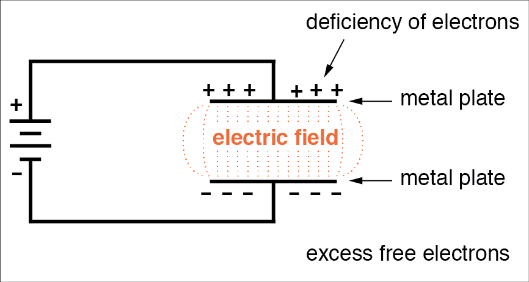

# First Order RC Circuits

RC circuits are those containing resistors and capacitors. First order means they can be modelled by first order differential equations

## Capacitors

Capacitors are reactive elements in circuits that store charge. They work by creating an electric field between two parallel plates seperated by a dielectric insulator.

- When charging, the electrons between the plates separate. At full charge, all electrons will be on opposite plates.
- When discharging, the plates discharge and the charges recombine, forming a current

### Equations
Capacitance of a specific capacitor, where
- $A$ = the area of the two plates
- $d$ = the separation of the two plates
- $\epsilon_r$ = the relative electric permittivity of the insulator
- $\epsilon_0$ = the permittivity of free space

$$C = \frac{A \epsilon_r \epsilon_0}{d}$$

The charge on a capacitor is equal to the product of the capacitance and the voltage accross it:
$$Q = C \cdot V$$

This can be used to derive the i-v equation for a capacitor:

$$C = \frac{Q}{V} = \frac{\int I \, dt}{V}$$
$$\int I \, dt = CV$$
$$I = C \, \frac{dV}{dt} $$

This equation is important as it shows how current leads voltage in a capacitor by a phase of $\frac{\pi}{2}$ rads.

### Energy

The energy stored in a capacitor:

$$W = \frac{1}{2}CV^2 = \frac{1}{2}QV = \frac{Q^2}{2C}$$

### Series and Parallel Combinations

Capacitance combines in series and parallel in the opposite way to resistors.

For capacitors in series:
$$\frac{1}{C_t} = \frac{1}{C_1} + \frac{1}{C_2}$$

In parallel:
$$C_t = C_1 + C_2$$

### Charging and Discharging

- When a voltage is applied to a capacitor, an electric field is formed between the two plates, and the dielectric becomes polarised. 
- As the capacitor charges, the charges in the dielectric separate which forms a displacement current. At time $t=0$, the capacitor behaves as a **short circuit**
- Capacitors charge exponentially, so the time at which one is fully charged is describes as time $t=\infty$. At this time, the capacitor can take no more charge, so it behaves as an **open circuit**
- When discharging, the displaced charges flow round the circuit back to the other side of the capacitor.
- The charge decays exponentially over time. 

## Step Response

Capacitors charge and discharge at exponential rates, and there are equations which describe this response to a step input.

The step response of a charging capacitor at time $t$, assuming the switch is closed at time $t=0$:

$$V_c(t) = V_{in} + (V_0 - V_{in}) e^{- \frac{t}{RC}}$$

Equations for current can be derived from this by differentiation:

$$I_c(t) = C \frac{d}{dt} V_c(t)$$

Assuming $V_0 = 0$, the equations for current and voltage when charging at time $t$ are:

$$I_c(t) = I_{in} \; e^{- \frac{t}{\tau}}$$
$$V_c(t) = V_{in} (1-e^{- \frac{t}{\tau}})$$

Where $I_{in}$ and $V_{in}$ are the input current and voltage, respectively. Similar equations exist for discharging. Voltage at time $t$ when discharging:

$$V(t) = V_0e^{- \frac{t}{\tau}}$$

### Time constant

$\tau = RC$ is the *time constant* of the circuit, which describes the rate at which it charges/discharges. 1 time constant is the time in seconds for which it takes the charge of a capacitor to rise by a factor of $1- e^{-1}$ (approx 63%). As charging and discharging are exponential, a capacitor will only be fully charged when $t=\infty$. However, in practical terms, a capacitor can be considered charged at $t = 5\tau$.

## Example
In the circuit below, determine equations for the response of the capacitor when the switch is moved to position 2.

$V_0$ is equal to the voltage accross the capacitor at time $t=0$, which is the same as the voltage accross the 5 $k\, \Omega$ resistor. When capacitors are fully charged, they are open circuit, so it is not conducing current, making the two voltages equal. 

$$V_0 = 24 \times \frac{5}{3+5} = 15V$$

$V_{in}$ is equal to the voltage of the charging circuit as seen by the capacitor. This can be calculated as the thevenin equivalent of the circuit when the switch is in the right position. 

$$V_{th} = -75 \times \frac{160k}{160k + 40k} = -60 \, V$$
$$R_{th} = 8k + \frac{160k \times 40k}{160k + 40k} = 40 k\Omega$$  

The time constant of the circuit:

$$\tau = R_{th} \times C = 40k \times 0.5m = 0.05$$

Therefore:

$$V_c(t) = V_{th} + (V_0 - V_{th}) e^{- \frac{t}{\tau}} = -60 + 75 e^{-0.05t} \, V$$

The current can be calculated using $I = C \frac{d}{dt} V$:
$$I_c(t) = C \frac{d}{dt} V_c(t) = 0.5m \times \frac{d}{dt}( -60 + 75 e^{-0.05t}) = -1.87e^{-0.05t} \,mA$$

## Another Example
For the circuit shown below:
- Determine Thevenin circuit as seen by capacitor in position 1
- Calculate the time constant of the circuit for time $t > 0$
- Derive an equation for $V_c(t)$ for $t > 0$
- Calculate the time taken for the capacitor voltage to fall to zero
- Derive an equation for $I_c(t)$ for $t > 0$ 

###  t < 0 

The Thevenin voltage of the left hand bit of the circuit can be calculated by KCL:

$$\frac{V_{th} - 40}{20k} + \frac{V_{th}}{60k} - 8 = 0$$
$$V_{th} = 150 \, V $$

Calculating Thevenin resistance by summing resistances:

$$R_{th} = 40k + \frac{20k \times 60k}{20k + 60k} = 55 \, k \Omega$$

### t > 0

The Thevenin voltage of the right hand side as seen by the capacitor, using the voltage divider rule:

$$V_{th} = -100 \times \frac{150k}{150k + 50k} = -75 \, V$$

Thevenin Resistance:

$$R_{th} = 12.5k + \frac{150k \times 50k}{150k + 50k} = 50 \, k \Omega$$

This gives the time constant $\tau = 50k \times 0.25\mu = 12.5 \, ms$

Deriving transient equations:

$$V_c(t) = V_{th} + (V_0 - V_{th}) e^{- \frac{t}{\tau}} = -75 + (150 -- 75)e ^{- \frac{t}{12.5}}$$
$$V_c(t) = -75 + 225 e ^{- 80t}$$
$$I_c(t) = C \frac{d}{dt}V_c(t) = 0.25\mu \times (-75 + 225 e ^{- 80t}) = 4.5 e^{-80t} \, mA$$

For $V_c$ to fall to zero:
$$ -75 + 225 e ^{- 80t} = 0$$
$$e^{-80t} = \frac{1}{3}$$
$$t = -\frac{1}{80} ln(0.33333) = 13.7 \, ms$$