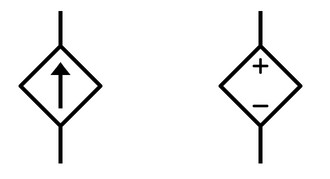
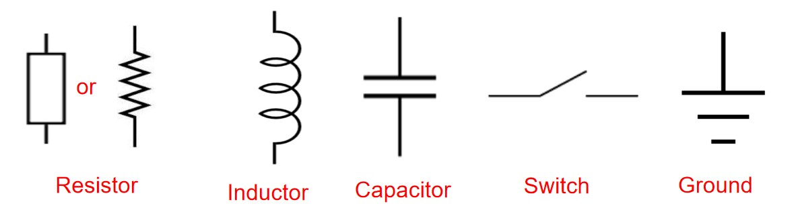
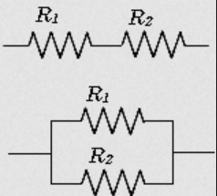

# Circuit Symbols and Conventions

## Circuits model electrical systems
- **Voltage** is work done per unit charge 
- **Potential difference**- difference in electrical potential between two points in an electric field
- A force used to move charge between two points in space 

$$V = \frac{W}{q} = \frac{dW}{dq}$$ 

- Moving charges produce an electric **current**
- Moving charges can do electrical work the same way moving objects do mechanical work

$$I = \frac{dq}{dt}$$

- Electrical energy is the capacity to do electrical work
- Electrical power is the rate at which work is done 

$$P = IV = \frac{dq}{dt} \cdot \frac{dW}{dq} = \frac{dW}{dt}$$

### Resistance
- Resistance is the opposition to the flow of current
- **Ohm's Law**:

$$ R = \frac{V}{I} $$

- Resistance is also proportional to the **Resistivity** of the material 
  - $l$ and $A$ are the length and area of the conductor, respectively.
  
$$ R = \frac{\rho \cdot l}{A}$$

## Sources and Nodes

Everything in a circuit can be modelled as either a source, or a node.
### Voltage Sources

- DC and AC voltage sources
- DC source has positive and negative terminals
- Ideal voltage source has **0** internal resistance (infinite conductance)
- Supplies constant voltage regardless of load
  - This is an assumption, is not the case in reality

### Current Sources

- Ideal current source has infinite resistance (0 conductance)
- Supplies constant current regardless of load
  - Also an assumption
  - In reality, will have some internal resistance and therefore a maximum power limit

### Dependant sources

- Diamond-shaped 
- Sources depend on values in other parts of the circuit
- Model real sources more accurately
  
### Nodes

All **passive** elements: generate no electrical power.   

- Resistors provide resistance/impedance in Ohms ($\Omega$)
- Inductors provide inductance in Henries ($L$)
- Capacitors provide capacitance in Farads ($F$)
  
***The voltage rise across an impedance conducting current is in opposition to the flow of current in the impedance.***

## Basic Conventions
Electrical current always flows from high to low potential.

- If the direction of the current in a circuit is such that it leaves the **positive** terminal of a voltage source and enters the **negative** terminal, then the voltage is designated as **negative**
- If the direction of the current is such that it leaves the **negative** and enters the **positive**, then the voltage is **positive**
  - *The sign of the loop current is the terminal that it flows into*

The power absorbed/produced by a source is $P = IV$.
- A voltage source is **absorbing** power if it is supplying a **negative** current
- A voltage source is **producing** power if it is supplying a **positive** current

The power dissapated in a resistor is $P = I^2R$.

## Resistors in series and parallel

Resistors in series: $R_t = R_1 + R_2$  

Resistors in parallel: $\frac{1}{R_t} = \frac{1}{R_1} + \frac{1}{R_2}$

Resistors dissipate electrical power, so there is a *drop* in voltage accross them, in the direction of current flow. Therefore, the voltage *rise* is in *opposition to the direction of current*

## Voltage dividers

Using two resistors to divide a voltage

In the general case:

$$V_{out} = V_{in} \times \frac{Z_1}{Z_1 + Z_2}$$