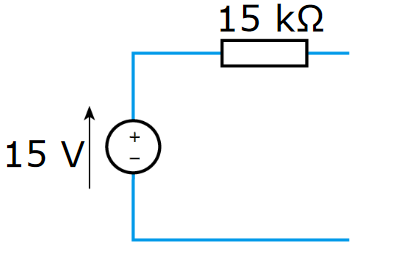

# Thevenin and Norton Equivalent Circuits

Thevenin's Theorem states that as far as its appearance from outside is concerned, any two terminal network of resistors and energy sources can be replaced by a series combination of an ideal voltage source V and a resistor R, where V is the open-circuit voltage of the network and R is the resistance that would be measured between the output terminals if the energy sources were removed and replaced by their internal resistance.

In practice, this can be used for reducing complex circuits to a more simple model: taking networks of resistors/impedances and reducing them to a simple circuit of one source and one resistance.

- Thevenin circuits contain a single voltage source and resistor in series
- Norton circuits contain a single current source and a resistor in parallel

## Calculating Equivalent Circuits

Any linear network viewed through 2 terminals is replaced with an equivalent single voltage & resistor.

- The equivalent voltage is equal to the open circuit voltage between the two terminals ($V_{oc}$/$V_{th}$)
- The equivalent resistance ($R_{th}$) is found by replacing all sources with their internal impedances and then calculating the impedance of the network, as seen by the two terminals.
  - This can be done alternatively by calculating the short circuit current ($I_{sc}$/$I_N$) between the two terminals, and then using ohms law: $R_{th} = \frac{V_{th}}{I_{sc}}$.
- The value of the voltage source in a Thevenin circuit is $V_{th}$
- The value of the current source in a Norton circuit is $I_{N}$
- The value of the resistor in either circuit is $R_{th}$

Often, nodal/mesh analysis is needed to determine the open circuit voltage and/or short circuit current.

## Maximum Power Transfer

For the maximum power transfer between a source and a load resistance in a Thevenin circuit, the load resistance must be _equal to the thevenin resistance $R_{th}$\_. This can be trivially proved, and is left as an exercise to the reader.

## Example 1

Determine the Thevenin equivalent of the following:

The open circuit voltage accross the two terminals can be calculated using the voltage divider rule, as the two resistors $R_1$ and $R_2$ split the voltage.

$$V_{oc} = V_{th} = 30 \times \frac{10k}{10k + 10k} = 15 \, V$$

The short circuit current can be calculated by nodal analysis. When calculating the short circuit current, it is assumed that the two terminals are connected (shorted), so current can flow between them.

KCL at the node labelled V:

$$\frac{V-30}{10k} + \frac{V}{10k} + \frac{V}{10k} = 0$$
$$V = 10 \, V$$

The voltage when the terminals are shorted is 10 V, so the short circuit current can be calculated using ohm's law:

$$I_{sc} = \frac{V}{R_2} = 1\,mA$$

Which gives

$$R_{th} = \frac{V_{th}}{I_{sc}} = \frac{15\, V}{1 \, mA} = 15 \, k\Omega$$

The resistance can alternatively be calculated by replacing the voltage source with it's internal resistance (0), and then determining the overall resistance of the network:

$$ R\_{th} = R_2 + (R_1 || R_3) = R_2 + \frac{R_1 \cdot R_3}{R_1 + R_3} = 15 \, k\Omega$$

The resulting Thevenin circuit is therefore:

## Example 2

Find the Thevenin equivalent circuit of the the network as seen by the two terminals A & B, and therefore the power dissapated/absorbed by the 12V source.

### Open Circuit

Doing nodal analysis to determine voltages:

$V_1$:
$$-4.8  + \frac{V_1}{7.5} + \frac{V_1 - V_2}{2.5} = 0$$
$$4V_1 - 3 V_2 = 36$$
$V_2$:
$$\frac{V_2 - V_1}{2.5} + \frac{V_2}{10} + I = 0$$
$V_3$:
$$-I + \frac{V_3}{2.5} = 0$$

Combining 2 & 3 by cancelling the assumed current $I$:

$$\frac{V_2 - V_1}{2.5} + \frac{V_2}{10} + \frac{V_3}{2.5} = 0$$
$$-4 V_1 + 5 V_2 +4 V_3 = 0 $$

Using $I_x$ to generate another equation:

$$I_x = V_1 - 7.5$$
$$V_3 - V_2 = I_x$$
$$V_1 + 7.5V_2 - 7.5V_3 = 0$$

This gives a system of 3 equations in 3 unknowns which can be solved to determine the node voltages:

$$
\begin{pmatrix}
4 & -3 & 0\\
-4 & 5 & 4 \\
1 & 7.5 & -7.5
\end{pmatrix}

\,

\begin{pmatrix}
V_1 \\ V_2 \\ V_3
\end{pmatrix}

=

\begin{pmatrix}
36 \\ 0 \\ 0
\end{pmatrix}
$$

$$
\begin{pmatrix}
V_1 \\ V_2 \\ V_3
\end{pmatrix}

=

\begin{pmatrix}
12.64 \\ 4.86 \\ 6.55
\end{pmatrix}
$$

$V_3$ is equal to $V_{oc}$, so $V_{th} = 6.55 \, V$

### Short Circuit

The same nodal analysis is needed, except this time the terminals are shorted. The steps are pretty much identical.

$V_1$ is the exact same, $4 V_1 - 3V_3 = 36$

$V_2$:
$$\frac{V_2 - V_1}{2.5} + \frac{V_2}{10} + I = 0$$
$V_3$:
$$-I + \frac{V_3}{2.5} + \frac{V_3}{1} = 0$$

2 & 3 are combined in the same way, except yielding a slightly different equation, as this time current can flow to ground from $V_3$ through the 1 \Omega Resistor.

$$-4V_1 + 5V_2 + 14V_3 = 0$$

The third equation generated using $I_x$ is also the same, $V_1 + 7.5V_2 - 7.5V_3 = 0$

The solution to this system is very similar to above:

$$
\begin{pmatrix}
4 & -3 & 0\\
-4 & 5 & 14 \\
1 & 7.5 & -7.5
\end{pmatrix}

\,

\begin{pmatrix}
V_1 \\ V_2 \\ V_3
\end{pmatrix}

=

\begin{pmatrix}
36 \\ 0 \\ 0
\end{pmatrix}
$$

$$
\begin{pmatrix}
V_1 \\ V_2 \\ V_3
\end{pmatrix}

=

\begin{pmatrix}
9.82 \\ 1.1 \\ 2.42
\end{pmatrix}
$$

The short circuit current is then calculated as:

$$I_{sc} = \frac{V_3}{1} = 2.42 \, A$$

### Solution

The Thevenin resistance is calculated as:

$$R_{th} = \frac{V_{oc}}{I_{sc}} = \frac{6.55}{2.42}$$

The power delivered to the 12V source is therefore:

$$P = IV = \frac{12 - 6.55}{2.7} \times 12 = 24 \, W $$
