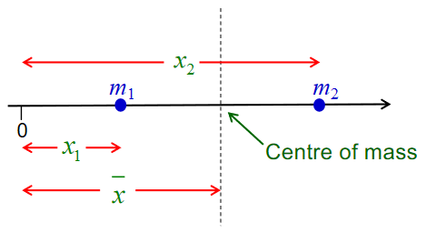

# Integration

## Integration by Parts

When an integral is a product of two functions (ie $\int e^x \sin x$), it can be integrated by parts:

$$\int u \frac{dv}{dx} \,dx = uv - \int v \frac{du}{dx} \,dx$$

(see also the DI method)

## Improper Integrals

An integral is improper if either

- One of its limits is infinity
- The function is not defined for any point within the interval (bounds inclusive)

To evaluate these integrals, replace the dodgy boundwith a variable $t$, evaluate the integral in terms of the variable, and then take the limit as the variable tends towards the bound.

$$\int_a^{\infty} f(x) \, dx = \lim_{t \to \infty} \int_a^t f(x) \, dx$$

Where functions are not continuous over the interval, may need to split the function into two integrals. For example, if $f(x)$ is not continuous at $x = c$ where $a < c <b$, then:
$$\int_a^b f(x) \,dx = \int_a^c f(x) \,dx  + \int_c^b f(x) \,dx $$

## Reduction Formulae

Reduction formulae involve rewriting an integral in terms of itself to get a recurrence relation. They usually involve some variable $n$ as well as other variables in the integral ($x$). For example, integrating $I_n = \int_0^{\infty} x^n e^{-x} dx$:

By parts:

$$u = x^n \qquad \frac{dv}{dx} =  e^{-x} $$
$$\frac{du}{dx} = n x^{n-1} \qquad v = -e^{-x}$$

$$\int u \frac{dv}{dx} \,dx = uv - \int v \frac{du}{dx} \,dx$$
$$\int_0^{\infty} x^n e^{-x} dx = -x^n e^{-x} - \int_0^{\infty} e^{-x} x^{n-1}$$
$$I_n = n \cdot I_{n-1}$$

Note how the integral is now in terms of itself, but with $n-1$. This creates a recursive definition that can be expanded to evaluate $I_5$

$$I_5 = 5I_4 = 5\times 4I_3 = 5 \times 4 \times 3 I_3 = 5 \times 4 \times 3 \times 2 \times 1 \times I_0 = 120 I_0$$
$$I_0 = \int_0^{\infty} x^0 e^{-x} dx = \int_0^{\infty} e^{-x} dx = \left( -e^{-\infty} + e^0 \right) = 1$$
$$I_5 = 5! = 120$$

## Integration by Substitution

Substitution is often useful in solving integrals.

- Choose a new function $u(x)$
- Find $\frac{du}{dx}$
- Substitute $u$ in
- Swap $dx$ for $du$
- Put limits in terms of $u$ (if appropriate)
- Solve with respect to u

Choosing a function $u$ to substitute depends on the integral, and there are certain patterns to spot which make it easier.

### Example

$$\int^1_0 \frac{y^2}{1 + y^6} \, dy$$

Substituting $u = y^3$:
$$u = y^3 \qquad \frac{du}{3} = y^2 dy$$

$$\int^{y=1}_{y=0} \frac{du}{1+u^2}$$
Substituting the limits:
$$u = 1^3 = 1 \qquad u = 0^3 = 0$$
The integral becomes:
$$\frac 1 3 \int^1_0 \frac{du}{1+u^2} = \frac 1 3 \left[\arctan u \right]^1_0 = \frac 1 3 [\arctan 1 - \arctan 0] = \frac {\pi}{12}$$

## $\tan$ Substitutions

There are two standard $\tan$ substitutions that can be really useful when integrating trig functions.

### $t = \tan \frac x 2$ Subs

The first one:
$$t = \tan \frac x 2 \qquad dx =  \frac{2dt}{1+t^2}$$
$$\cos x = \frac{1-t^2}{1+t^2} \quad \sin x = \frac{2t}{1+t^2} \quad \tan x = \frac{2t}{1-t^2}$$

For example:

$$\int \cosec x \, dx = \int \frac{1}{\sin x} \, dx$$

Letting $t = \tan \frac x 2$:
$$dx =  \frac{2dt}{1+t^2} \quad \sin x = \frac{2t}{1+t^2}$$
$$\int \frac{1+t^2}{2t} \cdot \frac{2dt}{1+t^2} = \int \frac{dt}{t} = \ln|t| + c$$

### $T = \tan x $ Subs

$$T = \tan x \qquad dx = \frac{dT}{1+T^2}$$
$$\sin x = \frac{T}{\sqrt{1+T^2}} \qquad \cos x = \frac{1}{\sqrt{1+T^2}}$$

For example:
$$\int \frac{dx}{4\cos^2 x - \sin^2 x}$$

Letting $T = \tan x$:
$$\sin^2 x = \frac{T^2}{1+T^2} \quad \cos^2 x \frac{1}{1+T^2} \quad dx = \frac{dT}{1+T^2}$$

$$\int \frac{dx}{4\cos^2 x - \sin^2 x} = \int \frac{\frac{dT}{1+T^2}}{\frac{4}{1+T^2} - \frac{T^2}{1+T^2}} = \int \frac{\frac{dT}{1+T^2}}{\frac{4 - T^2}{1+T^2}} = \int \frac{dT}{4 - T^2}$$
$$= \frac 1 2 \tanh^{-1} \frac T 2 + C =  \frac 1 2 \tanh^{-1} \frac{\tan x}{2} + C = \frac 1 4 \ln \left|  \frac{2+\tan x}{2-\tan x} \right| + C$$

## Standard Forms

Integrals will sometimes be (or can be put into) standard forms which then evaluate directly to inverse trig functions. The full list is given in the data book but:

$$\int \frac{du}{\sqrt{a^2 - u^2}} = \arcsin \frac u a + c$$
$$\int \frac{du}{a^2 + u^2} = \frac 1 a \arctan \frac u a + c$$

### Example

$$ \int^5_2 \frac{dx}{\sqrt{x^2 + 2x - 8}} = \int^5_2 \frac{dx}{\sqrt{(x+1)^2 - 9}}$$

Substituting $u = x+1$

$$ \int^6_3 \frac{du}{\sqrt{u^2 - 9}} = \left[\cosh^{-1} \frac u 3 \right]^6_3 = \left[ \cosh^{-1} 2 - \cosh^{-1} 1\right] = \cosh^{-1} 2$$

## Trigonometric Identities

Trig identities are often useful in evaluating integrals, for example:

$$\int \sin 4x \cos 3x \, dx$$

Using $2 \sin A \cos B =  (\sin (A+B) + sin (A-B))$:

$$\int \sin 4x \cos 3x \, dx = \frac 1 2 \int \sin 7x + \sin x\,  dx  = \frac 1 2 (- \frac 1 7 \cos 7x - \cos x) + c$$

$$\int \sin 4x \cos 3x \, dx = - \frac 1 14 \cos 7x - \frac 1 2 cos x + c$$

## Integration as a Limit

The area under a curve $f(x)$ from $a \leq x \leq b$ is given by:
$$\int_a^b f(x) \, dx$$
This can be approximated by dividing the area under the curve into a number of rectangles:

For $n$ rectangles over the width $b-a$, the width of each rectangle $\delta x = \frac{b-a}{n}$. The area of the rectangle is therefore given by $y(x_k)\cdot \delta x$. The sum of all the rectangles, and therefore total area is:
$$\sum^n_{k=1} y(x_k) \delta x$$

As $n \to \infty$, $\delta x \to 0$, so:
$$\int^b_a y(x) \, dx = \lim_{\delta x \to 0} \,\sum^{x=b}_{x=a} y(x) \delta x$$

## Volumes of Revolution

For a function $y(x)$ rotated 360 degrees about the x axis, consider a disc of width $\delta x$ and radius y. The volume is given by $\pi y^2 \delta x$. The volume of all slices as $n \to \infty$ is
$$\sum^{x=b}_{x=a} \pi y^2 \delta x$$

Therefore the volume of revolution for a function $y(x)$ about the x axis is
$$V = \pi \int^b_a y^2 \, dx$$

Volume of revolution about y axis:

$$V = \pi \int^b_a x^2 \, dy$$

## Centres of Mass for Planar Objects

The centre of mass is the point through which gravity acts. In 1 dimension:

The sum of the moments about 0 is $m_1 x_1 + m_2 x_2$. The moment of the total mass is $\bar x (m_1 + m_2)$. Equating these:
$$\bar x = \frac{m_1 x_1 + m_2 x_2}{m_1 + m_2} = \frac{\sum m_i x_i}{\sum m_i}= \frac{\text{sum of moments}}{\text{total mass}}$$

This can be expanded into 2 dimensions:
$$\bar x = \frac{\sum m_i x_i}{\sum m_i} \qquad \bar y = \frac{\sum m_i y_i}{\sum m_i}$$

For the centre of mass of an infinitely thin sheet with uniformly distributed mass, for x-axis consider thin slices of width $\delta x$.

- Area of slice = $y \cdot \delta x$
- Mass of slice = $m \cdot y\cdot \delta x$
- Moment of slice about y-axis = $x\cdot m\cdot y\cdot \delta x$
- Sum of all moments as $\delta x \to 0$ = $\int_0^a (m \cdot x \cdot y) \, dx$

$$\bar x = \frac {\int_0^a (m  x  y) \, dx}{m}$$

For the sum of the moments about y axis, take a horizontal slice with width $\delta y$ with length $(a-x)$

- Area of slice = $(a-x) \cdot \delta y$
- Mass of slice = $m \cdot (a-x) \cdot \delta y$
- Moments of slice about x-axis = $y \cdot m \cdot (a-x) \cdot \delta y$
- Sum of all moments as $y \to 0$ = $\int_0^{a} (y m (a-x)) \, dy$

$$\bar y = \frac{\int_0^{a} my(a-x)\, dy}{m}$$

Note that usually, mass $m$ is mass per unit area.

### Example

Find centre of mass of plane lamina shown

By symmetry, clearly $\bar x = 0$. For $\bar y$, let $m$ be the mass per unit area, and consider a horizontal strip of width $y$.

- Area of strip is $2x \delta y$
- Mass of strip is $2mx \delta y$
- Moment of one strip about x axis is $2mxy \delta y$

Total moment as $\delta y \to 0$:

$$\int_0^{4a^2} 2 m x y \, dy = 2m \int_0^{4a^2} y \sqrt{4a^2 - y} \, dy = \frac{256ma^5}{15}$$

For the total mass $M$, total area of the shape:
$$\int^{2a}_{2a} y \, dy = \int^{2a}_{2a} (4a^2 -x^2) \, dy = \frac{32a^3}{3}$$

So total mass M = $m \times M = \frac{32ma^3}{3}$

$$\bar y = \frac{Mx}{M} = \frac{256ma^5}{15} \div \frac{32ma^3}{3} = \frac{8a^2}{5}$$

## Moments of Inertia for Laminae

The moment of inertia $I$ is a measure of how difficult it is to rotate an object. Suppose a lamina is divided into a large number of small elments, each with mass $\delta m$ at distance $r$ from the origin $O$. The moment of inertia of one element is defined to be $r^2 \delta m$. Taking the sum of all moments as $\delta m \to 0$

$$I = \int r^2 \, dm$$

The bounds of the integral should be chosen appropriately such as to include the entire lamina.

- For a lamina lying in the x-y plane, the moment of inertia about z-axis is the sum of the moments about x and y axes.
  - $I_{oz} = I_{ox} + I_{oy}$
- For an axis $L'$ parallel to $L$ at a distance $d$ and both lying in the same plane as the lamina with mass $M$, where $L$ passes through the centere of the lamina:
  - $I_{L'} = I_L + Md^2$

### Example

Find the moment of inertia of a thin rectangular plate of mass $M$, length $2a$ and width $2b$ about an axis through its centre of gravity which is normal to its plane.

Assuming the plate lies in the x-y axis, the question is asking for the moment about the z-axis. To find this, the moments about both x and y axes are required as $I_{oz} = I_{ox} + I_{oy}$. To find $I_{oy}$:

- Let the mass per unit area $m = \frac{M}{4ab}$
- A strip of width $\delta x$ at distance $x$ from $Oy$ has mass $m\cdot 2b \cdot \delta x$
- The moment of inertia of the strip is $x^2 \cdot m\cdot 2b \cdot \delta x$

Taking the limit of the sum of all the strips:
$$\int_{-a}^a 2bmx^2 \, dx = \frac{4ba^3}{3}$$

As $m = \frac{M}{4ab}$,
$$I_{oy} = \frac{4ba^3}{3}\cdot \frac{M}{4ab} = \frac{Ma^2}{3}$$

$I_{ox}$ is identically dervied and equals $\frac{Mb^2}{3}$. Summing the two moments gives:

$$I_{oz} = \frac{Ma^2}{3} + \frac{Mb^2}{3} = \frac{M}{3} (a^2 + b^2)$$

## Lengths of Curves

The length of the arc of a curve $y(x)$ between $x=a$ and $x=b$ is given by
$$\int_a^b \sqrt{1 + \left(\frac{dy}{dx}\right)^2} \, dx$$

Alternatively, for parametrised curves:
$$\int^{t=t_2}_{t=t_1} \sqrt{\left(\frac{dx}{dt}\right)^2 + \left(\frac{dy}{dt}\right)^2} \, dt$$

## Surface Areas of Revolution

Similar to volumes of revolution, the surface area of a function when rotated about the x axis is given by:

$$A = 2\pi \int_a^b y \,\sqrt{1 + \left(\frac{dy}{dx}\right)^2}\, dx$$

### Example

The surface are of the parabola $y^2 = 8x$ between $x=0$ and $x=2$, when rotated about x axis:
$$y = 2 \sqrt{2x} \qquad \frac{dy}{dx} =  \sqrt{\frac 2 x}$$

$$A = 2 \pi \int^2_0 2 \sqrt{2x} \sqrt{1 + \frac 2 x} \, dx = 4 \sqrt 2 \pi \int^2_0 \sqrt{x+2} \, dx$$
$$A = \frac{64\sqrt 2 \pi - 32 \pi }{3}$$

## Mean Values of a Function

For a function $f(x)$ over the interval $[a,b]$

Mean value:
$$\frac{1}{b-a} \int^b_a f(x) dx$$

Root mean square value:
$$\sqrt{\frac{1}{b-a} \int^b_a \left(f(x)\right)^2 dx}$$
