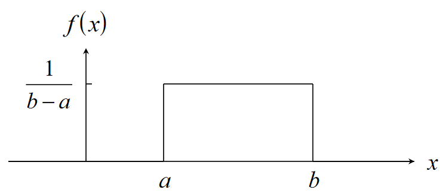
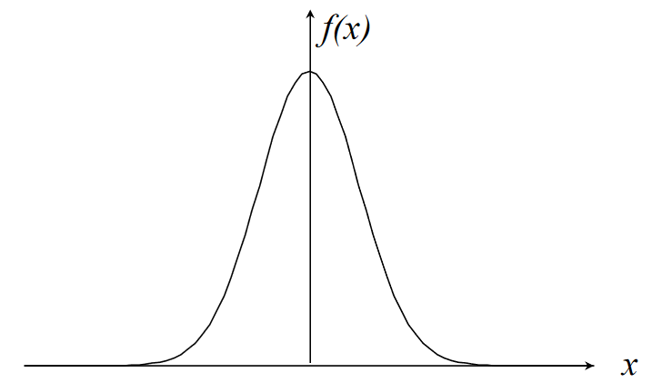

# Probability & Statistics

## Probability

### Set Theory

- A set is a collection of elements
  - Elements are members of a set
- $s \in S$ means "the element $s$ is a member of the set $S$
- The empty set $\varnothing$ contains no elements
  - It is empty
- $S = \{1,3,5,7,9\}$
  - $S$ is a set consisting of those integers
- $S = \{n: n \;\text{is a prime number and}\; n \leq 12\}$
  - $S = \{1,2,3,5,7,11\}$
- $S = \{x: x^2 = 4 \;\text{and}\; x \;\text{is odd}\}$
  - $S = \varnothing$
- $A \subset S$
  - $A$ is a subset of $S$
  - $a \in A$ implies $a \in S$
- $\varnothing \in S$ for all sets $S$
- $A = B$ if and only if $A \subset B$ and $B \subset A$
- $A \cup B$ is the union of $A$ and $B$
  - Set of elements belonging to $A$ _or_ $B$
- $A \cap B$ is the intersection of $A$ and $B$
  - Set of elements belonging to $A$ _and_ $B$
- Disjoint sets have no common elements
  - $A \cap B = \varnothing$
- $A \setminus B$ is the different of $A$ and $B$
  - Set of elements belonging to _$A$ but not $B$_
- $A^c$ is the complement of $A$
  - Set of elements _not_ belonging to $A$

### Random Processes & Probability

The probability of event $A$ occurring is denoted $P(A)$. This is the relative frequency of event $A \in S$ occurring in a random process within sample space S.

- $S$
  - Certain or sure event, guaranteed 100% to happen
- $\varnothing$
  - Impossible event, won't happen
- ${a} \in S$
  - Elementary event, the only event that can happen, the only possible outcome
- $A \cup B$
  - Event that occurs if _$A$ or $B$_ occurs
- $A \cap B$
  - Event that occurs if _$A$ and $B$_ occur
- $A^c = S \setminus A$
  - Event that occurs if $A$ _does not_ occur
- $A \cup B = \varnothing$
  - Events $A$ and $B$ are _mutually exclusive_

#### Example

Toss a coin 3 times and observe the sequence of heads and tails.

- Sample space $S =\{\text{HHH, HHT, HTH, HTT, THH, THT, TTH, TTT}\}$
- Event that $\geq 2$ heads occur in succession $A = \{\text{HHH,HHT,THH}\}$
- Event that 3 heads or 3 tails occur $B = \{\text{HHH,TTT}\}$
    
- $A \cup B = \{ \text{HHH,HHT,THH,TTT}\}$
- $A \cap B = \{\text{HHH}\}$
- $A^c = \{\text{HTH,HTT,THT,TTH,TTT}\}$
- $A^c \cup B =\{\text{TTT}\}$

#### Another Example

Sample space $S=\{17,18,19,20,21,22\}$. Each number is an individual event.

| Events | Frequency | Relative Frequency |
| ------ | --------- | ------------------ |
| 17     | 3         | 3/35               |
| 18     | 4         | 4/35               |
| 19     | 9         | 9/35               |
| 20     | 11        | 11/35              |
| 21     | 6         | 6/35               |
| 22     | 2         | 2/35               |

### Axioms & Laws of Probability

- $0 \leq P(A) \leq 1$ for all $ A \subset S$
  - Probabilities are always between 0 and 1 inclusive
- $P(S) = 1$
  - Probability of the certain event is 1
- If $A \cap B = \varnothing$ then $P(A \cup B) = P(A) + P(B)$
  - If two events are disjoint, then the probability of either occurring is equal to the sum of their two probabilities
- $P(\varnothing) = 0$
  - The probability of the impossible event is zero
- $P(A^c) = 1 - P(A)$
  - The probability of all the elements not in A occurring is the opposite of the probability of all the elements in A occurring
- If $A \subset B$, then $P(A) \leq P(B)$
  - The probability of A will always be less than or equal to the probability of B when A is a subset of B
- $P(A \setminus B) = P(A) - P(A \cup B)$
  - The probability of A minus B is equal to the probability of A minus the probability of A and B
- $P(A \cup B) = P(A) + P(B) - P(A \cap B)$
  - Probability of A or B is equal to probability of A plus the probability of B minus the probability of A and B
  - This is important

#### Example

In a batch of 50 ball bearings:

- 15 have surface damage ($A$)
  - $P(A) = 0.3$
- 12 have dents ($B$)
  - $P(B) = 0.24$
- 6 both have defects ($A \cap B$)
  - $P(A \cap B) = 0.12$

The probability a single ball bearing has surface damage or dents:
$$P(A \cup B) = P(A) + P(B) - P(A \cap B) = 0.3 + 0.24 - 0.12 = 0.42$$

The probability a single ball bearing has surface damage but no dents:
$$P(A \cap B^c) = P(A \setminus B) = P(A) - P(A \cap B) = 0.3 - 0.12 = 0.18$$

### Conditional Probability & Bayes' Theorem

A conditional probability $P(A | B)$ is the probability of event $A$ occurring, _given_ that the event $B$ has occurred.

$$P(A|B) = \frac{P(A \cap B)}{P(B)}$$

Bayes' theorem:

$$P(A|B) = \frac{P(B|A)P(A)}{P(B)}$$

Axioms of conditional probability:

- $P(B) = P(B|A)P(A) + P(B|A^c)P(A^c)$
- $P(A \cup B | C) = P(A|C) + P(B|C) - P(A \cap B | C)$

#### Example

In a semiconductor manufacturing process:

- $A$ is the event that chips are contaminated
  - $P(A) = 0.2$
- $F$ is the event that the product containing the chip fails
  - $P(F|A) = 0.1$ and $P(F|A^c) = 0.005$

Determining the rate of failure:
$P(F) = P(F|A)P(A) + P(F|A^c)P(A^c) = 0.1 \times 0.2 + 0.005 \times 0.8 = 0.024$

### Independent Events

Two events are independent when the probability of one occurring does not dependend on the occurrence of the other. An event $A$ is independent if and only if
$$P(A \cap B) = P(A)P(B)$$

#### Example

Using the coin flip example again with a sample space $S$ and 3 events $A, B, C$

- $S = \{\text{HHH, HHT, HTH, HTT, THH, THT, TTH, TTT}\}$
  - $P(S) = 1$
- $A = \{\text{HHH, HHT, HTH, HTT}\}$
  - $P(A) = 0.5$
- $B = \{\text{HHH, HHT, THH, THT}\}$
  - $P(B) = 0.5$
- $C = \{\text{HHT, THH}\}$
  - $P(C) = 0.25$

A and C are independent events:

- $A \cap C = \{\text{HHT}\}$
- $P(A \cap C) = 0.25 = 0.5 \times 0.25 = P(A)P(C)$

B and C are not independent events:

- $B \cap C = \{\text{HHT,THH}\}$
- $P(B \cap C) = 0.25 \neq 0.25 \times 0.5 = P(B)P(C)$

## Discrete Random Variables

For a random process with a _discrete_ sample space $S$, a discrete random variable $X$ is a function that assigns a real number to each outcome $s \in S$.

- $X$ is a measure related to the random distribution.
- Denoted $P(X = a)$

Consider a weighted coin where $P(H) = 0.75$ and $P(T) = 0.25$. Tossing the coin twice gives a sample space $S = \{\text{TT, TH, HT, HH}\}$, which makes the number of heads a random variable $X(s) = \{0, 1, 2\}$. Since successive coin tosses are independent events:

- $P(TT) = 0.0625$
- $P(TH) = 0.1875$
- $P(HT) = 0.1875$
- $P(HH) = 0.5625$

Events are also mutually exclusive, so:

- $f(0) = P(TT) = 0.0625$
- $f(1) = P(TH) + P(HT) = 0.375$
- $f(2) = P(HH) = 0.5625$

This gives a probability distribution function $f(x) = P(X=x)$ of:

| $x$ | $f(x)$   |
| --- | -------- |
| $0$ | $0.0625$ |
| $1$ | $0.375$  |
| $2$ | $0.5625$ |

### Cumulative Distribution Functions

The cumulative probability function gives a "running probability"
$$F_X(x_i) = P(X \leq x_i) = \sum^i_{j=1}f(x_j)$$

- if $x_i \leq x_j$ then $F_X(x_i) \leq F_X(x_j)$
- $F_X(x_1) = f(x_1)$
- $F_X(x_n) = 1$

Using coin example again:

| $x$ | $F_X(x)$ |
| --- | -------- |
| $0$ | $0.0625$ |
| $1$ | $0.4375$ |
| $2$ | $1$      |

### Expectation & Variance

- Expectation is the average value, ie the value most likely to come up
  - The mean of $X$

$$E(X) = \sum^n_{i=1} x_if(x_i) = \mu_X$$

- Variance is a measure of the spread of the data

$$Var(X) = \sum^n_{i=1}(x_i - \mu_x)^2 f(x_i) = E(X^2) - (E(X))^2 = \sigma^2_X$$

- Standard deviation $\sigma_X = \sqrt{Var(X)}$

Using the weighted coin example once more:

$$E(X) = 0 \times 0.0625 + 1 \times 0.375 + 2 \times 0.5625  = 1.5$$
$$E(X^2) =  0^2 \times 0.0625 + 1^2 \times 0.375 + 2^2 \times 0.5625 = 2.625 $$
$$Var(X) = E(X^2) - (E(X))^2 = 1.5 - 2.625^2 = 0.375$$

### Standardised Random Variable

The standardised random variable is a normalised version of the discrete random variable, obtained by the following transformation:
$$X^* = \frac{X - \mu_X}{\sigma_X}$$

- $E(X^*) = 0$
- $Var(X^*) =1$

## Binomial Distribution

- The binomial distribution models random processes consisting of repeated _independent_ events
- Each event has only 2 outcomes, success or failure
  - $P(success) = p$
  - $P(failure) = q = 1 - p$

The probability of $k$ successes in $n$ events:

$$b(k;n;p) = {n \choose k}p^k q^{n-k}, \;\; k = 0,1,2,...,n$$

- Probability of no success $= q^n$
- Probability of $\geq 1 $ successes is $1 - q^n$

### Expectation & Variance

$$\mu = np$$
$$\sigma^2 = npq$$

### Example

A fair coin is tossed 6 times.
$$p = q = 0.5$$

Probability of exactly 2 heads out of 6
$$b(2;6;0.5) = {6 \choose 2} \times 0.5 ^2 \times 0.5 ^4 = \frac{15}{64}$$

Probability of $\geq 1$ heads
$$1 - q^6 = 1 - 0.5 ^6 = \frac{63}{64}$$

Probability of $\geq 4$ heads

$$b(4;6;0.5) + b(5;6;0.5) + b(6;6;0.5) = {6 \choose 2} (\frac{1}{2})^4 (\frac{1}{2})^2 + {6 \choose 2} (\frac{1}{2})^5 (\frac{1}{2})^1 + (\frac{1}{2})^6 = \frac{11}{32}$$

Expected value $E(X)$
$$\mu = np = 6 \times 0.5 = 3$$

Variance
$$\sigma^2 = npq = 6 \times 0.5 \times 0.5 = 1.5$$

## Poisson Distribution

Models a random process consisting of repeated occurrence of a single event within a fixed interval. The probability of $k$ occurrences is given by
$$p(k;\lambda) = \frac{\lambda^k}{k!}e^{-\lambda}, \;\; k = 0,1,2,...$$

The poisson distribution can be used to approximate the binomial distribution with $\lambda = np$. This is only valid for large $n$ and small $p$

### Expectation & Variance

$$\mu = \sigma^2 = \lambda$$

### Example

The occurrence of typos on a page is modelled by a poisson distribution with $\lambda = 0.5$.

The probability of 2 errors:
$$p(2;0.5) = \frac{0.5^2}{2!}e^{-0.5} = 0.076$$

## Continuous Random Variables

Continuous random variables map events from a sample space to an interval. Probabilities are written $P(a \leq X \leq b)$, where $X$ is the random variable. $X$ is defined with a continuous function, the probability density function.

- The function must be positive
  - $f(x) \geq 0$
- The total area under the curve of the function must be 1
  - $\int^{\infty}_{-\infty} f(x) dx = 1$
- $P(a \leq X \leq b) = \int^b_a f(x) dx$

### Example

$$
f(x) =
\begin{cases}
a (x - x^2) & 0 \leq x \leq 1 \\
0 & otherwise
\end{cases}
$$

Require that $\int^{\infty}_{-\infty} f(x) dx = 1$, so have to find $a$:
$$\int^{\infty}_{-\infty} f(x) dx = \int^1_0 a (x - x^2) dx = a \left[\frac{x^2}{2} - \frac{x^3}{3}\right]^1_0 = \frac{a}{6} \Rightarrow a = 6$$

Calculating some probabilities:
$$P(0 \leq X \leq 0.5) = \int_0^{0.5} f(x) dx = \int_0^{0.5} 6(x - x^2) dx = 6 \left[\frac{x^2}{2} - \frac{x^3}{3}\right]_0^{0.5} = 0.5$$
$$P(0.25 \leq X \leq 0.75) = \int_{0.25}^{0.75} f(x) dx = \int_{0.25}^{0.75} 6(x - x^2) dx = 6 \left[\frac{x^2}{2} - \frac{x^3}{3}\right]_{0.25}^{0.75} = \frac{11}{16}$$

### Cumulative Distribution Function

The cumulative distribution function $F_X$ up to the point $a$ is given as
$$F_X(a) = \int_{-\infty}^a f(x) dx$$

- if $a \leq b$, then $F_X(a) \leq F_X(b)$
- $\lim_{ x \to -\infty} F_X(x) = 0$
- $\lim_{ x \to \infty} F_X(x) = 1$
- $\frac{d}{dx} F_X(x) = f(x)$
  - Derivative of cumulative distribution function is the probability distribution function

Using previous example, let $F_X(x) = \int_{-\infty}^x f(t) dt$. For $x < 0$
$$F_X(x) = 0$$

For $0 \leq x \leq 1$
$$F_X(x) = \int_0^x 6(t-t^2) dt = 6 \left[\frac{t^2}{2} - \frac{t^3}{3}\right]_0^x = 3x^2 - 2x^3$$

For $x > 1$
$$F_X(x) = \int_0^1 6(t-t^2) dt = 6 \left[\frac{t^2}{2} - \frac{t^3}{3}\right]_0^1 = 1$$

### Expectation & Variance

Where $X$ is a continuous random variable:

$$E(X) = \int^{\infty}_{-\infty} x f(x) dx = \mu$$
$$Var(X) = \int^{\infty}_{-\infty} (x - \mu)^2 f(x) dx = \sigma^2_X = E(X^2) - \mu^2$$

## Uniform Distribution

A continuous distribution with p.d.f:

$$
f(x) =
\begin{cases}
\frac{1}{b-a} & a \leq x \leq b \\
0 & otherwise
\end{cases}
$$

Expectation and variance:

$$\mu = \frac{a+b}{2}$$
$$\sigma^2 = \frac{(b-a)^2}{12}$$

Cumulative distribution function:

$$
F_X(x) =
\begin{cases}
0 & -\infty < x < a\\
\frac{x-a}{b-a} & a \leq x \leq b \\
0 & b < x < \infty>>
\end{cases}
$$

## Exponential Distribution

A continuous distribution with p.d.f:

$$
f(x) =
\begin{cases}
0 & -\infty < x < 0 \\
ve^{-vx} & 0 \leq x < \infty
\end{cases}
$$

Expectation and variance:

$$\mu = \frac{1}{v}$$
$$\sigma^2 = \frac{1}{v^2}$$

Cumulative distribution function:

$$
F_X(x) =
\begin{cases}
0 & -\infty < x < 0\\
1 - e^{-vx} & 0 \leq x < \infty \\
\end{cases}
$$

- Recall that a discrete random process $X$ where a single event occurs $i$ times in a fixed interval is modelled by a Possion distribution $p(k;\lambda)$
  - $E(X) = \lambda$
- Consider a situation where the event occurs at a constant mean rate $v$ per unit time
- Let $\lambda = vt$, then $P(0) = e^{-vt}$ and probability of $\geq 1$ events occurring is $1-e^{-vt}$
- Suppose the _continuous_ random variable $Y$ is the time between occurrences of successive events
- If there is a period of time $t$ with no events, then $Y > t$ and $P(Y > t) = e^{-vt}$
- If $\geq 1$ events occur then $Y \leq t$ and $P(Y \leq t) = 1 - e^{-vt}$

**If the number of events per interval of time is Possion distributed, then the length of time between events is exponentially distributed**

### Example

Calls arrive randomly at the telephone exchange at a mean rate of 2 calls per minute. The number of calls per minute $X$ is a d.r.v. which can be modelled by a Poisson distribution with $\lambda = 2$. The probability of 1 call in any given minute is:

$$P(X = 1) = \frac{\lambda e^(-\lambda)}{1!} = 2e^{-2} = 0.27$$

The time between consecutive calls $Y$ is a c.r.v. modelled by an exponential distribution with $v = \frac{\lambda}{t} = \frac{2}{1} = 2$. The probability of at least 1 ($\geq 1$) minute between calls is:
$$p(1 \leq Y \leq \infty) = \int_1^{\infty} v e^{-vt}dt = \int_1^{\infty} 2 e^{-2t}dt = \left[-e^{-2t}\right]_1^{\infty} = 0.135$$

## Normal Distribution

A distribution with probability density function:

$$f(x) = \frac{1}{\sigma \sqrt{2\pi}} e^{-\frac{(x-\mu)^2}{2 \sigma^2}}$$

Expectation $E(X) = \mu$ and variance $Var(X) = \sigma^2$. Normal distribution is denoted $N(\mu,\sigma^2)$ and is defined by its mean and variance.

### Standardised Normal Distribution

$X$ is a random variable with distribution $N(\mu,\sigma^2)$. The standardised random variable $U$ is distributed $N(0,1)$ and can be obtained with the transform:
$$U = \frac{X - \mu}{\sigma}$$
and has p.d.f.
$$f(u) = \frac{1}{\sqrt{2\pi}} e^{-\frac{u^2}{2}}$$

$P(X \leq b) = P(U \leq \beta)$ where $\beta = \frac{b - \mu}{\sigma}$. Values for the standard normal distribution are tabulated in the data book.

### Example

The length of bolts $x$ from a production process are distributed normally with $\mu = 2.5$ and $\sigma^2 = 0.01$.

$$u = \frac{x - \mu}{\sigma} = \frac{x - 2.5}{0.1}$$
The probability the length of a bolt is between 2.6 and 2.7 cm (values obtained from table lookups):
$$P(2.6 \leq X \leq 2.7) = P(\frac{2.6- 2.5}{0.1} \leq U \leq \frac{2.7 - 2.5}{0.1}) = P(1 \leq U \leq 2)$$
$$=  P(0 \leq U \leq 2) - P(0 \leq U \leq 1) = 0.4772 - 0.3413 = 0.1359$$

### Confidence Intervals

A confidence interval is the interval in which we would expect to find an estimate of a parameter, at a specified probability level. For example, the interval covering 95% of the population of $N(\mu,\sigma^2)$ is $\mu \pm 1.96 \sigma$.

For a random variable $X$ with distribution $N(67.5,2.5^2)$, the standard variate $u = \frac{x - 67.5}{2.5}$. For confidence interval at 95% probability:

$$Q(u) = \frac{0.95}{2} = 0.475$$

Using table lookups, $u = \pm 1.96$, and:
$$x = \mu \pm 1.96 \sigma = 67.5 \pm 1.96 \times 2.5 = 67.5 \pm 4.9$$

For confidence interval at 99.9% probability:

$$Q(u) = \frac{0.999}{2} = 0.4995$$

Table lookups again, $u = \pm 3.3$, and:
$$x = \mu \pm 3.3 \sigma = 67.5 \pm 3.3 \times 2.5 = 67.5 \pm 8.25$$

### Normal Approximation to Binomial Distribution

The normal distribution gives a close approximation to the binomial distribution, provided:

- $n$ is large
- neither $p$ nor $q$ are close to zero
- $\mu = np$ and $\sigma^2 = npq$

For example, take a random process consitsting of 64 spins of a fair coin $n = 64$ and $p = q = 0.5$. The probability of 40 heads is:
$$P(40) = {60 \choose 40} \times 0.5^{64} = 0.01359 $$
$$\mu = np = 32, \;\; \sigma = \sqrt{npq} = 4$$

For a normal approximation, must use the interval around 40 (normal is continuous, binomial is discrete) $[39.5,40.5]$:

$$P(39.5 \leq X \leq 40.5) = P(\frac{39.5 - 32}{4} \leq X \leq \frac{39.5 - 32}{4}) = 0.4832 - 0.4696 = 0.0136$$

### Normal Approximation to Poisson Distribution

The normal distribution gives a close approximation to the binomial distribution, provided:

- $\lambda$ is large
- $\mu = \sigma^2 = np$

For example, say a radioactive decay emits a mean of 69 particles per seconds. A standard normal approximation to this is:

$$u = \frac{x - \mu}{\sigma} = \frac{x-69}{\sqrt{69}}$$

The probability of emitting $\leq 60$ particles in a second is therefore:
$$P(0 \leq X \leq 60) = P(\frac{0-69}{\sqrt{69}} \leq X \leq \frac{60.5 - 69}{\sqrt{69}}) = 0.5 - 0.3473 = 0.1527$$
