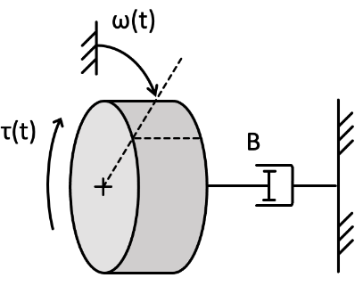
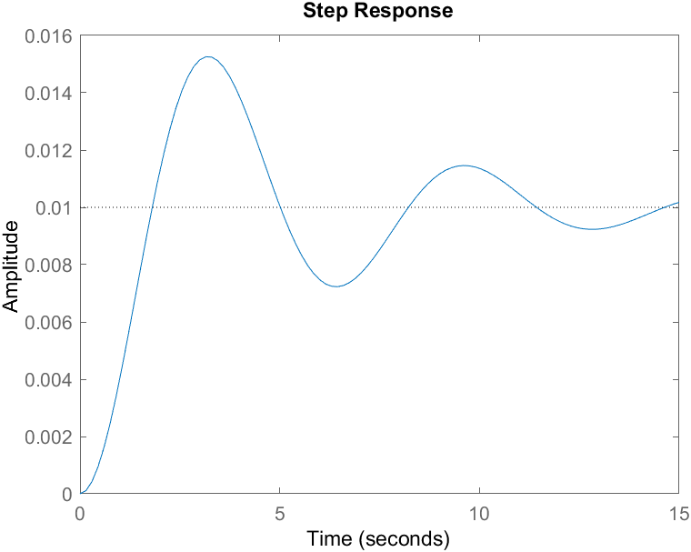

# Transfer Functions

- A transfer function is a representation of the system which maps from input to output
  - Useful for system analysis
  - Carried out in the *Laplace Domain*

## The Laplace Domain
- Problems can be easier to solve in the Laplace domain, so the equation is Laplace transformed to make it easier to work with
- Given a problem such as "what is the output $y(t)$ given a differential equation in $y$ and the step input $u(t)$?"
  - Express step input in Laplace domain $U(s)$
  - Express differential equation in Laplace domain and find transfer function $G(s)$
  - Find output $Y(s) = U(s)G(s)$ in Laplace domain
  - Transfer back to time domain to get $y(t)$

Function|Time domain|Laplace domain
--------|-----------|--------------
Input|$u(t)$|$U(s)$
Output|$y(t)$|$Y(s)$
Transfer|$g(t)$|$G(s)$

The laplace domain is particularly useful in this case, as a differential equation in the time domain becomes an algebraic one in the Laplace domain.
$$\mathcal{L}(\frac{dy}{dx}) = sY(s) - y(0)$$

## Transfer Function Definition
The transfer function is the **ratio of output to input**, given **zero initial conditions**.
$$G(s) = \frac{Y(s)}{U(s)} $$

For a general first order system of the form
$$T \frac{d}{dt}y(t) + y(t) = u(t)$$

The transfer function in the Laplace domain can be derived as:
$$T \cdot \mathcal{L}(\frac{d}{dt}y(t)) + \mathcal{L}(y(t)) = \mathcal{L}(u(t))$$
$$T(sY(s)) + Y(s) = U(s)$$
$$Y(s)(Ts+1) = U(s)$$
$$G(s) = \frac{Y(s)}{U(s)} = \frac{1}{Ts+1}$$

## Step Input in the Laplace Domain
Step input has a constant value $H$ for $t > 0$
$$\mathcal{L}(H) = \frac{H}{s} = U(s)$$


For a first order system, the output will therefore be:
$$Y(s) = U(s)G(s) = \frac{H}{s} \frac{1}{Ts+1}$$
$$y(t) = \mathcal{L}^{-1}(\frac{H}{s} \cdot \frac{1}{Ts+1}) = H(1 - e^{\frac{t}{T}})$$

## Example
Find the transfer function for the system shown:



The system has input-output equation (in standard form):
$$\frac{J}{B}\dot{\omega}(t) + \omega(t) = \frac{1}{B}\tau(t)$$

Taking the Laplace transform of both sides:
$$\frac{J}{B}s\Omega(s) + \Omega(s) = \frac{1}{B}\Tau(s)$$

Rearranging to obtain the transfer function:
$$G(s) = \frac{\Omega(s)}{\Tau(s)} = \frac{1}{B} \cdot \frac{1}{\frac{J}{B}s + 1} = \frac{1}{Js + B}$$

## Using Matlab
In matlab the `tf` function ([Matlab docs](https://uk.mathworks.com/help/control/ref/tf.html)) can be used to generate a system model using it's transfer function. For example, those code below generates a transfer function $G(s) = \frac{1}{2s+3}$, and then plots it's response to a step input of amplitude 1.

```matlab
G = tf([1],[2 3]);
step(G);
```

### Example
For the system shown below, where $M=100$, $B =40$, $K=100$, plot the step response and obtain the undamped natural frequency $\omega_n$ and damping factor $\zeta$.


$$G(s) = \frac{1}{s^2M +sB + K} = \frac{1}{100s^2+40s+100}$$

```matlab
system = tf([1],[100 40 100]);
step(system, 15); % plot 15 seconds of the response

%function to obtain system parameters
[wn,z] = damp(system)
```
The script will output `wn=1`, and `z = 0.2`. The plotted step response will look like:

