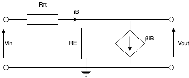

# BJT Amplifiers

- BJTs make excellent amplifiers when biased in the forward-active region
- Transistors can provide high voltage, current and power gain
- DC biasing stabilises the operating point
- DC Q-point determines
  - Small-signal parameters
  - Voltage gain
  - Input & output impedances
  - Power consumption
- DC analysis finds the Q-point
- AC analysis with the small-signal model is used to analyse the amplifier

## Hybrid-Pi Model

The hybrid-pi small signal model is what is used for hand analysis of BJTs:

- Intrinsic low-frequency representation of a BJT
  - Does not work for RF stuff
- Ignoring output impedance assumes $V_A$ is large
- Parameters are controlled by the Q-point
- Transconductance $g_m = \frac{I_{CQ}}{V_T} \approxeq 40 I_{CQ}$
  - Thermal voltage $V_T = 25mV$
- Input resistance $r_\pi = \frac{\beta V_T}{I_{CQ}} = \frac{\beta}{g_m}$

For AC analysis, coupling capacitors are replaced by short circuits, and DC voltages replaced by short circuits to ground. The circuit below shows a 4-resistor bias amplifier replaced by it's small signal model.

## AC Analysis

The impdance at the base input $R_{ib}$:

$$
R_{ib} = \frac{V_{in}}{i_b} = \frac{i_b r_{\pi} + R_E (1 + \beta) i_b}{i_b} = r_\pi + R_E (1 + \beta)
$$

The impedance at the emitter is **reflected** back to the base, multiplied by $(1+\beta)$. This makes the overall input impedance of the amplifier:

$$
R_i = R_{ib} || R_1 || R_2 \\
R_i = (r_\pi + R_E (1+\beta)) || R_{TH}
$$

The output impedance is easy, as lookong into the collector, we can see $R_C$ in parallel with a current source which has infinite impedance, so:

$$
R_O = R_C
$$

The voltage accross $R_C$ is the output voltage:

$$
V_o = -\beta i_b R_C
$$

The voltage accross $r_\pi + R_E$ is the input voltage:

$$
V_{in} = i_b (r_\pi + R_E (1+\beta))
$$

The overall voltage gain is therefore:

$$
A_v = \frac{V_o}{V_{in}} = \frac{-\beta R_C}{r_\pi + R_E (1+\beta)}
$$

Note that the gain is negative meaning this is an inverting amplifier. If we make the assumption that $r_{\pi} << R_E(1+\beta)$, and that $\beta$ is large, then:

$$
A_v = \frac{V_o}{V_{in}} \approx \frac{-\beta R_C}{R_E (1+\beta)} \approx \frac{-R_C}{R_E}
$$

## Common Collector Amplifier

The common collector (or emitter-follower) amplifier is another amplifier circuit used with BJTs (as oppose to the common emitter shown above).

The hybrid-pi model of this circuit looks like, as without the collector the circuit can be re-arranged to:

The output voltage is the voltage accross the emitter resists, and as $i_E = (1+\beta) i_v$:

$$
V_o = i_b (1+ \beta) R_E
$$

The input voltage is the voltage accross both the emitter resisitor and $R_\pi$:

$$
V_{in} = r_\pi i_b + i_b (1+\beta) r_E
$$

Therefore the voltage gain for this amplifier is:

$$
A_v = \frac{V_o}{V_in} = \frac{i_b (1+ \beta) R_E}{r_\pi i_b + i_b (1+\beta) r_E}
$$

$$
A_v = \frac{R_E (1+\beta)}{r_\pi + R_E (1+\beta)}
$$

As usually, $r_\pi >> R_E (1+\beta)$, $A_V \approx 1$. This amplifier has very low voltage gain, and instead acts as a current amplifier:

$$
A_i = \frac{i_E}{i_b} = \frac{(1+ \beta)i_b}{i_b} = 1 + \beta
$$

The input impedance is large, as it is the reflected impedance from the emitter resistor again:

$$
R_{in} = \frac{V_i}{i_b} = \frac{i_b r_\pi + i_b (1+ \beta)R_E}{i_b} = r_\pi + R_E(1+\beta)
$$

The output impedance can be calculate by shorting $V_{in}$, and by applying a test current source $i_x$ accross the output terminals. I'm not going to type out all the analysis but:

$$
R_o = \frac{r_\pi}{1+\beta} = \frac{1}{g_m}
$$

The emitter follow has high input and low output impedance with a high current gain, so acts as an impedance transformer and a buffer.
