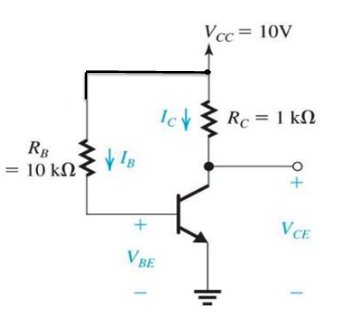
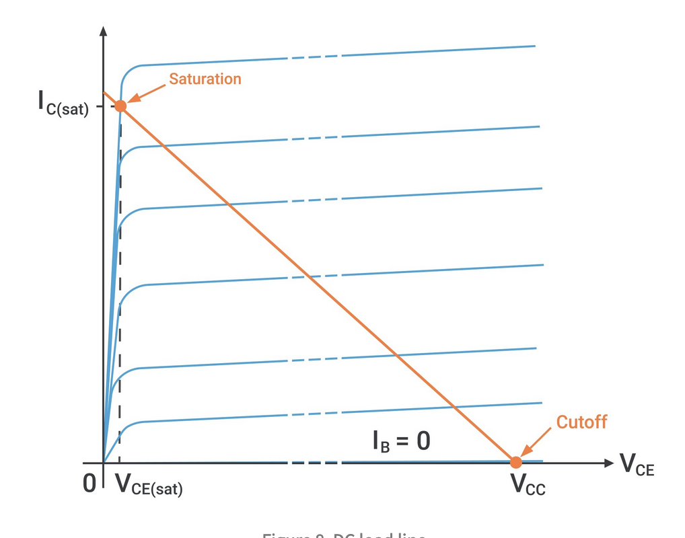

# Bipolar Junction Transistors

There are two kinds of BJTs, NPN and PNP. Both have a base, collector, and emitter and consist of two PN-junctions.

The operating mode of a BJT depends on how the junctions are biased.

- **Forward active** mode is used for amplification
- **Cutoff and saturation** modes are used for switching in digital circuits
  - Cutoff is when both junctions are fully off
  - Saturation is when both junctions are fully on

| Mode           | Base-Emitter Bias | Collector-Base Bias |
| -------------- | ----------------- | ------------------- |
| Cutoff         | Reverse           | Reverse             |
| Forward active | Forward           | Reverse             |
| Saturation     | Forward           | Forward             |

Transistors obey KCL, so all currents entering a transistor must leave:

$$
i_E = i_B + i_C
$$

Transistors also have common-emitter **current gain**, $\beta$

$$
i_C = \beta i_B
$$

There is also the parameter $\alpha$, the common-base current gain:

$$
\alpha = \frac{\beta}{1+\beta} \qquad i_E = \frac{i_C}{\alpha}
$$

$\beta$ is usually large, so $\alpha \approx 1$

## Large-Signal Model

BJTs operating in forward-active mode can be modelled as shown:

The current source shown is dependant upon the base current, and a diode is included to model the 0.7v drop across the PN-junction. This model assumes the transistor is biased correctly, as shown:

## Biasing

Biasing is used to set up quiescent collector current to achieve optimum AC and DC conditions at the same time. $\beta$ is not well specified and can vary per device, so it should be designed to produce the correct operating conditions independent of device parameters and temperature. The Q-point is defined by $V_{CEQ}$ and $I_CQ$.

The circuit shows a single resistor base-biased circuit. Doing KVL around the base-emitter loop gives $I_CQ$:

$$
V_{CC} = I_BR_B + V_{BE}
$$

$$
I_B = \frac{V_{CC} - V_{BE}}{R_B}
$$

$$
I_{CQ} = \beta I_{B} = \beta \frac{V_{CC} - V_{BE}}{R_B}
$$

KVL between $V_{CC}$ and ground gives $V_{CEQ}$:

$$
V_{CC} = I_C R_C + V_{CE}
$$

$$
V_{CE} = V_{CC} - I_C R_C
$$

$$
V_{CEQ} = V_{CC} - \beta \frac{V_{CC} - V_{BE}}{R_B} R_C
$$

Equations depending on $\beta$ are bad though, because $\beta$ can vary too much to rely on it as a parameter. The graph below shows the same circuit with the same resistors, as $\beta$ varies:

The Q-point shown is for $\beta = 175$, which gives $V_{CEQ} = 3.5V$ and $I_{CQ} = 1mA$

## Four-Resistor Voltage Divider Bias

This is the most widely used method to bias a BJT

Thevenin's theorem is used to simplify the bias circuit

- $R_{TH} = R_1 || R_2$
- $V_{TH} = V_{C }(R_2 / (R_1 + R_2))$

Applying KVL around the base-emitter loop:

$$
V_{TH} = I_B R_{TH} + V_{BE} + I_E R_E
$$

As $I_E = (1+\beta) I_B$:

$$
V_{TH} = I_B R_{TH} + V_{BE} + (1+\beta) I_B R_E
$$

$$
I_B = \frac{V_{TH} - V_{BE}}{R_{TH} + (1+\beta) R_E}
$$

Therefore, the collector current $I_C$:

$$
I_C = \beta I_B = \beta \frac{V_{TH} - V_{BE}}{R_{TH} + (1+\beta) R_E}
$$

Howere, we need to stabilise $I_C$ to not depend upon $\beta$. If we choose $R_{TH}$ to be small, ie $R_{TH} = \beta R_E / 10$, then we can disregard it along with $\beta$:

$$
I_C \approx \frac{\beta(V_{TH} - V_{BE})}{(1+\beta)R_E} \approx \frac{V_{TH} - V_{BE}}{R_E} \approx I_E
$$

The equation (approximately) no longer depends upon $\beta$. Applying KVL around the collector-emitter loop for the voltage gives:

$$
V_{CE} = V_{CC} - I_C{R_C + R_E}
$$

So, if $I_C$ is stable, then the Q-point $(V_{CEQ}, I_{CQ})$ is **bias-stable**. Stability is achieved through the choice of a small enough, $R_{TH}$, and also the inclusion of an emitter resistor which provides negative feedback stabilisation.

Compare the graph below with the same one further up for the single-resistor bias circuit. The voltage/current are much more stable and less dependant up on $\beta$.

## Transistors in Saturation

$$
I_B = \frac{10-0.7}{10k} = 0.93mA
$$

$$
I_C = \frac{50(1.7-0.7)}{10k} = 45.6mA
$$

$$
V_C = 10 - 46.5m \times 1k = -36.5 V
$$

This can't be correct. The model breaks down as the transistor is **saturated**, its no longer operating in the forward-active region.

- The voltage accross the collector/emitter maxes out at about 0.2v
- The transistor then turns on like a switch
- Collector to emitter is (roughly) a short circuit

When operating in saturation, $\beta$ becomes $\beta_{\text{forced}}$:

$$
\beta_{\text{forced}} = \frac{I_C}{I_B} = \frac{9.8}{0.93} = 10.5
$$

This is much lower than a typical $\beta$ would be. As $V_{BC}$ is increased further, $\beta$ decreases further and further.

