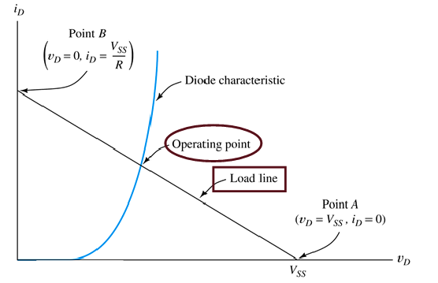
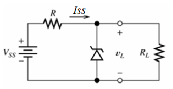

# Diodes

Transistors were originally designed to replace mechanical switches/relays, but also provide amplification. Transitstor/diodes are made by adding impurities to silicon to make it either _p-type_ (hole carriers, positive charge moves) or _n-type_ (electron carriers, negative charge moves). Putting the two together makes a PN-junction, or diode. Diodes only allow current in one direction, as determined by the bias voltage (usually around 0.7v).

When the PN-junction is forward biased, current flows from P to N.

The PN-junction can be reverse biased too, and at a certain point ("the knee"), the bias will break down and current flow in reverse

The graph shows a typical small-signal silicon diode at a temperature of 300k. **Zener Diodes** are diodes where the reverse breakdown voltage is controlled during manufacture to create diodes that act as voltage regulators when reverse biased.

The Shockley equation for a PN-junction related diode current $i_D$ and voltage $v_D$:

$$
i_D = I_s \left[ \exp \left( \frac{v_D}{V_T} \right) -1 \right]
$$

Where I_s is the reverse saturation current, and $V_T \approx 25 mV$ is the thermal voltage. When v_D is large, typically $v_D > 0.1V$:

$$
i_D \approxeq I_s  \exp \left( \frac{v_D}{V_T} \right)
$$

## Load Line Analysis

For the circuit below, KVL gives $V_ss = Ri_D + vD$.

The Shockley equation also gives $V_SS = R \times I_s e^{\frac{v_D}{V_T}} + v_D$. Equating these gives a transcendental equation with no trivial solution.

Instead, if an I-V curve is given, can perform load line analysis.

The load line is the straight line from one axis to the other, overlaid with the diode's I-V characteristic curve.

- Point B is a perfect short circuit, $v_D = 0$, $i_D = \frac{V_ss}{R}$
- Point A is an open circuit, $v_D = V_SS$, $i_D = 0$

The operating point, or Q (Quiescent)-point, is the point at which the two lines intersect, giving an operating point of $(V_{DQ},I_{DQ})$.

If the diode is not conducting, then tiny to zero current flows. Otherwise, it will conduct almost perfectly at about 0.7 volts, so $V_{DQ} \approx 0.7$ usually.

## The Zener Diode

Zener diodes are designed to operate in the reverse breakdown region. The breakdown voltage is controlled by the doping level during manufacture, which allows a fixed voltage to appear between cathode and anode (that isn't just 0.7v). The ideal Zener diode behaves something like this:

The circuit below shows a diode being used to regulate the voltage of a variable supply, to keep the voltage supply to a load $R_L$ constant

As an example, given a Zener diode's I-V curve, find the output voltage for $V_SS = 15V$ and $V_SS = 20V$, with $R=1k\Omega$. KVL gives a load line of $V_SS + Ri_D + v_D = 0$:

The graph shows the two load lines plotted with the diode I-V curve, giving $V_o$ of 10V and 10.5V, respectively.

When modelling Zener diodes, an internal resistance $r_Z$ is sometimes used, which is what gives the slope of the I-V curve as $1/r_Z$:

