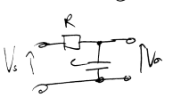
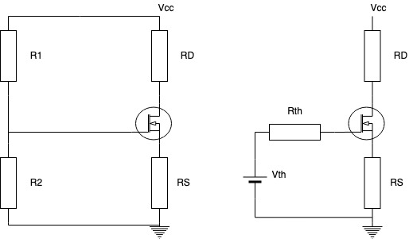

# Equations

Below are some of the main equations that I have found useful to have on hand.

Use `./generateTables.sh ../src/es2c0/equations.md ` in the scripts folder.

<equation-table>

| [Oscillators](#oscillators)                                                                                                         |                                                                                         |
| ----------------------------------------------------------------------------------------------------------------------------------- | --------------------------------------------------------------------------------------- |
| [Closed Loop Gain](#closed-loop-gain)                                                                                               | $A_{cl}(j \omega) = \frac{v_o}{v_i} = \frac{A}{1-A\beta(j\omega)}$                      |
| [Loop Gain](#loop-gain)                                                                                                             | $L(jw) = A\beta{}(jw)$                                                                  |
| [Frequency Potential Divider ($s$)](#frequency-potential-divider-s)                                                                 | $\frac{V_o}{V_i}(s) = \frac{Z_2}{Z_1 + Z_2} = \frac{sCR}{1 + 3sCR + s^2 C^2 R^2}$       |
| [Frequency Potential Divider ($jw$)](#frequency-potential-divider-jw)                                                               | $\frac{V_o}{V_i}(jw) = \frac{j\omega CR }{1 - \omega^2 C^2 R^2 + 3j \omega CR}$         |
| [Frequency of Unity Gain (0 phase shift)](#frequency-of-unity-gain-0-phase-shift)                                                   | $\omega_0 = \frac{1}{RC} \Rightarrow f_0 = \frac{1}{2\pi RC}$                           |
| [60 Degrees of phase shift in CR network](#60-degrees-of-phase-shift-in-cr-network)                                                 | $\omega_{60\degree} = \frac{1}{sqrt{3} \times{}RC}$                                     |
| [Transfer function of CR Network](#transfer-function-of-cr-network)                                                                 | $\frac{v_o}{v_i} = \frac{j \omega RC}{1 + j \omega RC}$                                 |
| [Transfer function of RC Network](#transfer-function-of-rc-network)                                                                 | $\frac{v_o}{v_i} = \frac{1}{1+sCR} = \frac{1}{1+jwCR}$                                  |
| [Transfer function of Inverse Frequency potential divider ($s$)](#transfer-function-of-inverse-frequency-potential-divider-s)       | $\frac{V_o}{V_i}(s) = \frac{Z_2}{Z_1 + Z_2} = \frac{(1+sCR)^2}{1 + 3sCR + s^2 C^2 R^2}$ |
| [Transfer function of Inverse Frequency potential divider ($jw$)](#transfer-function-of-inverse-frequency-potential-divider-jw)     | $\frac{V_o}{V_i}(jw) = \frac{(1+jwCR)^2 }{(1-w^2C^2R^2) + 3jwCR}$                       |
| [Transfer function of Frequency potential divider (Inductor) ($s$)](#transfer-function-of-frequency-potential-divider-inductor-s)   | $\frac{V_o}{V_i}(s)  = \frac{sLR}{(R^2 + s^2L^2) + 3sLR}$                               |
| [Transfer function of Frequency potential divider (Inductor) ($jw$)](#transfer-function-of-frequency-potential-divider-inductor-jw) | $\frac{V_o}{V_i}(jw) = \frac{jwLR}{(R^2-w^2L^2) + 3jwLR}$                               |
| [Frequency of Unity Gain (0 phase shift) (Inductor)](#frequency-of-unity-gain-0-phase-shift-inductor)                               | $\omega_0 = \frac{R}{L} \Rightarrow f_0 = \frac{R}{2\pi{}L}$                            |

| [BJT Transitors](#bjt-transitors)                                                     |                                                                                   |
| ------------------------------------------------------------------------------------- | --------------------------------------------------------------------------------- |
| [Common Emitter Forward Gain, $\beta$](#common-emitter-forward-gain-beta)             | $\beta{} = \frac{I_C}{I_B} = \frac{\alpha}{1-\alpha}$                             |
| [Common Base Forward current gain, $\alpha$](#common-base-forward-current-gain-alpha) | $\alpha = \frac{\beta}{\beta + 1}$                                                |
| [NPN Emitter Current](#npn-emitter-current)                                           | $I_E = I_B + I_C = \frac{I_C}{\alpha} = I_C + \frac{I_C}{\beta} = (1+\beta{})I_B$ |
| [Emmitter Voltage Rule of Thumb](#emmitter-voltage-rule-of-thumb)                     | $V_E \approx \frac{V_{cc}}{10}$                                                   |
| [Thevin Resistance Rule of Thumb](#thevin-resistance-rule-of-thumb)                   | $R_{TH} = \frac{\beta{}R_E}{10}$                                                  |
| [Four Resistor Bias Circuit $R_{TH}$](#four-resistor-bias-circuit-r_th)               | $R_{TH} = R_1//R_2 = \frac{R_1R_2}{R_1 + R_2}$                                    |
| [Four Resistor Bias Circuit $V_{TH}$](#four-resistor-bias-circuit-v_th)               | $V_{TH} = V_{CC} \frac{R_2}{R_1 + R_2}$                                           |
| [Transconductance](#transconductance)                                                 | $g_m = \frac{I_{CQ}}{V_T} \approxeq 40I_{CQ}$                                     |

| [AC BJT Analysis](#ac-bjt-analysis)                                                                                               |                                                                                                        |
| --------------------------------------------------------------------------------------------------------------------------------- | ------------------------------------------------------------------------------------------------------ |
| [Amplifier Topologies](#amplifier-topologies)                                                                                     | $x$                                                                                                    |
| [Transistor Input Impedance](#transistor-input-impedance)                                                                         | $r_\pi{} = \frac{\beta{}V_T}{I_{CQ}}$                                                                  |
| [Gain of Collector Follower (Common Emitter) AC](#gain-of-collector-follower-common-emitter-ac)                                   | $A_v = \frac{V_O}{V_{in}} = \frac{-\beta{}R_C}{r_{\pi{}} + (1 + \beta{})R_E} \approx -\frac{R_C}{R_E}$ |
| [Input Impedance of Collector Follower (Common Emitter)](#input-impedance-of-collector-follower-common-emitter)                   | $R_{in} = r_\pi + (1+\beta)R_E$                                                                        |
| [Output Impedance of Collector Follower (Common Emitter)](#output-impedance-of-collector-follower-common-emitter)                 | $R_{out} = R_C$                                                                                        |
| [Emitter Follower (Common Collector)](#emitter-follower-common-collector)                                                         | $N/A$                                                                                                  |
| [Voltage Gain of Emitter Follower (Common Collector)](#voltage-gain-of-emitter-follower-common-collector)                         | $A_v = \frac{R_E(1+\beta)}{r_\pi{} + R_E(1+\beta)}$                                                    |
| [Current Gain of Emitter Follower (Common Collector)](#current-gain-of-emitter-follower-common-collector)                         | $A_i = \frac{(1+\beta)i_b}{i_b}$                                                                       |
| [Input Impedance of Emitter Follower (Common Collector)](#input-impedance-of-emitter-follower-common-collector)                   | $R_{in} = r_\pi{} + (1+\beta{})R_E$                                                                    |
| [Output Impedence of Emitter Follower  (Common Collector)](#output-impedence-of-emitter-follower--common-collector)               | $R_{out} = \frac{R_E(r_\pi{} + R_S)}{(r_\pi+R_S) + R_E(1+\beta)}$                                      |
| [Output Impedence of Emitter Follower  (Common Collector) Simple](#output-impedence-of-emitter-follower--common-collector-simple) | $R_{out} = \frac{r_\pi{}}{(1+\beta)} = \frac{1}{g_m}$                                                  |

| [MOSFETs DC](#mosfets-dc)                                          |                                                                                                       |
| ------------------------------------------------------------------ | ----------------------------------------------------------------------------------------------------- |
| [Stages](#stages)                                                  | $V_{DS(sat)} = V_{GS} - V_{TN}$                                                                       |
| [Linear Region Drain Current](#linear-region-drain-current)        | $i_D = K_n \left[ 2(V_{GS} - V_{TN})-V_{DS}\right]V_{DS}$                                             |
| [Saturation Drain Current](#saturation-drain-current)              | $i_D = K_n (V_{GS} - V_{TN})^2$                                                                       |
| [Saturation Drain Current -> VGS](#saturation-drain-current---vgs) | $V_{GS} = (\frac{i_d}{K_n})^{1/2} + V_{TN}$                                                           |
| [Small Signal Model](#small-signal-model)                          | $i_D = g_m \times{} V_{GS}$                                                                           |
| [Transconductance $g_m$](#transconductance-g_m)                    | $g_m = \frac{2I_{DQ}}{V_{GS}-V_{TN}}$                                                                 |
| [MOSFET Bias Network](#mosfet-bias-network)                        | $\text{sqrt }{i_D} = \frac{-K_n^{-1/2} \pm ({K_n^{-1} - 4R_s(V_{TN} - V_{TH})})^{\frac{1}{2}}}{2R_s}$ |
| [MOSFET input impedence](#mosfet-input-impedence)                  | $R_{in} = \infin$                                                                                     |

| [MOSFET Common Source](#mosfet-common-source)                   |                                                    |
| --------------------------------------------------------------- | -------------------------------------------------- |
| [Overall Input Impedence](#overall-input-impedence)             | $R_{in} = R_{TH}$                                  |
| [Overall Output Impedance](#overall-output-impedance)           | $R_{out} = R_D$                                    |
| [Bypassed Gain](#bypassed-gain)                                 | $A_v = \frac{-g_m R_D V_{GS}}{V_{GS}} = - g_m R_D$ |
| [Common Drain (Source Follower)](#common-drain-source-follower) | $z$                                                |
| [Output Impedance](#output-impedance)                           | $R_{out} = \frac{1}{gm}$                           |

| [Differential Amplifier](#differential-amplifier)                                             |                                               |
| --------------------------------------------------------------------------------------------- | --------------------------------------------- |
| [Quiescent Current of Long Tail Pair](#quiescent-current-of-long-tail-pair)                   | $I_Q = I_{E1} + I_{E2}$                       |
| [Biasing](#biasing)                                                                           | $I_Q = \frac{(V_{EE}) + V_{E}}{R_{EE}}$       |
| [Collector Voltage of Grounded Long Tail Pair](#collector-voltage-of-grounded-long-tail-pair) | $V_{C_1} = V_{C_2} = V_{CC} - I_C R_C$        |
| [Differential Gain without ground](#differential-gain-without-ground)                         | $A_{id} = \left                               | \frac{V_{od}}{V_d}\right    | = g_m R_C$                                                                |
| [Differential Gain - Single Ended](#differential-gain---single-ended)                         | $\left                                        | \frac{V_{o}}{V_d}\right     | = \frac{g_m R_C}{2}$                                                      |
| [Differential Input Resistance](#differential-input-resistance)                               | $R_{id} = 2 r_\pi$                            |
| [Differential Output Resistance](#differential-output-resistance)                             | $R_{od} = 2 R_E$                              |
| [Common Mode Gain](#common-mode-gain)                                                         | $A_{cm} = \left                               | \frac{V_{o1}}{V_{cm}}\right | = \frac{-\beta R_C}{r_\pi + 2(1+\beta)R_{EE}} \approx \frac{-R_C}{2R_EE}$ |
| [Common Mode Input Resistance](#common-mode-input-resistance)                                 | $R_{ic} = \frac{r_\pi}{2} + R_{EE} (1+\beta)$ |
| [CMRR - Common Mode Rejection Ratio](#cmrr---common-mode-rejection-ratio)                     | $CMRR =\left                                  | \frac{A_{id}}{A_{cm}}\right | $                                                                         |
| [Generalised Differential Amplifier Output](#generalised-differential-amplifier-output)       | $V_{out} = A_{id} V_{id} + A_{cm} V_{cm}$     |

| [Impedance Laplace](#impedance-laplace)                     |                                                     |
| ----------------------------------------------------------- | --------------------------------------------------- |
| [Resistor](#resistor)                                       | $Z = R$                                             |
| [Capacitor](#capacitor)                                     | $Z = \frac{1}{sC} = \frac{1}{jwC} = -\frac{1}{wC}j$ |
| [Inductor](#inductor)                                       | $Z = sL$                                            |
| [Resistor Capacitor Series](#resistor-capacitor-series)     | $Z = R + \frac{1}{sC}$                              |
| [Resistor Capacitor Parallel](#resistor-capacitor-parallel) | $Z = \frac{R}{1+sCR}$                               |
| [Resistor Inductor Series](#resistor-inductor-series)       | $Z = R + sL$                                        |
| [Resistor Inductor Parallel](#resistor-inductor-parallel)   | $Z = \frac{sLR}{R+sL}$                              |

| [Op-Amps](#op-amps)                       |                         |
| ----------------------------------------- | ----------------------- |
| [Non-inverting Gain](#non-inverting-gain) | $A = 1 + \frac{R2}{R1}$ |
| [Inverting Gain](#inverting-gain)         | $A = -\frac{R2}{R1}$    |

| [Misc](#misc)                           |                                     |
| --------------------------------------- | ----------------------------------- |
| [Source Regulation](#source-regulation) | $\frac{\Delta{V_L}}{\Delta{V_i}}$   |
| [Load Regulation](#load-regulation)     | $\frac{\Delta{V_L}}{V_{Lexpected}}$ |

</equation-table>

## Oscillators

### Closed Loop Gain

$$A_{cl}(j \omega) = \frac{v_o}{v_i} = \frac{A}{1-A\beta(j\omega)}$$

- $A_{cl}$ is the closed loop gain of the system.
- $A$ is the open loop gain (with no feedback)
- $\beta$ is the feedback fraction, that feeds back a portion of the output voltage back to the input

### Loop Gain
$$ L(jw) = A\beta{}(jw)$$
For oscillation, need unity gain, so angle $=0\degree$ therefore must be real, so $\beta$ also must be real.
### Frequency Potential Divider ($s$)

$$\frac{V_o}{V_i}(s) = \frac{Z_2}{Z_1 + Z_2} = \frac{sCR}{1 + 3sCR + s^2 C^2 R^2}$$

### Frequency Potential Divider ($jw$)
$$\frac{V_o}{V_i}(jw) = \frac{j\omega CR }{1 - \omega^2 C^2 R^2 + 3j \omega CR}$$

### Frequency of Unity Gain (0 phase shift)

$$\omega_0 = \frac{1}{RC} \Rightarrow f_0 = \frac{1}{2\pi RC}$$

### 60 Degrees of phase shift in CR network
$$\omega_{60\degree} = \frac{1}{sqrt{3} \times{}RC}$$

### Transfer function of CR Network

$$\frac{v_o}{v_i} = \frac{j \omega RC}{1 + j \omega RC}$$
$\frac{v_o}{v_i}$= Gain of CR network

### Transfer function of RC Network
$$\frac{v_o}{v_i} = \frac{1}{1+sCR} = \frac{1}{1+jwCR}$$
 $\frac{v_o}{v_i}$= Gain of RC network

### Transfer function of Inverse Frequency potential divider ($s$)
$$\frac{V_o}{V_i}(s) = \frac{Z_2}{Z_1 + Z_2} = \frac{(1+sCR)^2}{1 + 3sCR + s^2 C^2 R^2}$$

### Transfer function of Inverse Frequency potential divider ($jw$)
$$\frac{V_o}{V_i}(jw) = \frac{(1+jwCR)^2 }{(1-w^2C^2R^2) + 3jwCR}$$

### Transfer function of Frequency potential divider (Inductor) ($s$)
$$\frac{V_o}{V_i}(s)  = \frac{sLR}{(R^2 + s^2L^2) + 3sLR}$$

### Transfer function of Frequency potential divider (Inductor) ($jw$)
$$\frac{V_o}{V_i}(jw) = \frac{jwLR}{(R^2-w^2L^2) + 3jwLR}$$

### Frequency of Unity Gain (0 phase shift) (Inductor)
$$\omega_0 = \frac{R}{L} \Rightarrow f_0 = \frac{R}{2\pi{}L}$$

## BJT Transitors

### Common Emitter Forward Gain, $\beta$
$$ \beta{} = \frac{I_C}{I_B} = \frac{\alpha}{1-\alpha}$$

### Common Base Forward current gain, $\alpha$
$$ \alpha = \frac{\beta}{\beta + 1}$$
### NPN Emitter Current
$$ I_E = I_B + I_C = \frac{I_C}{\alpha} = I_C + \frac{I_C}{\beta} = (1+\beta{})I_B$$

### Emmitter Voltage Rule of Thumb
$$ V_E \approx \frac{V_{cc}}{10} $$

### Thevin Resistance Rule of Thumb
$$ R_{TH} = \frac{\beta{}R_E}{10} $$

### Four Resistor Bias Circuit $R_{TH}$
$$ R_{TH} = R_1//R_2 = \frac{R_1R_2}{R_1 + R_2}$$

### Four Resistor Bias Circuit $V_{TH}$
$$ V_{TH} = V_{CC} \frac{R_2}{R_1 + R_2}$$

### Transconductance
$$ g_m = \frac{I_{CQ}}{V_T} \approxeq 40I_{CQ}$$

## AC BJT Analysis

### Amplifier Topologies
$$x$$

### Transistor Input Impedance
$$ r_\pi{} = \frac{\beta{}V_T}{I_{CQ}}$$
Where $V_T$ = 25mV, $I_CQ$ = Collector current at Q point.

### Gain of Collector Follower (Common Emitter) AC
$$ A_v = \frac{V_O}{V_{in}} = \frac{-\beta{}R_C}{r_{\pi{}} + (1 + \beta{})R_E} \approx -\frac{R_C}{R_E}$$

### Input Impedance of Collector Follower (Common Emitter)
$$ R_{in} = r_\pi + (1+\beta)R_E $$ 
Into the transistor
### Output Impedance of Collector Follower (Common Emitter)
$$ R_{out} = R_C$$
As current source has infinite impedance.

### Emitter Follower (Common Collector)
$$N/A$$

- High Input, low ouput impedence
- High current gain
- So acts as impedence trasnformer and buffer
  
  

### Voltage Gain of Emitter Follower (Common Collector)
$$ A_v = \frac{R_E(1+\beta)}{r_\pi{} + R_E(1+\beta)}$$
$A_v \approx 1$ as $r_\pi >> RE(1+\beta)$ So low voltage gain, so instead current amplifier.

### Current Gain of Emitter Follower (Common Collector)
$$ A_i = \frac{(1+\beta)i_b}{i_b} $$

### Input Impedance of Emitter Follower (Common Collector)
$$R_{in} = r_\pi{} + (1+\beta{})R_E $$

### Output Impedence of Emitter Follower  (Common Collector)
$$R_{out} = \frac{R_E(r_\pi{} + R_S)}{(r_\pi+R_S) + R_E(1+\beta)} $$
Where $R_S$ = source input impedance

### Output Impedence of Emitter Follower  (Common Collector) Simple
$$R_{out} = \frac{r_\pi{}}{(1+\beta)} = \frac{1}{g_m}$$
Where $R_S$ = source input impedance

## MOSFETs DC
No current through gate in MOSFET (as voltage controlled) (infinite input impedence)
$$ i_G = 0 \rightarrow i_D = i_S$$

### Stages
$$V_{DS(sat)} = V_{GS} - V_{TN}$$

- Cut off (no current flows, $V_{GS} < V_{TN})$
- Linear $V_{DS} > V_{DS(sat)}$
- Saturation $V_{DS} < V_{DS(sat)}$

Where $V_{TN}$ = **Threshold Voltage**

### Linear Region Drain Current
$$ i_D = K_n \left[ 2(V_{GS} - V_{TN})-V_{DS}\right]V_{DS} $$

$\text{for} \quad  0 < V_{DS} < (V_{GS} - V_{TN})$, where $K_n$ = transconductance constant

### Saturation Drain Current 
$$ i_D = K_n (V_{GS} - V_{TN})^2 $$

### Saturation Drain Current -> VGS
$$ V_{GS} = (\frac{i_d}{K_n})^{1/2} + V_{TN} $$

### Small Signal Model
$$ i_D = g_m \times{} V_{GS} $$

### Transconductance $g_m$
$$ g_m = \frac{2I_{DQ}}{V_{GS}-V_{TN}}$$

### MOSFET Bias Network
$$ \text{sqrt }{i_D} = \frac{-K_n^{-1/2} \pm ({K_n^{-1} - 4R_s(V_{TN} - V_{TH})})^{\frac{1}{2}}}{2R_s} $$
Must check the two different values to see which ones are valid solutions. 

$$ V_{GS} > V_{TN} \quad \text{and} \quad V_{DS} > V_{DS(sat)} $$

### MOSFET input impedence
$$ R_{in} = \infin$$
As no current flows into gate

## MOSFET Common Source
Similar to BJT common emmitter amplifier

### Overall Input Impedence
$$ R_{in} = R_{TH} $$
As two gate bias resistors act as impedances to input signals. Therefore used over BJTs when high impedence required.

Is actually in parallel with source (input) impedence $R_{s}$ if it has it. 

### Overall Output Impedance
$$ R_{out} = R_D $$
What the load resistor sees.

As current source has infinite impedence, therefore $R_D$ is the only impedence seen. 

Unless there is an $R_{load}$ which would be in parallel with $R_D$.

### Bypassed Gain
$$ A_v = \frac{-g_m R_D V_{GS}}{V_{GS}} = - g_m R_D$$

### Common Drain (Source Follower)
$$ z $$

### Output Impedance
$$ R_{out} = \frac{1}{gm} $$

 
 

## Differential Amplifier
Long tail pair:

**Modes**
Can operate in two modes.
- Differential (Amplfies Difference between two input signals)
- Common mode (Works similar to regular BJT amp)
  
> Common Mode
Same signal is connected to both input terminals.
- Ideal differential amp rejects common mode input, but not realistic
- Defined by CMRR

Better amps, have high ratio of differnetial to common gain, AKA *Common Mode Rejection Ratio (CMRR)*.
### Quiescent Current of Long Tail Pair
$$ I_Q = I_{E1} + I_{E2} $$
Current through shared emitter resistor, $R_{EE}$. 

### Biasing 
$$ I_Q = \frac{(V_{EE}) + V_{E}}{R_{EE}} $$
$V_1$ and $V_2$ are grounded, therefore collector voltages are the same.

### Collector Voltage of Grounded Long Tail Pair
$$V_{C_1} = V_{C_2} = V_{CC} - I_C R_C$$
And for matched transistors,  $V_{C_1} - V_{C_2} = 0$.

### Differential Gain without ground
$$ A_{id} = \left| \frac{V_{od}}{V_d}\right| = g_m R_C $$

Not really used

### Differential Gain - Single Ended
$$ \left| \frac{V_{o}}{V_d}\right| = \frac{g_m R_C}{2} $$

### Differential Input Resistance
$$R_{id} = 2 r_\pi$$

### Differential Output Resistance
$$R_{od} = 2 R_E$$

### Common Mode Gain
$$ A_{cm} = \left|\frac{V_{o1}}{V_{cm}}\right| = \frac{-\beta R_C}{r_\pi + 2(1+\beta)R_{EE}} \approx \frac{-R_C}{2R_EE}$$

### Common Mode Input Resistance
$$ R_{ic} = \frac{r_\pi}{2} + R_{EE} (1+\beta)$$

### CMRR - Common Mode Rejection Ratio
$$ CMRR =\left|\frac{A_{id}}{A_{cm}}\right| $$ 

### Generalised Differential Amplifier Output
$$ V_{out} = A_{id} V_{id} + A_{cm} V_{cm} $$
Both common mode and differential mode input signals are factored in.

 

 

## Impedance Laplace

### Resistor
$$Z = R$$

### Capacitor
$$Z = \frac{1}{sC} = \frac{1}{jwC} = -\frac{1}{wC}j$$

### Inductor
$$Z = sL$$

### Resistor Capacitor Series
$$ Z = R + \frac{1}{sC} $$

### Resistor Capacitor Parallel
$$ Z = \frac{R}{1+sCR} $$

### Resistor Inductor Series
$$ Z = R + sL $$
### Resistor Inductor Parallel
$$ Z = \frac{sLR}{R+sL} $$

## Op-Amps

### Non-inverting Gain
$$A = 1 + \frac{R2}{R1}$$
### Inverting Gain
$$A = -\frac{R2}{R1}$$

### Active Filter Gain
$$\frac{V_{out}}{V_{in}} = A(j \omega)=  -\frac{Z_2}{Z_1}$$

### Active Filter Gain, Z2 = R2 || C
$$ A(j \omega) = - \frac{R_2/R_1}{1 + j \omega C R_2}$$
- Low Pass filter
- Cutoff where $A(jw) = 1+j$ = $\frac{1}{2\pi{}R_2C}$Hz

## Misc

### Source Regulation

Fraction of change in load and input voltage
$$\frac{\Delta{V_L}}{\Delta{V_i}}$$

### Load Regulation

Fraction of change in load to expected
$$\frac{\Delta{V_L}}{V_{Lexpected}}$$

