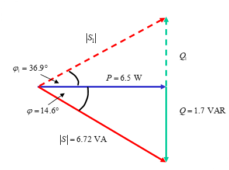

# AC Power

The overwhelming majority of electrial power is AC power, single phase power from the mains at 240V 50-60 Hz.

## RMS Power

AC voltages and currents alternate polarities so it is useful to define a DC equivalent, an average voltage/current. This is obtained by taking the root mean square of the sine wave:

$$
V_{RMS} = \frac{1}{\sqrt 2} V_p \qquad I_{RMS} = \frac{1}{\sqrt 2} I_p \qquad
$$

## Real Power

Assume a simple circuit with just an AC source and resistor. The time taken for voltage and current to complete one cycle is $T = 2\pi / \omega = 1 / f$. The power dissapated in a resistor over a full cycle is:

$$
P = \frac{1}{T} \int^{\frac{2\pi}{\omega}}_0 (VI) \, dt = \frac{\omega}{2\pi} \int^{\frac{2\pi}{\omega}}_0 (VI) \, dt = \frac{V_pI_p}{2} = V_{RMS} I_{RMS}
$$

- There is a real power dissipated by a resistor
  - Also called active, average or useful power.
- Measured in Watts
- Useful because it is converted to non-electrical forms like heat, light, or torque

## Reactive Power

Assume a simple circuit with just an AC source and an inductor:

$$
V = V_p \cos \omega t
$$

$$
I = \frac{1}{L} \int V \, dt = \frac{V_p \sin \omega t}{\omega L}
$$

The power dissipated in one cycle $T$ is:

$$
P = \frac{1}{T} \int^{\frac{2\pi}{\omega}}_0 (VI) \, dt = \frac{\omega}{2\pi} \int^{\frac{2\pi}{\omega}}_0 (V_p \cos \omega t)\left(\frac{V_p \sin \omega t}{\omega L}\right) \, dt = 0
$$

- The average power dissipated by an inductor is 0
- No useful work is done as there is no energy conversion
- Energy is exchanged between the magnetic field of the inductor and the power supply
- Instantaneous power is not zero
- Power consumed by a reactance is called **reactive power** and is measured in VARS (Volt-Amp Reactives)
- The same can be done for a capacitor, which exchanges energy between the power supply and it's electric field

## Complex Power

- In a pure resistance, the voltage and current are in phase, and all power is positive and is dissipated
- In a pure reactance, the voltage and current are out of phase by 90 degrees, and the average power over a cycle is 0
  - Instantaneous power, the power at any given point in time, is $P(t) = V(t) I(t)$
- Most AC circuits contain both real and reactive components
  - Resistors are real and dissipate active power in Watts
  - Capacitors/inductors are reactive and dissipate reactive power in VARS
- The power supply will delive both real and reactive power in proportion to the magnitudes of real and reactive components
- Total power delivered is the **complex power**, a vector sum of real and reactive power
  - Measured in Volt-Amps (VA)

Say an AC circuit applies a voltage $V_p \angle \theta_v$ accross an impedance $Z = R + j X$, causing a current of $I_p \angle \theta_i$ to flow. The impedance can be written:

$$
Z = |Z| \angle \phi \qquad |Z| = \sqrt{R^2 + X^2_L} \qquad \phi = \tan^{-1}\frac {X}{R}
$$

By Ohm's law:

$$
I_P \angle \theta_i = \frac{V_p \angle \theta_v}{ |Z|\angle \phi }
$$

$$
\phi = \theta_v - \theta_i
$$

$\phi$ is the load angle, which can be used to sketch a **load triangle** representing the complex power:

The load multiplied by the current square gives the power ($P=i^2R$):

$$
i^2_{rms}Z =i^2_{rms}R + ji^2_{rms}X_L
$$

$$
S = P + j Q
$$

$S$ is the **complex power**, comprised of the real and reactive power.

$$
S = V_{rms}I_{rms} = P + jQ = |S| \angle \phi \qquad |S| = \sqrt{P^2 + Q^2}
$$

$$
P = I_{rms} V_{rms} \cos \phi \qquad Q = I_{rms} V_{rms} \sin \phi
$$

$\cos \phi$ is the **power factor**. The closer it is to 1, the more real, useful, power is being dissapated in the system, which we want to maximise.

- If $\phi$ is positive, the power factor is lagging, meaning that the phase of the current is lagging the voltage
  - The load is inductive, as current lags voltage in an inductance
- If $\phi$ is negative, the power factor is leading, current leads voltage
  - The load is capacitive

## Power Factor Correction

- Electrical power sources have to produce both real and reactive power
- Real power is useful and does work, reactive power does not
  - Most reactive power is inductance in transmission lines
- We want to maximise the real power in the system, the ratio of which is given by the power factor $\cos\phi = P/S$
- Inductive loads cause a positive phase angle
- Capacitive loads cause a negative phase angle
- Additional capacitors or inductors can be added to a power system to make the power factor as close to 1 as possible

The power triangle below shoes a reduction in $\phi$ reducing the reactive power but keeping the same real power

### Example 1

Improve the power factor of the AC system shown to 0.98 lagging by adding a shunt reactance to the circuit

Reducing the system to a single impedance:

$$
Z_T = \frac{Z_C(R + Z_L)}{Z_C + R + Z_L} = \frac{\frac{-j}{\omega C} \times (R + j\omega L)}{\frac{-j}{\omega C} + R + j\omega L} = \frac{(-j6.37)(2+j1.57)}{-j6.37 + 2+j1.57} = 3.11 \angle 15.5 \degree \,\Omega = 3 + j0.83 \\
Z = R + jX = 3 + j0.83
$$

Calculating the complex power:

$$
I_{rms} = \frac{V}{Z} = \frac{25 \angle 0}{3.11 \angle 15.5} = 8.04 \angle -15.5
$$

$$
P = I^2 R = 194
$$

$$
Q = I^2 X = 56.63
$$

$$
|S| = \sqrt{P^2 + Q^2} = 202
$$

The current power triangle is therefore:

With a power factor of $\cos \left( \tan^{-1} \frac{56.63}{194} \right) = 0.961$. The new load angle we require is $\cos^{-1}(0.98) = 11.48$. This will require a capacitance in parallel with the current impedance, which will dissipate more reactive power $Q_C$ to give a new overall reactive power $Q_1$:

$$
Q_C = Q - Q_1 = 56.63 - P \tan 11.48 = 17.23
$$

$$
X_C = \frac{V^2}{Q_C} = \frac{25^2}{17.23} = 36.27
$$

$$
C = \frac{1}{2\pi f X_C} = \frac{1}{2 \pi \times 50 \times 36.27} = 8.775 \times 10^{-5}
$$

The shunt capacitance should have a value of $87.75 \mu F$ to increase the power factor to 0.98 lagging.

### Example 2

Add a component to this system to improve the power factor to 0.8 lagging.

The total impedance of the system:

$$
Z_T = 1 + \frac{j6(2-2j)}{j6 + 2 - 2j} = 4.6 - j1.2 = 4.75 \angle - 14.6
$$

$$
I = \frac{V}{Z} = \frac{8 \angle -40}{4.75 \angle -14.6} = 1.68 \angle - 25.4
$$

Calculating the power:

$$
S = |V_{rms}||I_{rms}| = \frac{8}{\sqrt{2}} \times \frac{1.68}{\sqrt 2} = 6.72
$$

$$
P = I^2 R = \frac{1.68^2}{2} \times 4.6 = 6.6
$$

$$
Q = I^2 X = \frac{1.68^2}{2} \times 1.2 = 1.7
$$

The current load angle is 14.6 lagging, so we need to add an inductance to make the system have a load angle of $\arccos 0.8 = 36.9$ leading:

The power dissipated by the new inductor:

$$
Q_L = Q + Q_1 = 1.7 + 6.5 \tan (36.9) = 6.58
$$

$$
X_L = \frac{V^2_{rms}}{Q_L} = \frac{8^2 / 2}{6.58} = 4.86
$$

$$
L = \frac{X_L}{\omega} = \frac{4.86}{2} = 2.43
$$

A shunt inductor of $2.43$ H is added to the system.

## Resonant Circuits

- In any RLC circuit, it is possible to select a frequency at which the impedance is purely real
- At this frequency the circuit will draw only real power
- All the reactance will cancel out
- In cases where frequency is controllable this is useful to improve efficiency
- To calculate:
  - Derive expression for the total circuit impedance
  - Split into real and imaginary parts
  - Derive a value of $\omega$ such that the imaginary part is 0

### Example

Find an expression for the resonant frequency:

$$
Z_1 =  R_1 + j\omega L
$$

$$
Z_2 = \frac{R_2}{1 + j \omega R_2 C} = \frac{R_2}{1 + \omega^2 R_2^2 C^2} - j \frac{\omega R^2_2C}{1 + \omega^2 R_2^2 C^2}
$$

$$
Z_T = R_1 + j\omega L + \frac{R_2}{1 + \omega^2 R_2^2 C^2} - j \frac{\omega R^2_2C}{1 + \omega^2 R_2^2 C^2}
$$

$$
\operatorname{re}(Z_T) = R_1 + \frac{R_2}{1 + \omega^2 R_2^2 C^2}
$$

$$
\operatorname{im}(Z_T) =\omega L -  \frac{\omega R^2_2C}{1 + \omega^2 R_2^2 C^2}
$$

We require that $\omega$ such that $\operatorname{im}(Z_T) = 0$:

$$
0 = \omega L -  \frac{\omega R^2_2C}{1 + \omega^2 R_2^2 C^2}
$$

$$
\omega = \sqrt{\frac{1}{LC} - \frac{1}{R^2_2 C^2}}
$$
