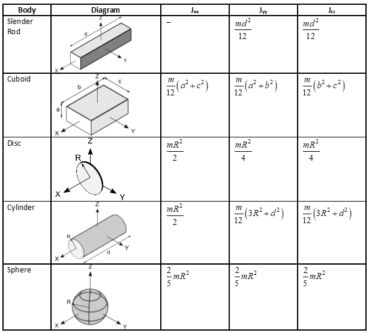
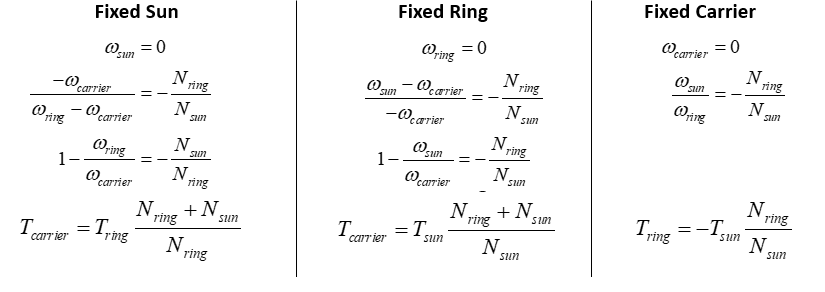
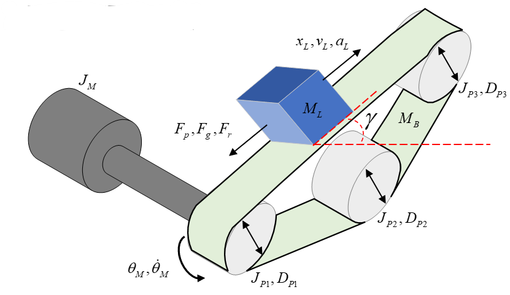

# Drive Systems

## Rotary Systems

- A rotary system is a system in which the load is rotating
- A direct drive system is one in which the motor is directly driving a load through a shaft
  - No other transmission system other than the shaft
  - All components have the same angular velocity
- Inertia is the rotary equivalent of mass
- Torque is the rotary equivalent of force.

System parameters:

- $J_M$ = motor inertia, kgm$^2$
- $J_L$ = load inertia, kgm$^2$
- $T_L$ = torque load, Nm
- $T_M$ = motor torque, Nm
- $B$ = shaft damping, Nm/rad/s
- $\dot \theta$ = angular velocity, rad/s

The system equation for how much torque the motor must provide is:

$$
(J_M + J_L) \ddot \theta = T_M - B \dot \theta - T_L\\
T_M = (J_M + J_L)\ddot \theta + B \dot\theta + T_L

$$

The system's total moment of inertia $(J_M + J_L)$ is the sum of the inertias in the transmission system and load referred to the motor shaft, plus the inertia of the motor.

- The inertias here can be summed as the have the same angular velocity
- The load will accelerate or decelerate depending on whether the applied torque is greater than or less than the required driving torque
- For an accelerating system, the motor must overcome thr torque load, frictional forces, and the total inertia of the system
- For a decelerating system, the frictional forces and torque load work to slow system down, but system inertia must still be overcome

### Example

Using the same system shown above with parameters:

- $J_M = 2\times 10^{-3}$
- $J_L = 1\times 10^{-2}$
- $T_L = 0.5$
- $B = 1 \times 10^{-2}$

$$
T_M = (J_M + J_L)\ddot \theta + B \dot\theta + T_L = (2\times 10^{-3} + 1\times 10^{-2})\ddot\theta + 10^{-2}\dot\theta + 0.5

$$

To rotate the load from stationary to 20 rad/s, at an acceleration of 10 rad/s$^2$, the torque delivered is:

- $T_M = 0.62$ Nm at $t=0$
- $T_M = 0.82$ Nm at $t=2$
- $T_M = 0.7$ Nm at $t > 2$
- It can be seen that for a given motion trajectory, the maximum torque load was when the system was still accelerating, but had reached its final velocity
- Decreasing the acceleration will reduce the maximum torque requirement, which will reduce load on the motor
- More torque is required to accelerate a load than decelerate it due to friction
- If there is a torque load remaining when the load is stationary, the motor must compensate for this

## Moments of Inertia

An object's moment of inertia is determined by it's shape, and the axis through which it rotates. For a point mass the moment of inertia $J= mr^2$, where $m$ is the mass and $r$ the perpendicular distance from the center of mass to the axis. Infinite infinitesimally small masses can be considered to calculate the moment of inertia of an entire body through integration.

Fortunately, this is rarely needed as the inertias of common shapes through all 3 axes are given:

For rotation about an axis other than one through the centre of gravity, the parallel axis theorem can be used. The parallel axis theorem states that the moment of inertia about any axis $J$ is equal to the moment of inertia about an parallel axis through the centre of gravity $J_G$, plus the mass of the body $m$ times the square distance between the two axes $d^2$:

$$
J = J_G + md^2

$$

### Example 1

The body shown is modelled as two 30kg spheres with radii 0.1m, connected with a slender rod of length 1m with weight 10kg. The whole body rotates about the $z$ axis, shown. Calculate the total inertia.

First the moment of inertia of the rod about the $z$ axis:

$$
J_{r,z} = \frac{1}{12}m_rd_r^2 = \frac{10}{12} = \frac{5}{6}

$$

The moment of inertia of the spheres requires the parallel axis theorem:

$$
J_{z,s} = \frac{2}{5}m_sR_s^2 + m_s d^2 = \frac{2}{5}(30)(0.1)^2 + (30)(0.6)^2  = 10.92

$$

Total inertia:

$$
J_{z,t} = 2J_{z,s} + J_{r,z} = \frac{5}{6} + 2 \times 10.92 = 22.67

$$

### Example 2

Derive an equation for motor torque in the system below

- $J_M = 2 \times 10^-3$
- $J_L = 10^{-2}$
- $J_S = 10^{-3}$
- $T_L = 0.5 $
- $B = 10^{-2}$
- Rod length $l_r=0.5$
- Rod mass $m_r = 0.2$
- Encoder radius $r_e = 0.1$
- Encoder length $l_e = 0.05$
- Encoder mass $m_e = 0.1$
- Shaft radius $r_s = 0.15$

Inertia of encoder:

$$
J_e = \frac{m_er^2_e}{2} = \frac{0.1 \times 0.1^2}{2} = 5 \times 10^{-4}

$$

Inertia of rod using the parallel axis theorem, with the axis through it's centre of mass halfway up it's length parallel to the shaft:

$$
J_r = J_G + md^2 = \frac{m_rl_r^2}{12} + m_r (r_s + \frac{l_r}{2})^2 = \frac{0.2 \times 0.5 ^2}{12} + 0.2(0.15 + \frac{0.5}{2})^2 = 3 \times 10^{-2}

$$

The total inertia:

$$
J_T = J_M + J_L + J_S + J_r + J_r = 4.95 \times 10^{-2}

$$

Deriving the equation for motor torque and then substituting in:

$$
T_m = J\ddot\theta + B\dot\theta + T_L = (4.95 \times 10^{-2})\ddot\theta + (10^{-2})\dot\theta + 0.5

$$

## Geared Rotary Systems

Connecting a load to a motor via a gearbox allows a motor to drive higher torque loads, at the expense of reducing the angular velocity (or vice versa). Analysis of such systems is more complex as there are different velocities involved. Systems can be reduced to an equivalent direct drive system by referring torques accross the gearbox.

- Assuming a gearbox is 100% efficient, input and output power $P = T\omega$ are the same
- Angular velocity is decreased and torque increased by a factor of $N$
  - If $N <1$, the inverse happens
- The gear ratio $N$ is defined as the number of teeth on output gear $N_2$ over the number of teeth on the input gear $N_1$
  - $N = N_2/N_1$
- The sign of the output is determined by the structure of the gearbox, two gears will rotate in opposite directions
  - Three gears in chain will rotate in the same direction

$$
T_{\text{out}} = \pm N T_{\text{in}} \qquad \ddot\theta_{\text{out}} = \pm \frac{\ddot\theta_{\text{in}}}{N} \qquad \dot\theta_{\text{out}} = \pm \frac{\dot\theta_{\text{in}}}{N}

$$

In general, terms reflected across a gear system are:

$$
J_{\text{ref}} = \frac{J}{N^2} \qquad B_{\text{ref}} = \frac{B}{N^2} \qquad T_{\text{ref}} = \frac{T}{N}

$$

### Example 1

A geared rotary system is shown below. Derive an equation for the torque delivered by the motor

- $J_M = 2 \times 10^-3$
- $J_L = 10^{-2}$
- $T_L = 0.5 $
- $B_1 = 10^{-2}$
- $B_2 = 10^{-3}$
- $N_1 = 5$
- $N_2 = 20$

Total inertia is the motor inertia plus the load inertia reflected across the gearbox

$$
J_{t} = J_M + \frac{J_L}{N^2} = 2 \times 10^-3 + \frac{10^{-2}}{10^2} = 2.1 \times 10^{-3}

$$

Reflecting the damping and torque load too:

$$
B_{t} = B_1 + \frac{B_2}{N^2} = 10^{-3} + \frac{10^{-2}}{10^2} = 1.1 \times 10^{-3}

$$

$$
T_{Lr} = \frac{T_L}{N} = \frac{0.5}{10} = 5 \times 10^{-2}

$$

Final equation:

$$
T_m = J\ddot\theta + B\dot\theta + T_L  = (2.1 \times 10^{-3})\ddot\theta + (1.1 \times 10^{-3})\dot\theta

$$

### Gear Ratios

The chosen gear ratio affects the behaviour of the system, so the gear ratio is an important design choice. Minimising the peak torque requirement of the motor is important and can be done through the gear ratio.

In the example above, the peak torque when accelerating to 20 rad/s at 10 rad/s$^2$ is 0.48 Nm. This is still less than direct drive, but there is an optimal gear ratio that minimises the strain on the motor. Through differentiation, this is found to be:

$$
N^{*} = \frac{J_L}{J_M}

$$

The minimum torque in a geared assembly **with no torque load** is achieved when the **reflected load inertia is equal to the motor inertia**. There are a few reasons why this may not be achevied, however:

- The $J_M$ term also must include additional components such as encoders, couplings, etc, each of which require energy input which is not then available to the load
- The gears also have an inertia which represents a loss factor as torque is required to turn these
- Off the shelf gears come in finite configurations so there may not be available components which match the theoretical optimum

Gear ratios may also be optimised to reduce the angular velocity and power of the motor, which may be a more desirable outcome. In practice, either acceleration or torque will be optimised for, or a compromise between the two must be made.

### Example 2

For the geared system with a torque load shown below, find the gear ratio that minimises the torque delivered by the motor

- $J_L = 3 \times 10^{-1}$
- $J_M = 2.4 \times 10^{-4}$
- $\dot\theta_{L\text{max}} = 25$
- $t_{\text{acc}} = 0.1$
- $T_L = 100$

The motor torque is the acceleration times total inertia, plus referred torque load

$$
T_M = \ddot\theta_L N \left(J_M + \frac{J_L}{N^2}\right) + \frac{T_L}{N}

$$

Rearranging for acceleration:

$$
\ddot\theta_L = \frac{T_M - T_L/N}{N\left(J_M + \frac{J_L}{N^2}\right)}

$$

The addition of a constant torque load changes the optimal gear ratio, which is now given by:

$$
\frac{\partial T_M}{\partial N} = \frac{\partial}{\partial N}\left( \ddot\theta_L N \left(J_M + \frac{J_L}{N^2}\right) + \frac{T_L}{N}\right) = 0

$$

$$
N^* = \sqrt{\frac{\ddot\theta_L J_L + T_L}{\ddot\theta_L J_M}}

$$

**This is the optimal gear ratio for a geared rotary system with a constant torque load**

$$
\ddot\theta_L = \frac{\dot\theta_{L\text{max}}}{t_{\text{acc}}} = \frac{25}{0.1} = 250

$$

$$
N* = \sqrt{\frac{250 \times 3 \times 10^{-1} +  100}{250 \times 2.4 \times 10^-4}} = 54

$$

$$
T^*_M = \left(J_M + \frac{J_L}{(N^*)^2}\right) + \frac{T_L}{N^*} = \left(2.4 \times 10^{-4} + \frac{3 \times 10^{-1}}{54^2}\right) + \frac{100}{54} = 6.48

$$

## Torque Loads

There are 4 main types of torque loads:

- Windage torque $T_w$
  - Motor is driving a component that moves fluid such as a propeller in water, or a fan
  - Torque load is proportional to square of the speed of the motion
    - $T_w = k \ddot\theta^2$
  - Can be useful, such as a fan
  - Can be considered a loss, such as a motor doing work to move air when it should be rotating a shaft
- Electromagnetic torque
  - Exists in motors because that's how motors work
  - If the same machine is being driven mechanically to generate electricity, ie in a generator, electromagnetic torque must be overcome
  - $K_i = J\ddot\theta + B\theta + T_L$ is the EM torque generated from input electrical energy
- Resistive torque
  - Any mechanical resistance to the torque, such as overcoming gravity by lifting a mass with a pulley
  - Any resistive force seen by the motor as torque
- Frictional torque
  - Any two moving surfaces in contact
  - Two models of friction
  - Coulomb friction
  - Constant independent of velocity
    - Coefficient $\mu_c$ multiplied by the sign of the velocity such that it always resists motion
    - $T_c = \mu_c \operatorname{sign}(\dot\theta)$
  - Viscous friction
    - Coefficient multiplied by velocity
    - $T_v = \mu_v \dot\theta$
  - Both models summed to give a more accurate frictional model
  - Values of constants can be found experimentally

## Motion Profiles

Most rotary and linear systems can be categorised as either:

- Incremental Motion
  - Repetitive motion between two positions
  - Time and distance are important
  - Velocity is secondary
  - For example, pick and place
  - A conveyor belt that has stop/start behaviour
- Constant Motion
  - Velocity and distance are more important
  - A machining operation such as CNC milling
  - A conveyor belt that reaches a fixed velocity and keeps going

There are four types of motion profiles:

- Triangular
- Trapezoidal (the only examinable one)
- Cosine
- Polynomial

They are defined by:

- Acceleration time $t_{\text{acc}}$
- The time spent at constant velocity, slew time $t_{s}$
- Deceleration time $t_{\text{dec}}$
- Total motoring time $t_M$

The beginning and ends of the time are dentoed $t_a$ and $t_b$, where $t_b$ and $t_c$ are the beginning and end of the slew time.

Additionally, $k$ is a value whch is defined as the fraction of the total runtime for which velocity is constant:

$$
k = \frac{t_s}{t_M} = \frac{t_M - t_acc - t_dec}{t_M}
$$

### Trapezoidal Motion

We want to define the acceleration, velocity, and position in the three distinct time periods: accelerating $[t_a,t_b]$ , constant velocity $(t_b,t_c]$, and decelerating $(t_c,t_d]$.

$$
\theta(t) =
\begin{cases}
\frac{1}{2} \alpha t^2 & t \in [t_a,t_b] \\
\frac{1}{2} \alpha t_b^2 + \alpha t_b (t-t_b) & t \in (t_b,t_c] \\
\frac{1}{2} \alpha t_b^2 + \alpha t_b (t_c - t_b) + \alpha t_b (t - t_c) + \alpha t_c (t-t_c) - \frac{1}{2} \alpha (t^2 - t^2_c) & t \in (t_c, t_d]
\end{cases}
$$

$$
\dot\theta(t) =
\begin{cases}
\alpha t & t \in [t_a,t_b] \\
\alpha t_b & t \in (t_b,t_c] \\
\alpha t_b - \alpha(t-t_c) & t \in (t_c, t_d]
\end{cases}
$$

$$
\ddot\theta(t) =
\begin{cases}
\alpha & t \in [t_a,t_b] \\
0 & t \in (t_b,t_c] \\
-\alpha & t \in (t_c, t_d]
\end{cases}
$$

We can also define the time periods with respect to $k$:

$$
t_a = 0
$$

$$
t_b = t_a + \frac{1}{2}(t_M - kt_M)  = t_{acc}
$$

$$
t_c = t_b + kt_M
$$

$$
t_c = t_c + t_b = t_M
$$

And the max velocity/acceleration:

$$
\dot\theta_{max} = \frac{2L}{(1+k)t_M}
$$

$$
\ddot\theta_{max} = \pm \left(\frac{4}{1-k^2}\right)\left(\frac{L}{t^2_M}\right) = \pm \alpha
$$

## Gearboxes

Rotary transmission systems (gearboxes) used multiple gears compounded together with intermediate shafts

- Driven gears are rotated by another gear
- Driver gears are rotated by a shaft
- Used where higher gear ratios are needed

The gear ratio for compound gears like this:

- Gears 2,4,6 are driven gears
- Gears 1,3,5 are driver gears

$$
N = \frac{\omega_i}{\omega_o} = \frac{\text{product of teeth on driven gears}}{\text{product of teeth on driver gears}}

$$

### Worm and Wheel

A worm and wheel gearbox changes the axis of rotation and provides a high gear ratio

- The worm drives the wheel
  - Wheel cannot drive worm
- The **lead** is the distance the worm moves forward in one revolution
  - $L = N_1 p_a$
  - $N$ is teeth on worm, $p_a$ is axial pitch in meters
- The axial pitch is the distance between each thread on the worm gear
- A worm with one tooth is single start, two teeth double start, three teeth triple start
- Gear ratio $N$ is wheel teeth / worm teeth
- To drive the gearbox backwards, $\tan \lambda < \mu$
  - $\mu$ is coefficient of friction
  - $\lambda$ is angle formed by the triangle between the length of the worm $L$ , and $\pi d_w$
    - $d_w$ is diameter of the worm gear
- In most applications $\tan \lambda >> \mu$, so cannot be drive backwards

### Planetary Gearbox

A planetary gearbox is a co-axial gearbox, used in high-torque low-speed applications. It is cheap, compact, and efficient.

- Four main components
  - Sun gear in the centre connected to one shaft
  - Carrier connected to another shaft
    - That fidget spinner-looking bit in the picture
  - Outer ring
  - Multiple planet gears connected to the carrier
- Relationship between input and output torque depends on which components are fixed in place

$$
\frac{\omega_{sun} - \omega_{carrier}}{\omega_{ring} - \omega_{carrier}} = - \frac{N_{ring}}{N_{sun}} = \frac{\text{teeth on ring}}{\text{teeth on sun}}

$$

One of these velocities will always be zero, so the relationships are given below between velocities and torques for different fixed components

### Choosing a Gearbox

An appropriate gearbox should be chosen based on velocities and torques in the system:

- Max intermittent and continuous velocities
- Max intermittent and continuous torques
- Gear ratio
- Radial and axial loads

Equivalent torque $T_{equiv}$ is found based upon the motion profile and average torques:

- $\bar T$ is average torque in a time period
- $\bar \omega$ is average velocity in a time period
- $x$ is a constant depending upon the gear construction, usually between 0.3 and 10
  - Always use 5 here

$$
T_{equiv} = x \sqrt{\frac{\bar \omega_{acc} t_{acc} \bar T^x_{acc} +  \omega_{s} t_{s} \bar T^x_{s} + \bar \omega_{dec} t_{dec} \bar T^x_{dec}}{\bar \omega_{acc} t_{acc} +  \omega_{s} t_{s}+ \bar \omega_{dec} t_{dec}}}

$$

Mean velocity is also required:

$$
\omega_{avg} = \frac{\bar \omega_{acc} t_{acc} +  \omega_{s} t_{s}+ \bar \omega_{dec} t_{dec}}{t_{acc} + t_{s} + t_{dec}}

$$

The selection process for an appropriate gearbox is as follows:

- Choose a gearbox whose maximum continuous torque (rated torque) is larger that $T_{equiv}$
- Ensure max intermittent torque is frater than max torque load (torque at end of t\_{acc})
- Divide the max gearbox speed by $\omega_s$ to determine maximum possible gear ratio
- Select a standard gear ratio $N$ below this value
- Input mean velocity is $N \times \omega_{avg}$
- Input peak velocity is $N \times \omega_s$
- If either of these exceed gearbox velocity ratings, select a lower gear ratio and try again

## Rotary to Linear Motion

### Belt and Pulley

Transfers rotary motion across a distance

The rotational position, velocity, and acceleration of the motor and load are related by the relative diameters of the pulleys

- $N = \frac{D_{PL}}{D_{PM}}$
- $\theta_M = N\theta_L$
- $\dot\theta_M = N \dot\theta_L$
- $\ddot\theta_M = N\ddot\theta_L$

The total intertia of the torque load is the intertia of the motor, pullets, belt, and load, all referred to the motor

- $J_T = J_M + J_{PM} + J_{PL \to M} + J_{B \to M} + J_{L \to M}$
- $J_{PL \to M} = J_{PL}\times \frac{1}{N^2}$
- $J_{B \to M} = M_B\times \frac{D_{PM}^2}{N^2}$
- $J_{L \to M} = J_L\times \frac{1}{N^2}$

The torque load must also be referred across the belt and pully system using the equation

$$
T_{L \to M} = T_L \frac{1}{N}
$$

The total torque the motor must provide for the belt and pully system shown is:

$$
T_M = \left( J_M + J_{PM} + J_{PL} \times \frac{1}{N^2} + M_B \times \frac{D_{PM}^2}{N^2} + J_L\times \frac{1}{N^2} \right) \ddot\theta_M + \left(B_M + B_L \frac{1}{N^2} \right) \dot\theta_M + \frac{T_L}{N}
$$

### Lead and Screw

- The screw is rotated by the motor, which makes the nut move along the thread of the screw
- The distance the nut moves in one rotation is the **lead** $L$
- The **pitch** is the distance between two adjacent threads
- The **starts** is the number of independent threads in a screw, typically 1-3
- $L = starts \times pitch$
- The relationship between rotary velocity of the screw and linear velocity of the nut is $\omega = V/L$

The diagram below shows a lead and screw subject to three forces

- Push-pull $F_P$
- Gravity $F_g = M_L g \sin \gamma$
- Frition $F_f = \mu M_L g \cos \gamma $

The forces must be referred to the motor as a torque, which is done using the lead

$$
T_M = \left(J_M + J_S + M_L \left(\frac{L}{2\pi}\right)\right)\ddot\theta + \frac{L}{2\pi}(F_P + F_g + F_f)
$$

The equation above is written using lead in m/rev. Lead is sometimes given in m/rad, and the conversion is given as:

$$
1 \frac{m}{rev} = \frac{1}{2\pi} \frac{m}{rad}
$$

### Conveyor Belt

The position, velocity, and acceleration of the motor and the load can be related using the following formulae:

$$
\theta_M = \frac{x_L}{D_{P1}/2} \quad \dot\theta_M = \frac{v_L}{D_{P1}/2} \quad \ddot\theta_M = \frac{a_L}{D_{P1}/2}
$$

The inertia of each of the pulleys depends on their relative diameters, so the total intertia referred to each motor is it's own inertia, plus the intertia of each pulley, plus the load:

$$
J_T = J_M + J_{P1} + J_{P2} \left(\frac{D_{P1}}{D_{P2}}\right)^2 + J_{P3} \left(\frac{D_{P1}}{D_{P3}}\right)^2 + J_{L \to M}
$$

$$
J_{L \to M} = (M_B + M_L) \left( \frac{D_{P1}}{2} \right)
$$

The forces from the load must be referred to the motor as a torque, which is done using the diameter of the pulley the motor is connected to also:

$$
T_{L \to M} = (F_P + F_g + F_f) \frac{D_{P1}}{2}
$$

### Rack and Pinion

The equations for position, velocity, acceleration,inertia, and torque are literally all the same as for a conveyor what more do u want me to say

## Transmission Efficiency and RMS Torque

- No gearboxes have 100% efficiency
- Efficiency modifies torque, not velocity
- $P_{in} = T_{in}\dot\theta_{in}$
- $P_{out} = (\eta T_{out})\dot\theta_{out}$

RMS torque is a useful metric of a system to inform the choice of motor used in design. Assuming a trapezoidal motion profile:

$$
T_{RMS} = \sqrt{\frac{\frac{1}{2}(T^2_{M,acc} + T^2_{P, acc})t_{acc} + T^2_{P,s} t_s + \frac{1}{2}(T^2_{M,dec} + T^2_{P, dec})t_{dec}}{t_M}}
$$
