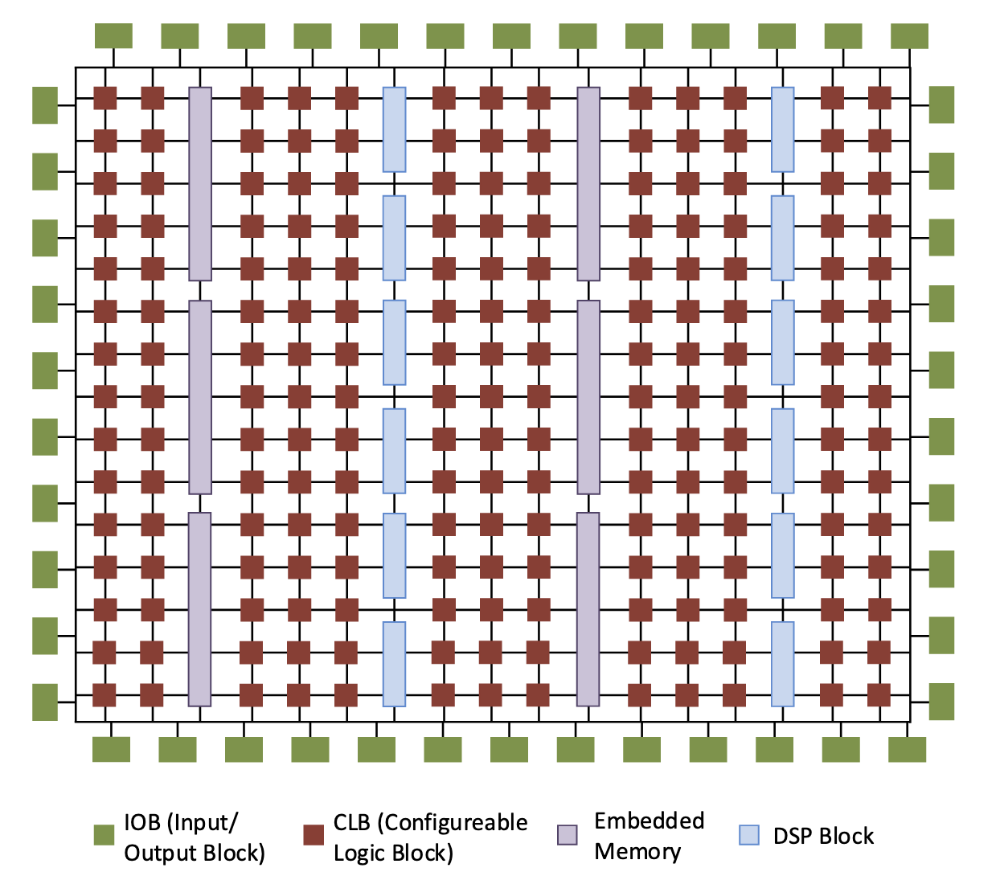

# FPGA Architecture

Anything written in HDL will probably eventually end up as a real circuit that the mapping tool has to generate from basic components.

- In ASICs, CMOS is the most common technology, however:
  - Fabrication is complex and expensive
  - Designs are inflexible
  - High-start up costs
- FPGAs are more attractive because they are cheaper and more flexible
- ASICs can be cheaper for large volumes however, so there is a cost tradeoff

Understanding FPGA architecture gives us a better understanding of the mapping process to make our circuits easier to map, and to make most efficient use of FPGA resources. There are primarily four distinct types of resources on an FPGA:

- **Flexible logic**: basic configurable blocks to implement combinational logic, coupled with clocked elements to enable synchronous logic and pipelining
- **Flexible routing**: signigicant chip area dedicated to wires and switch boxes that enable connections between all components
- **Flexible I/O**: multi-standard interfacing to external pins, with a range of speed capabilities
- **Embedded hard modules**: an number of different resources optimised for speed and area, including DSPs and memories

## Logic Blocks

- Logic blocks do most of the computation on FPGAs
- Made up of basic elements called Configurable Logic Blocks (CLBs), which consist of:
  - A LUT to implement combinational functions
  - Some arithmetic logic
  - Flip-flops
- LUTs and flip-flops can be used together or independently
- Most FPGAs are built using SRAM technology
  - An n-input LUT is just a $2^n-1$ x 1-bit memory
  - The truth table for the function is stored in the LUT
  - When an input pattern is applied, the bit at the corresponding location is the output
- The propagation delay through a LUT is independent of the function it computes
- LUTs can be broken down for smaller functions or combined for larger functions
- LUTs are grouped together in groups of 4 to form a slice
  - Slices also contain clocked elements, ALUs, etc
  - Multiple slices form CLBs
- LUTs can also be used as mini-memories to form **distributed RAM**
- Each 6-input LUT can also implement a 32-bit shift register, without using the flip-flops in the slice

## Routing

- There is a large grid of wires throughout the FPGA
- Connection boxes allow different elements to connect to this network
- Switch boxes allow tracks to connect to each other
- Place & route tools work out how to most efficiently make these connections
- Routing is a key factor in the performance of a design
  - Longer wires = higher latency
  - Dedicated wires between blocks exist and are faster and save the general routing for other uses
  - The individual bits of multi-bit wide signals may take different routes
- As architectures evolve, connectivity keeps improving
  - A mix of wire lengths helps improve performance

## I/O

A key feature of FPGAs is highly flexible I/O.

- Individual groups of pins can be interfaced according to different standards
- High end FPGAs include high-speed serial interfaces
  - Support for 10GigE, SATA, PCIe
  - IP blocks included to configure these
- On modern FPGAs, rates of over 32 Gb/s can be achieved

## Block Memory

LUTs can implement very small memories, but hard blocks of synchronous memories are also included as block RAMs.

- 36Kb, and can be split into two 18Kb blocks
- Can run at well over 500MHz
- Support different sizes and configurations
- All the features of a high-end memory system

## DSP

FPGAs excel in Digital Signal Processing applications, so modern FPGAs include hard DSP blocks.

- Usable for any multiply/add/accumulate operations
- Highly parallel dataflow arrangement
- Much faster than LUTs

DSP blocks are highly configurable

- Configurable number of pipeline stages
- Dynamically configurable ALU function
- Dynamically configurable bypass for pre-adder and multiplier
- Can cascade signals for combining DSP blocks

Synthesis and mapping tools work out how best to utilise all the resources most efficiently, but Verilog should always be written to optimise for and take advantage of the target architecture.
