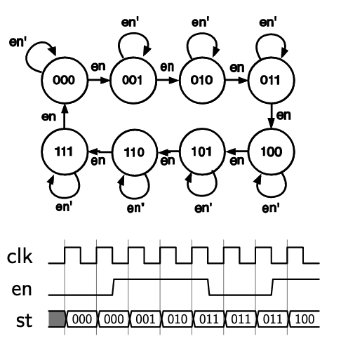
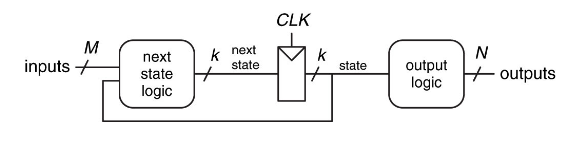
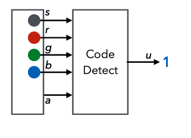
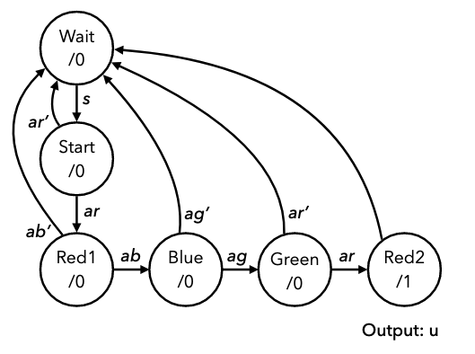
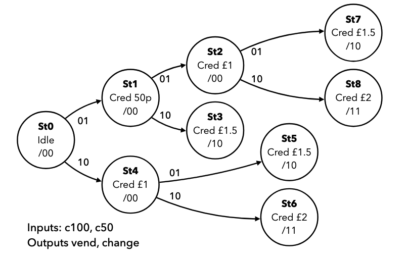
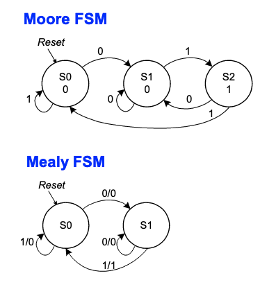

# Finite State Machines

Take a binary counter as an example, the output of which is a sequence of numbers, increasing by one each step. The behaviour is described in terms of a register and an incrementer circuit. This is fairly easy to reason about as a state machine:

- At each point in time the system is in a **state** that determines what the output is (the contents of the register)
- On each **transition**, the state changes (counter increments)

This is a state machine. A finite state machine describes a system using a finite number of states, and associated transitions. In synchronous design, an FSM is in one state for the duration of each clock cycle, and may transition on each rising edge depending upon the input.

**State transition diagrams** show the different states of a system and transitions between them. The diagram below shows a 3-bit binary counter with an enable signal. The state only transitions if enable is high.



The diagram consisits of nodes with states, edges between the states, and conditions that determine which transitions may occur. Diagrams may be simplified by only including conditions that result in state-changing transitions:


Consider an up/down counter:

- Two input signals, `dn` and `en`
- Counts up when `en` is high
- Counts up when `dn` is low, down when `dn` is high
- An input of 10 is `en` high and `dn` low
  - Other combinations with `en` = 0 result in no transition


States can be labelled with a more meaningful name, like in the example below


This FSM always produces 3 high cycles followed by one low, with the output `x` shown with the states. The FSM is off in the off state, and then on for the three on states.

The diagram below shows the same FSM, but it will only output the three-cycle pulse when an input signal `b` is set high. The output of each state is also shown in the circle next to the state: state/output. It is important to label diagrams with a proper legend to make it clear what means what.


State transition information can also be presented in tables, which is effectively a truth table for the next state based on the current state

| Current state | Input `b` | Next state | Output `x` |
| ------------- | --------- | ---------- | ---------- |
| off           | 0         | off        | 0          |
| off           | 1         | on1        | 0          |
| on1           | 0         | on2        | 1          |
| on1           | 1         | on2        | 1          |
| on2           | 0         | on3        | 1          |
| on2           | 1         | on3        | 1          |
| on3           | 0         | off        | 1          |
| on3           | 1         | off        | 1          |

Can see that the state only transitions from off to on1 when input `b` is asserted.

## Implementing FSM

Using a state table, you can build the combinational circuit that determines the next state from the current state. Connected with a register holding state, this forms the structure of a finite state machine.



Consider an example of designing a lock that only unlocks (output `u` = 1) when input buttons are pressed in a fixed sequence. Inputs are 4 buttons: start, red, blue, green, and an input that indicates if any button has been pressed.



We can capture the lock's behaviour in a state diagram:

- Start in an initial state
- If start is pressed then move to another state (input `s`)
- If a button is pressed and its red, move to next state (input `ar`)
  - So on for button presses
- If at any point a button is pressed but it is not the correct one, go back to the start again



However their is still another issue, where if someone holds down all the buttons the machine will just cycle through to the end state. This can be fixed by attaching conditions to check that other buttons aren't pressed to the states, ensuring the machine is robust with regards to the requirements.


Consider another example of a vending machine:

- Accepts only £1 and 50p coins
- Dispenses drink for £1.50 and change if necessary
- Two inputs, c100 for £1 coin, c50 for 50p coin
- Assume only ever 1 input high, and it tells us which coin is inserted
- Two outputs, vend to release a drink, and change to give 50p of change.



However, notice that some of these states are equivalent. These can be merged to reduce the number of states in the diagram, hence simplifying it


## Moore and Mealy Machines

In all the previous examples, outputs depend only on the state. These are called **Moore Machines**. The alternative is **Mealy Machines**, where the output depends on the state _and_ the current value of the inputs. Mealy machines are harder to design and analyze, but can be more compact. In mealy machines, the outputs cant be drawn in the state circles, so are added to the edges, as output is a function of state and input. The diagram below shows a previous example with the outputs on the arrows.


The two diagrams below show the same machine, that outputs a 1 when the last two inputs were 0 then 1.



## State Encoding & Transition Logic

In a synchronous design, we can assume that the FSM changes states only on rising edges, so we can put together a circuit like this, with a register and two sets of combinational logic:


- The state register stores the current state
  - To encode state, a binary value is assigned to each state
  - Need $\log_2 m$ bits for $m$ states
- Must also build the transition logic
  - This can be done from a state table, by replacing names with encodings

Consider the state transition logic for the example with the three-cycle pulse:

| Current state: `s[1:0]` | Input `b` | Next state: `ns[1:0]` | Output `x` |
| ----------------------- | --------- | --------------------- | ---------- |
| 00                      | 0         | 00                    | 0          |
| 00                      | 1         | 01                    | 0          |
| 01                      | 0         | 10                    | 1          |
| 01                      | 1         | 10                    | 1          |
| 10                      | 0         | 11                    | 1          |
| 10                      | 1         | 11                    | 1          |
| 11                      | 0         | 00                    | 1          |
| 11                      | 1         | 00                    | 1          |

This is now a binary truth table, from which we can determine equations for each output bit, mapping `s` to `ns`.

- `ns[1] = s[1] & !s[0] | !s[1] & s[0]`
- `ns[0] = !s[1] & !s[0] & b | s[1] & !s[0]`
- `x = s[1] | s[0]`

We can now create the two circuits and connect them into a state register. As a Verilog module, this requires a register, an `always` block, and combinational assignments connecting `s` and `ns`.

```verilog
module pulse3 (input clk, rst, b, output x);

reg [1:0] s;
wire [1:0] ns;

assign ns[1] = s[1] ^ s[0];
assign ns[0] = (!s[1] & !s[0] & b) | (s[1] & !s[0]);
assign x = s[1] | s[0];

always @ (posedge clk) begin
    if (rst) begin
        s <= 2'b00;
    end else begin
        s <= ns;
    end
end
endmodule
```

When implementing a finite state machine, always ensure the state register as a reset, and a defined initial state, otherwise the starting state of the FSM is unpredictable.

## More Complex FSM
