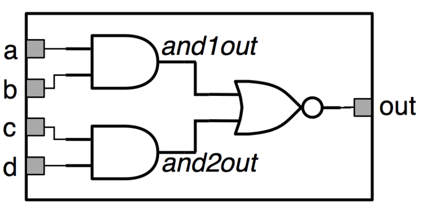

# Hardware Description Languages

So far, we've been restricted to describing circuits using equations and diagrams. Diagrams can convey structure, but behaviour can be hard to see and they become unweildy as they grow. HDLs are languages that describe hardware with a heirarchical design.

## History

- Programmaple Array Logic (PAL) allows for implementing a sum of products logic, building circuits by blowing fuses in certain places.
  - This got cumbersome for larger circuits
- PALASM developed as a language for mapping functional specifications to PAL
- Other languages developed around this concept, all with the idea of introducing more layers of abstraction
- There are two main languages in use today:
  - Verilog
  - VHDL
- Verilog started as a proprietary language, released to the public in 1991 and standardised in 1995 by the IEEE
  - Standard revised in 2001
- SystemVerilog is an extension of Verilog with more capabilities

## Verilog

- Verilog designs are broken down into modules
  - A module is an encapsulation of a unit of functionality
  - Good designs have appropriate levels of hierarchy
  - At each level, modules below are treated as black boxes
- **Modules** are declared using the `module` keyword and a list of ports
  - Can indicate the direction of the port as `input` or `output`
  - `endmodule` indicate the end of a module
- **Identifiers** are the names of modules, signals, ports, etc
  - Must start with a letter, and can't clash with keywords
- **Wires** can be declared within modules using the `wire` keyword
- Verilog is case sensitive, ignores whitespace and uses C-style `//comments`

## Structural Verilog Design

- Circuits are described structurally, by the structure of their constituent parts
- Primitives are included for all basic gates:
  - `and(x, a, b)` is equivalent to $x = a \cdot b$
  - `or(z, a, b, c, d)` is equivalent to $z = a + b + c + d$
  - Arguments are either ports or wires declared within module

Consider an and-or inverter: $out = ((a \cdot b) + (c \cdot d))'$



```verilog
module andorinv (input a, b, c, d, output out);
    wire and1out, and2out;
    and (and1out, a, b);
    and (and2out, c, d);
    nor(out, and1out, and2out);
endmodule
```

Note the two internal wires being used here. Gates can also be given identifiers, which helps with testing and readability:

```verilog
module andorinv (input a, b, c, d, output out);
    wire and1out, and2out;
    and g1(and1out, a, b);
    and g2(and2out, c, d);
    nor g3(out, and1out, and2out);
endmodule
```

The order of statements in Verilog is **irrelevant**, as each statement describes a piece of hardware, so there is no sequence of steps, unlike when writing procedural code.

It is also important to obey the usual connection rules for combinational circuits:

- Every node of the circuit is either an input, or connects to exactly one output terminal of a gate
- **The same wire cannot be driven by multiple gates**
- There can be no cycles in the circuit
