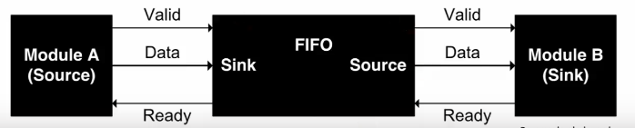

# Interfaces

- FPGAs come in a wide variety of packages with a range of IO capabilities
  - Most pins are reserved for specific uses such as voltage rails, clocks, configuration
  - Other pins are multifunction and used for I/O
- FPGAs can be incorporated into a system in many ways
  - Standalone, interfacing with peripherals and implementing all functionality
  - As a peer to a more general purpose processor, connected with high bandwith
  - As an accelerator on a high performance bus with shared memory
  - As a separate device that communicates with another processor over a lower throughput bus
- How to integerate and communicate with an FPGA depends on the application
  - Tightly coupled offers good bandwith but requires complex OS support
  - Treating it as an accelerator like a GPU allows it to work with the CPU
- New hybrid FPGA designs that include an embedded processor in the same fabric
  - Design built around a processor subsystem along with programmable logic
  - High throughput interconnect

## ADCs and DACs

- Interfacing with the real, analog world requires converting between analog and digital signals
- Analog-to-digital converters take an analog voltage level and convert it to a digital word
- Digital-to-analog converters take a digital word and convert to an analog voltage level
- ADCs and DACs are characterised by
  - Sampling rate: the number of values the device can create/consume per second
    - Determines the bandwidth based on the Nyquist theorem
  - Resolution: the number of different levels the device can differentiate between
  - Various fidelity characteristics such as linearity, noise, jitter
- In most cases, external ADCs/DACs are used with FPGAs
- Modern FPGAs include analog interfaces with internal ADCs
- Recent RFSoC radio-focused FPGAs include high speed ADCs and DACs on chip for integrated RF implementation

## GPIO

- Most FPGAs and microcontrollers have pins for general purpose I/O
- Each pin can be set as an input or output for a single bit
- The I/O voltage level is customisable for banks of GPIO pins
- Easiest way to get data in and out of an FPGA
- Support switching rates of over 200MHz
- The number of pins is generally limited and insufficient for creating large parallel data busses
  - Parallel I/O at high speeds requires detailed timing calibration and synchronisation

## PWM

- Method of switching an output on and off, where the ratio of on to off, the duty cycle, gives an average output level
- Used for changing motor speed, servo direction, LED brightness
- Works due to the inertial load of output devices
  - High speed switching means the overall output level is the average of the high and low periods
  - An LED flickering at 500Hz cannot be detected as flickering by a human eye
- Microcontrollers use timers to generate waveforms, and the number of timers available limits the number of PWM signals that can be generated
- FPGAs can create counters specifically for PWM

```Verilog
module pwmgen #(parameter CNTR_BITS=6) (input clk, rst,
                input [CNTR_BITS-1:0] duty,
                output pwm_out);

reg [CNTR_BITS-1:0] pwm_step;

always @ (posedge clk) begin
    if(rst)
        pwm_step <= 1'b0;
    else
        pwm_step <= pwm_step + 1'b1;
end

assign pwm_out = (duty >= pwm_step);

endmodule
```

- `CNTR_BITS` is the width of the counter
- `duty` is the number of steps that the pwm signal is high for
- `pwm_step` is the internal counter for each period

## UART

- Universal Asynchronous Receiver/Transmitter is the easier way of sending multi-bit data between two systems
  - Uses a single wire
  - Asynchronous because no clock line between
    - Baud rate is pre-agreed
- Data is transmitted in frames
  - Frames can vary in bit length, and sometimes include parity, start, and stop bits
- Shift register is used at either end for parallel-serial conversion
- Rx of one device connected to Tx of another
- Combination of start and stop bit means frames can always be detected
- Can be issues when clocks are not well matched, which limits possible throughput

## SPI

- Serial Peripheral Interface is a syncrhonous communication protocol that uses a shared clock at both transmitter and receiver
- Master initiates communication and generates clock
- Slave devices used as peripherals
  - A single master can communicate with multiple slaves on the same SPI bus
- Four signals required
  - `SCLK` - the clock generated by the master
  - `MISO` - master in slave out
    - Data input from slave to master
  - `MOSI`
    - Data output from master to slave
  - `SS` - slave select
    - Select which slave is being communicated with
    - Typically active low
- Each slave connected to a master requires a separate slave select line
- Master outputs the same clock for synchronous communication


- To initiate communication, the master sets the required slave select line low and sends a clock signal
- On each clock edge, the data can be sent bi-directionally on `MOSI` and `MISO`
- With multiple slaves, the `MISO` line must only be driven by one at a time so other slaves must be set to high impedance
- All devices must agree on clock frequency, polarity and phase
  - Specified in datasheets

## I2C

- Inter-intergrated circuit protocol is similar do SPI but has different features
  - Uses fewer wires due to lack of slave select lines
  - Uses addressing to allow a large number of devices to share the same lines
- Only two wires
  - SDA - serial data
  - SCL - serial clock
  - I2C clock is usually 100kHz
- All devices connected to an I2C bus act the same
- Whichever device is transmitting is the master for that communication
- Pull-up resistors keep each line high when no device is transmitting
- The device intending to communicate indicates this by pulling SDA low
- Data is then put onto the bus while SCL is low and sampled by slave devices during the rising edges
- Simpler signalling means more complicated data framing
  - Pulled low to start
  - 7 bit address sent
  - 1 bit for read/write mode
  - 1 bit slave ack
  - 8 bit word
  - 1 bit ack signal
  - Stop bit


- Takes 20 cycles to read a single byte
  - Vs 10 for SPI
- I2C is also half-duplex with a slow clock
- I2C used when there is less pins, SPI needed for higher data throughput

## High Speed Serial I/O

- Higher speed communication off ship is facilitated by special serial/desrial blocks
  - These take data words and serialise them, and transmit them over differential pairs of I/O pins
  - Controller by high-speed clocks
  - Can acheive up to 10s of gigabit speeds
- Differential signalling is used to improve noise resistance at high speed
  - Signal sent twice, one an inverted copy of the other
  - Balanced lines means better resistance to EM interference
- Clock information is encoded in data that is sent
- Data is encoded and scrambled to ensure sufficient transitions between 1s and 0s for receiver to be able to decode
- Extra bits are added to the data bits to ensure sufficient transitions and DC balance
- Specific schemes are specified by different physical layer standards
  - 8b/10b means 2 extra bits are added to each byte
- Effective data rate is determined from two specifications
  - Baud rate
  - Encoding scheme
  - For example, 2GHz with 8b/10b encoding gives 200MB/s
    - 20% of baud rate is encoding overhead
- Multiple lanes are used to improve throughput
  - PCIe gen 3 had a transfer rate of 8Gb/s per lane and uses a 128b/130b encoding
    - 985 MB/s
    - 1.5% encoding overhead
    - 16 lanes (PCIe3 x16) gives about 16GBps
- Use in many interfaces
  - Serial ATA for disks and storage
  - Gigabit ethernet
  - Used over a variety of physical media
- Circuits required to interface with high speed I/O have to be designed carefully to meet strict timing requirements
  - Vendors usually provide IP for this
  - IP blocks designed to specific standard for the interface they are meant to be using
- The simplest form of communicating between modules in design is the ready/valid handshaking
  - One module is a source, another a sink
  - The sink module asserts a ready signal when it is ready to consume data
  - The source module asserts a valid signal when it is outputting valid data
  - At any clock edge when both ready and valid are asserted, data is transferred on the data line
  - Can introduce a bottleneck
- In the source module, the pipeline can be halted when the sink is not ready, and resumed when ready
  - In the sink, ready is asserted when data is ready to be accepted
  - Such an interface allows a FIFO buffer to be inserted between modules to offer more isolation



### AXI4

- Most hybrid FPGAs include an ARM processor
- Advanced microcontroller bus architecture (AMBA) is an on-chip interconnect specification introduced by ARM for use in SoCs
- Defines a number of interfaces
  - AXI4 for high performance memory mapped communication
  - AXI4-Lite is a simpler interface for low throughput
  - AXI4-Stream is for high speed streaming data
- Reads are initiated by a master over the read address channel
  - The slave response with data over the read data channel
- Writes are similar, with address and control data being placed on the write address channel
  - The master sends data over the write data channel
  - Slave responds on the write response channel
- Read and write channels are separeatre, allowing bidirectional communication
- AXI4 supports bursts of up to 256 words
- Each master/slave pair can have a separate clock
- A system consists of multiple masters and slaves connected on an interconnect
- Most vendor IP is provided with an AXI4 interface to simplify integration into a design
  - Different interface specifications are shown in datasheets
