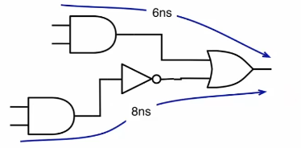
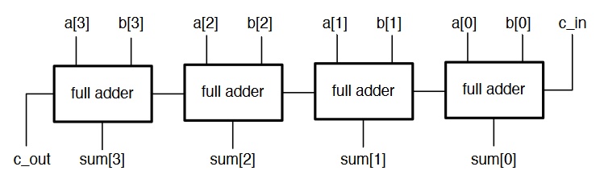
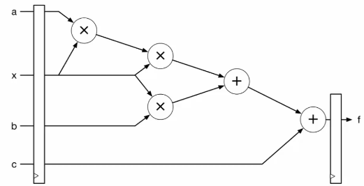

# Timing & Pipelining

So far, digital circuits have been considered as instantaneous, where outputs are available immediately. This is an approximation, as there are delays in the propagation of signals through circuits. There are delays associated with many elements in circuits, and these need to be analysed and take in to account.

- Every gate or circuit element exhibits a propagation delay
- A change in the input causes a change in output, but only after a propagation delay: $t_p$
- Delay arises due to low level factors to do with analog properties including capacitance
  - Figures usually supplied by manufacturers
  - Can differ for different gates
  - Can be affected by temperature
  - Low-to-high may differ from high-to-low delay
  - Also related to fanout
    - The number of inputs the output is driving
- This information can give the total propagation delay for a whole circuit
  - Sum up all delays along all paths from inputs to outputs
    - Worst case delay is the one we're concerned with
  - Different path delays can cause internal glitches
  - The worst case through a circuit is the deciding factor in how fast we can supply inputs

## Combinational Timing

It is typically easiest to trace through a circuit gate by gate, working out what the delay would be at each step. The gate delay can be indicated on timing diagrams, but only when specifically interested in them. The diagram shows a circuit, along with it's timing diagram including propagation delay.

Attaching some numbers to the delays:

- $t_{pAND} = t_{pOR} = 3$ ns
- $t_{pINV} = 2$ ns
- $t_{pXOR} = 4$ ns

There are four inputs and one output in this circuit, so four possible paths. All paths have the same delay of 6ns.

Another example:

- The first two paths have a 6ns delay
- the second two paths also include an inverter, which adds another 2ns of delay for a total of 8ns

Looking again at the ripple adder, and assuming each gate has a unit delay:

- a,b to sum has 2 delays
- cin to sum has 1 delay
- a,b to cout has 3 delays
- cin to cout has 2 delays
- Worst case is 3 delays, so this is how long we must wait for signals to propagate fully

Uneven path delays mean there may be invalid intermediate values before outputs settle, called glitches. It is important to wait for all signals to propagate to avoid incorrect results in the circuit.

The total delay of an n-stage ripple adder is $4 + 2(n-2)$ gate delays:

- The 1st stage has 3 delays
- intermediate ripple stages have 2 delays
- The final stage will have 2 delays

Any combinational circuit element will have a delay, which can be determined from it's datasheet. Combining larger complex combinational elements must follow the same rules as combining gates. Consider the circuit to the right which computes $f = ax^2 + bx + c$:

- The longest path from input to output is through the 2 multipliers and 2 adders
- Assuming 4ns and 2ns delay respectively, the total worst case delay is 12ns

## Synchronous Timing

When composing large combinational circuits, the timing characteristics of each part must be considered to ensure that inputs and outputs are all timed correctly, analysing all paths. Any change to the circuit requires re-analysis of the timing behaviour. Sequential circuits are more complex to analyse.

- A synchronous system has a single clock that marks the timesteps when the new inputs are passed to sub-circuits
- At each rising edge, register outputs change
- Any combinational path must process this input, and have the result ready before the next clock cycle
- **The clock must be slow enough to accommodate the slowest path between two flip-flops**

- At the first clock edge, values emerge from the first set of registers and propagate through the circuit, taking 12ns
- After 12ns, the values at the combinational output are stable and correct
- At the next clock edge, this output is stored in the register, and a new set of values enter the combinational circuit
- The maximum frequency = 1/12ns = approx 83MHz
  - Or any slower clock will also work

When looking at a larger synchronous circuit:

- There will be a delay between any pair of registers
- The output of any register must have enough time to propagate through all the combinational logic to the next input
- The paths between all pairs of registers is considered, and the longest is selected as the **critical path**
  - The critical path determines the maximum clock frequency for the whole circuit

## Flip-Flop Timing

Recall how flip-flops are constructed, in a master/slave arrangement such that the master is active low and the slave active high, which traps data on the rising edge of the clock.

`int` represents the output of the master latch, and follows the input as long as `clk` is low. When `clk` is high the slave latch becomes transparent, passing through the trapped value.

The actual timing characteristics are a little more complex:

- There is a **clock-to-q** delay, which is the delay between the clock edge and output changing
- Any desired input must arrive and be stable for a portion of time before the rising edge: the **setup** time
- The input must be held for a short while after the rising edge: the **hold**time\*

- For a more accurate max clock period, this must be factored in
- Min clock period $T$ is given by $t_{cQ} + t_p + t_s < T$
- This does not factor in hold time
  - The previous register must not produce an output that can reach the next register's input before $t_h$ after the rising edge
  - As long as $t_{cQ} > t_h$, this cannot happen
    - $t_h$ is often 0 in modern devices

### Example

Assuming a gate delay of 1ns, $t_{cQ} = 0.6ns$, and $t_s = 0.4ns$, determine the max clock frequency for a 6 bit ripple adder.

- $n$ bit ripple adder has $4+2(n-2)$ gate delays
  - For 6 bits, delay is 12ns
- Require $T > t_{cQ} + t_p + t_s$
- $T > 13ns$
- $f_{max} = 1/13\text{ns} = 76.9 \text{MHz}$

## Synchronous Design

- When designing a circuit, we want to process large amounts of data
- Software programs used for data processing spend most of their time inside loops
  - eg processing an image means applying a filter which involved maths over each pixel of the frame
- Combinational circuits with no clocks become difficult to build as they increase in size
  - Difficult to keep track of the delay
  - A synchronous system gives a predictable, fixed rate of data movement so the system can be modelled more easily
- I/O typically supplies data at a regular rate
  - Sensors/ADCs
  - I/O Busses such as PCIe
  - Outputs read from a memory
- Building a data processing pipeline allows computation to be done quicker than a processor
  - Can exploit parallelism
  - Implement complex, custom datapaths
- Throughput is the number of input values that can be processed per unit time
  - Determines the real speed of the circuit
  - A fully synchronous circuit that can accept one set of inputs per cycle has a throughput of clock speed x amount of data per input
- Latency is the time between an input entering the system, and the computed output emerging from the system
  - Less critical as it is a fixed delay
- Generally, it is desirable to maximise throughput, even if this comes at a slight cost of latency
- The limiting factor in any circuit is combinational propagation delay
  - The largest chunk of combinational logic between any two registers determines the max frequency
  - Large chunks of logic can be broken down by adding another register in the middle
    - This increases latency, but allows the circuit to be clocked faster

## Pipelining Circuits

Recall the polynomial calculation circuit from earlier. If another register stage is added in the middle, we now have two sets of paths between three registers:

- The longest path between the first two register stages is through two multipliers: 8ns
- Longest path between second pair is 4ns
- Critical path is now 8ns, so can be clocked at 125MHz
  - Latency is now 2 clock cycles, 16ns
- Throughput has been increased

This can be broken down further to add yet another register stage:

- Critical path now 4ns, clock speed now 250MHz
- Latency now 3 cycles (12ns)
- Have increased throughput and decrease latency

It would be pointless to add another stage between the two final adders as the critical path would still be elsewhere. It is important to place register stages to balance delays between pairs.

As a general rule, clock frequency can be increased by splitting up combinational logic. This is **pipelineing**

- A heavily pipeline circuit has many pipeline stages to allow the clock to be as fast as possible
- Even if cycle latency increases, may actually still be faster due to increased clock
- Leads to more complex designs and increased resource usage

To add a pipeline stage to a circuit:

- Find the largest block of combinational logic
- Break all paths between the registers with a new pipeline stage
- Wherever the break crosses a signal, place a register
- Registers are drawn combined but each signal requires a separate register
- Some registers will do nothing but delay signals so they align correctly
- The widths of registers will depend on the signals going in/out of them

### Timing in FPGAs

- On FPGAs, logic is implemented in LUTs, so gate delays are not relevant
- A 6-input LUT can implement any function of 6 inputs
  - The propagation delay is the same no matter what function is implements
- If a function is too large for a single LUTs, it will be spread accross multiple, increasing delay
  - A single LUT in a Xilinx Virtex-6 is around 240ps
- Other FPGA resources have specified delays too
  - DSP blocks have a specific combinational delay
    - Registers can be enabled to decrease the critical path
- Total combinational delay in an FPGA is composed of
  - Logic delay: delay through LUTs, DSPs, etc
  - Routing delay: the delay through the routing fabric
- Synthesis and mapping tools will break logic into blocks, but pipelining is done as coded in verilog
- Place and route tools will minimise routing delay
  - Use numbers from datasheet to find critical paths
- FPGAs have many flip flops around the chip to allow deep pipelining
- Timing characteristics are given in datasheet
  - A slice register has clock-to-output delay, $T_{CKO}$, of around 0.4ns
  - Setup and hold times are around 0.4ns and 0.2ns, respectively
  - Specifics depend on which outputs are used
  - Slice multiplexers affects timing
