# Brief Notes + Equations
This is just a collection of notes for ES3C5 Signal Processing that I have found useful to have on hand and easily accessible.

The notes made by Adam (MO) cover everything so this is just intended to be an easy to search document.

Download [lecture notes here](https://moodle.warwick.ac.uk/mod/resource/view.php?id=1673561)

Use `./generateTables.sh ../src/es2c5/brief-notes.md ` in the scripts folder.

<equation-table>

| [Laplace Conversion](#laplace-conversion)                              |                   |
| ---------------------------------------------------------------------- | ----------------- |
| [Laplace Table](#laplace-table)                                        | Insert table here |
| [Finding Time Domain Output $y(t)$](#finding-time-domain-output-yt)    |                   |
| [Input as Delta Function $\delta(t)$](#input-as-delta-function-deltat) | $x(t)=\delta(t)$  |
| [Input as Step Function $u(t)$](#input-as-step-function-ut)            | $x(t)=u(t)$       |
| [LTI System Properties](#lti-system-properties)                        | LTI =             |

| [3 - Poles and Zeros](#3---poles-and-zeros)                                               |                                                                                                               |
| ----------------------------------------------------------------------------------------- | ------------------------------------------------------------------------------------------------------------- |
| [General Transfer Function as 2 polynomials](#general-transfer-function-as-2-polynomials) | $H (s) = \frac{b_0s^M + b_1s^{M-1} + \cdots + b_{M-1}s + b_M}{a_0s^N + a_1s^{N-1} + \cdots + a_{N-1}s + a_N}$ |
| [Factorised Transfer Function](#factorised-transfer-function)                             | $H (s) = K \frac{(s - z_1)(s - z_2) \cdots (s - z_M)}{(s - p_1)(s - p_2) \cdots (s - p_N)}$                   |
| [Real system as real](#real-system-as-real)                                               | $M \le N$                                                                                                     |
| [Zero Definition](#zero-definition)                                                       | Roots z of the numerator. When $s =$ any $z$, $H(s)=0$                                                        |
| [Pole Definition](#pole-definition)                                                       | Poles p of the denominator. When $s =$ any $p$, $H(s)$ approaches $\inf$                                      |
| [Transfer Function Gain](#transfer-function-gain)                                         | K is the overall transfer function gain. (Coefficient of $s^M$ and $s^N$ is 1.)                               |
| [Stable System](#stable-system)                                                           | A system is considered stable if its impulse response tends to zero or a finite ...                           |
| [Components to Response](#components-to-response)                                         | Real Components $\rArr$ Exponential Response $\vert$ Imaginary $\rArr$ angular f...                           |

| [4 - Analog Frequency Response](#4---analog-frequency-response)                                                                          |                                                                                                                                                                                           |
| ---------------------------------------------------------------------------------------------------------------------------------------- | ----------------------------------------------------------------------------------------------------------------------------------------------------------------------------------------- |
| [Frequency Response](#frequency-response)                                                                                                | Frequency response of a system = output in response to sinusoid input of unit ma...                                                                                                       |
| [Continuous Fourier Transform](#continuous-fourier-transform)                                                                            | $F(jw) = \int{}^{\infty}_{t=0} ,f(t) , e^{-j\omega{}t} , dt$                                                                                                                              |
| [Inverse Fourier Transform](#inverse-fourier-transform)                                                                                  | $f(t) = \frac{1}{2\pi} \int{}^{\infty}_{\omega{}=-\infty} , F(j\omega{}) , e^{j\omega{}t} , d\omega{}$                                                                                    |
| [Magnitude of Frequency Response (MFR) $\vert H(j\omega{})\vert$](#magnitude-of-frequency-response-mfr-vert-hjomegavert)                 | $\left \vert H(j\omega ) \right \vert = \left \vert K \right \vert \frac{\prod _{i=1}^{M} \left \vert j\omega -z_i \right \vert}{\prod _{i=1}^{N} \left \vert j\omega -p_i \right \vert}$ |
| [Phase Angle of Frequency Response (PAFR) $\angle H(j\omega)$ - $K > 0$](#phase-angle-of-frequency-response-pafr-angle-hjomega---k--0)   | $\angle H(j\omega) = \sum _{i=1}^{M}\angle(j\omega -z_i) - \sum _{i=1}^{N}\angle(j\omega -p_i)$                                                                                           |
| [Phase Angle of Frequency Response (PAFR) $\angle H(j\omega)$ - $K < 0$](#phase-angle-of-frequency-response-pafr-angle-hjomega---k--0-1) | $\angle H(j\omega) = \sum _{i=1}^{M}\angle(j\omega -z_i) - \sum _{i=1}^{N}\angle(j\omega -p_i) + \pi$                                                                                     |

| [5 - Analog Filter Design](#5---analog-filter-design)                                                                                       |                                                                                                                                      |
| ------------------------------------------------------------------------------------------------------------------------------------------- | ------------------------------------------------------------------------------------------------------------------------------------ |
| [Ideal Filters](#ideal-filters)                                                                                                             | Each ideal filter has unambiguous                                                                                                    |
| [Realisability](#realisability)                                                                                                             | System starts to respond to input before input is applied. Non-zero for $t<0$.                                                       |
| [Causality](#causality)                                                                                                                     | Output depends only on past and current inputs, not future inputs.                                                                   |
| [Realising Filters](#realising-filters)                                                                                                     | Realise as we seek smooth behaviour.                                                                                                 |
| [Gain $G_{dB}$ (linear $\rightarrow$ dB)](#gain-g_db-linear-rightarrow-db)                                                                  | $G_{dB} = 20 , log_{10}(G_{linear})$                                                                                                 |
| [Gain $G_{linear}$ (dB $\rightarrow$ linear)](#gain-g_linear-db-rightarrow-linear)                                                          | $G_{linear} = 10 ^{\frac{G_{dB}}{20}}$                                                                                               |
| [Transfer Function of Nth Order Butterworth Low Pass Filter](#transfer-function-of-nth-order-butterworth-low-pass-filter)                   | $H(s) = \frac{\omega_{c}^{N}}{\prod _{n=1}^{N}(s-p_n)}$                                                                              |
| [Frequency Response of common Low pass Butterworth filter](#frequency-response-of-common-low-pass-butterworth-filter)                       | $H(j\omega) = \frac{1}{sqrt{1 + (\frac{w}{w_c})^{2N}}}$                                                                              |
| [Normalised Frequency Response of common Low pass Butterworth filter](#normalised-frequency-response-of-common-low-pass-butterworth-filter) | $H(j\omega) = \frac{1}{sqrt{1 + w^{2N}}}$                                                                                            |
| [Minimum Order for Low Pass Butterworth](#minimum-order-for-low-pass-butterworth)                                                           | $N = \left \lceil \frac{log(\frac{10^{-\frac{G_s}{10}}-1}{10^{-\frac{G_p}{10}}-1})}{2,log(\frac{\omega_s}{\omega_p})} \right \rceil$ |
| [Low pass Butterworth Cut-off frequency $\omega_c$ (Pass)](#low-pass-butterworth-cut-off-frequency-omega_c-pass)                            | $\omega_c = \frac{\omega_p}{(10^{-\frac{G_p}{10}}-1)^\frac{1}{2N}}$                                                                  |
| [Low pass Butterworth Cut-off frequency $\omega_c$ (Stop)](#low-pass-butterworth-cut-off-frequency-omega_c-stop)                            | $\omega_c = \frac{\omega_s}{(10^{-\frac{G_s}{10}}-1)^\frac{1}{2N}}$                                                                  |

| [6 - Periodic Analogue Functions](#6---periodic-analogue-functions)                                                                         |                                                                                                     |
| ------------------------------------------------------------------------------------------------------------------------------------------- | --------------------------------------------------------------------------------------------------- |
| [Exponential Representation from  Trigonometric representation](#exponential-representation-from--trigonometric-representation)             | $e^{jx} = \cos x + j\sin x$                                                                         |
| [Trigonometric from exponential - Real (cos)](#trigonometric-from-exponential---real-cos)                                                   | $\cos x = Re{e^{jx}} = \frac{e^{jx} + e^{-jx}}{2}$                                                  |
| [Trigonometric from exponential - Imaginary (cos)](#trigonometric-from-exponential---imaginary-cos)                                         | $\sin x = Im{e^{jx}} = \frac{e^{jx} + e^{-jx}}{2j}$                                                 |
| [Fourier Series](#fourier-series)                                                                                                           | $x(t) = \sum_{k=-\infty}^{\infty}X_ke^{jk\omega_0t}$                                                |
| [Fourier Coefficients](#fourier-coefficients)                                                                                               | $X_k = \frac{1}{T_0} \int_{T_0}x(t)e^{-jk\omega_0t}dt$                                              |
| [Fourier Series of Periodic Square Wave (Example)](#fourier-series-of-periodic-square-wave-example)                                         | $x(t) = \sum_{k=-\infty }^{\infty} \frac{A\tau}{T_0} sinc(k\omega_0\frac{\tau}{2}) e^{jk\omega_0t}$ |
| [Output of LTI system from Signal with multiple frequency components](#output-of-lti-system-from-signal-with-multiple-frequency-components) | $y(t) = \sum_{k=-\infty }^{\infty} H(jk\omega_0) X_k e^{jk\omega_0t}$                               |
| [Filtering Periodic Signal (Example 6.2)](#filtering-periodic-signal-example-62)                                                            | See example 6.2 below...                                                                            |

| [7 - Computing with Analogue Signals](#7---computing-with-analogue-signals) |     |
| --------------------------------------------------------------------------- | --- |

| [8 - Signal Conversion between Analog and Digital](#8---signal-conversion-between-analog-and-digital) |                                                                                     |
| ----------------------------------------------------------------------------------------------------- | ----------------------------------------------------------------------------------- |
| [Digital Signal Processing Workflow](#digital-signal-processing-workflow)                             | See diagram:                                                                        |
| [Sampling](#sampling)                                                                                 | Convert signal from continuous-time to discrete-time. Record amplitude of the an... |
| [Oversample](#oversample)                                                                             | Sample too often, use more complexity, wasting energy                               |
| [Undersample](#undersample)                                                                           | Not sampling often enough, get                                                      |
| [Aliasing](#aliasing)                                                                                 | Multiple signals of different frequencies yield the same data when sampled.         |
| [Nyquist Rate](#nyquist-rate)                                                                         | $\omega_s = 2\omega_B$                                                              |
| [Quantisation](#quantisation)                                                                         | The mapping of                                                                      |
| [Data Interpolation](#data-interpolation)                                                             | Convert digital signal back to analogue domain, reconstruct continous signal fro... |
| [Hold Circuit](#hold-circuit)                                                                         | Simplest interpolation in a DAC, where amplitude of continuous-time signal match... |
| [Resolution](#resolution)                                                                             | $\frac{1}{2^W} \times 100%$                                                         |
| [Dynamic range](#dynamic-range)                                                                       | $,20log_{10}2^W \approx 6WdB$                                                       |

| [9 - Z-Transforms and LSI Systems](#9---z-transforms-and-lsi-systems)                                 |                                                                                                                                  |
| ----------------------------------------------------------------------------------------------------- | -------------------------------------------------------------------------------------------------------------------------------- |
| [LSI Rules](#lsi-rules)                                                                               | Linear Shift-Invariant                                                                                                           |
| [Common Components of LSI Systems](#common-components-of-lsi-systems)                                 | For digital systems, only need 3 types of LSI circuit components.                                                                |
| [Discrete Time Impulse Function](#discrete-time-impulse-function)                                     | Impulse response is very similar in digital domain, as it is the system output w...                                              |
| [Impulse Response Sequence](#impulse-response-sequence)                                               | $h[n] = \mathcal{F}{\delta[n]}$                                                                                                  |
| [LSI Output](#lsi-output)                                                                             | $y[n] = \sum _{k=-\infty}^{\infty}x[k]h[n-k] = x[n] *h[n] = h[n]*x[n]$                                                           |
| [Z-Transform](#z-transform)                                                                           | $\mathcal{Z}{f[n]} = F(z) = \sum _{k=0}^{\infty}f[k]z^{-k}$                                                                      |
| [Z-Transform Examples](#z-transform-examples)                                                         | Simple examples...                                                                                                               |
| [Binomial Theorem for Inverse Z-Transform](#binomial-theorem-for-inverse-z-transform)                 | $\sum _{n=0}^{\infty} a^n = \frac{1}{1-a}$                                                                                       |
| [Z-Transform Properties](#z-transform-properties)                                                     | Linearity, Time Shifting and Convolution                                                                                         |
| [Sample Pairs](#sample-pairs)                                                                         | See example                                                                                                                      |
| [Z-Transform of Output Signal](#z-transform-of-output-signal)                                         | $Y(z) = \mathcal{Z}{y[n]} = \mathcal{Z}{x[n]*h[n]} = \mathcal{Z}{x[n]}\mathcal{Z}{h[n]} = X(z)H(z) \Rightarrow Y(z) = X(z) H(z)$ |
| [Finding time-domain output $y[n]$ of an LSI System](#finding-time-domain-output-yn-of-an-lsi-system) | Transform, product, inverse.                                                                                                     |
| [Difference Equation](#difference-equation)                                                           | Time domain output $y[n]$ directly as a function of time-domain input $x[n]$ as ...                                              |
| [Z-Transform Table](#z-transform-table)                                                               | See table...                                                                                                                     |

| [10 - Stability of Digital Systems](#10---stability-of-digital-systems) |     |
| ----------------------------------------------------------------------- | --- |

| [11 - Digital Frequency Response](#11---digital-frequency-response) |     |
| ------------------------------------------------------------------- | --- |

| [12 - Filter Difference equations and Impulse responses](#12---filter-difference-equations-and-impulse-responses) |     |
| ----------------------------------------------------------------------------------------------------------------- | --- |

| [13 - FIR Digital Filter Design](#13---fir-digital-filter-design) |     |
| ----------------------------------------------------------------- | --- |

| [14 - Discrete fourier transform and FFT](#14---discrete-fourier-transform-and-fft) |     |
| ----------------------------------------------------------------------------------- | --- |

| [15 - Computing Digital Signals](#15---computing-digital-signals) |     |
| ----------------------------------------------------------------- | --- |

| [16 - Digital vs Analogue Recap](#16---digital-vs-analogue-recap) |     |
| ----------------------------------------------------------------- | --- |

| [17 - Probabilities and random signals](#17---probabilities-and-random-signals) |     |
| ------------------------------------------------------------------------------- | --- |

| [18 - Signal estimation](#18---signal-estimation) |     |
| ------------------------------------------------- | --- |

| [19 - Correlation and Power spectral density](#19---correlation-and-power-spectral-density) |     |
| ------------------------------------------------------------------------------------------- | --- |

| [20 - Image Processing](#20---image-processing) |     |
| ----------------------------------------------- | --- |

</equation-table>

# Part 1 - Analogue Signals and Systems

## Laplace Conversion

### Laplace Table
Insert table here

### Finding Time Domain Output $y(t)$
1. Transform $x(t)$ and $h(t)$ into Laplace domain
2. Find product $Y(s) = X(s)H(s)$
3. Take inverse Laplace transform $Y(s)$

### Input as Delta Function $\delta(t)$
$$x(t)=\delta(t)$$
Then $X(s) = 1$, so $Y(s) = H(s)$.

### Input as Step Function $u(t)$
$$x(t)=u(t)$$
Then $X(s) = \frac{1}{s}$, so $Y(s) = \frac{H(s)}{s}$.

### LTI System Properties
LTI = **Linear Time Invariant**.
- LTI systems are *linear*. Given system $F\{\}$ and signals $x_1(t)$, $x_2(t)$ etc
  - LIT is *Additive*:
    $$ F\{x_1(t) + x_2(t)\} = F \{x_1(t)\} + F\{x_2(t)\} $$
  - LTI is scalable (or *homogeneous*)
    $$ F\{\alpha{}x_1(t)\} = \alpha{}F\{x_1(t)\}$$
- LTI is *time-invariant*, ie, if output $y(t) = F\{x_1(t)\}$ then:
    - $$ y (t - \tau) = F\{x_1(t - \tau)\} $$

## 3 - Poles and Zeros

### General Transfer Function as 2 polynomials
$$ H (s) = \frac{b_0s^M + b_1s^{M-1} + \cdots + b_{M-1}s + b_M}{a_0s^N + a_1s^{N-1} + \cdots + a_{N-1}s + a_N} $$

### Factorised Transfer Function
$$ H (s) = K \frac{(s - z_1)(s - z_2) \cdots (s - z_M)}{(s - p_1)(s - p_2) \cdots (s - p_N)}$$
Is factorised and rewrite as a ratio of products:
$$ 
= K \frac{\prod{}^M_{t=1}s-z_t}{\prod{}^N_{t=1}s-p_t}
$$
### Real system as real
$$ M \le N $$
Where the numerator i a $M$th order polynomial with coefficients $b$s and the denominator is a $N$th order polynomial with coefficients $a$s. For a system to be real, the order of the numerator polynomial must be no greater than the order of the denominator polynomial, ie: $M \le N$.

### Zero Definition
Roots z of the numerator. When $s =$ any $z$, $H(s)=0$ 

### Pole Definition
Poles p of the denominator. When $s =$ any $p$, $H(s)$ approaches $\inf$ 

### Transfer Function Gain
K is the overall transfer function gain. (Coefficient of $s^M$ and $s^N$ is 1.)

### Stable System
A system is considered stable if its impulse response tends to zero or a finite value in the time domain. 

Requires all real components to be negative (on the left hand side of the complex s-plane of a pole-zero plot (left if the imaginary s axis)).

### Components to Response
Real Components $\rArr$ Exponential Response $\vert$ Imaginary $\rArr$ angular frequency of oscillating responses.

## 4 - Analog Frequency Response

### Frequency Response
Frequency response of a system = output in response to sinusoid input of unit magnitude and specified frequency, $\omega{}$. Response is measured as **magnitude** and **phase angle**.

### Continuous Fourier Transform
$$  F(jw) = \int{}^{\infty}_{t=0} \,f(t) \, e^{-j\omega{}t} \, dt$$

Laplace transform evaluated on the imaginary s-axis at some frequency $s = j\omega{}$.

$\omega{}=$ radial frequency, $\frac{rad}{s}$

### Inverse Fourier Transform
$$  f(t) = \frac{1}{2\pi} \int{}^{\infty}_{\omega{}=-\infty} \, F(j\omega{}) \, e^{j\omega{}t} \, d\omega{}$$

### Magnitude of Frequency Response (MFR) $\vert H(j\omega{})\vert$ 
$$\left \vert H(j\omega ) \right \vert = \left \vert K \right \vert \frac{\prod _{i=1}^{M} \left \vert j\omega -z_i \right \vert}{\prod _{i=1}^{N} \left \vert j\omega -p_i \right \vert}$$

In words, the **magnitude** of the frequency response (MFR) $\vert H(j\omega{}) \bar$  is equal
to the **gain** multiplied by the **magnitudes** of the **vectors** corresponding to the **zeros**,
divided by the **magnitudes** of the vectors corresponding to the **poles**.

### Phase Angle of Frequency Response (PAFR) $\angle H(j\omega)$ - $K > 0$
$$ \angle H(j\omega) = \sum _{i=1}^{M}\angle(j\omega -z_i) - \sum _{i=1}^{N}\angle(j\omega -p_i) $$

### Phase Angle of Frequency Response (PAFR) $\angle H(j\omega)$ - $K < 0$
$$ \angle H(j\omega) = \sum _{i=1}^{M}\angle(j\omega -z_i) - \sum _{i=1}^{N}\angle(j\omega -p_i) + \pi$$

In words, the **phase angle** of the frequency response (**PAFR**) $\angle H(j\omega)$ is
equal to the **sum** of the **phases** of the vectors corresponding to the **zeros**, **minus** the
**sum** of the phases of the vectors correspond to the **poles**, plus $\pi$ if the gain is **negative**.

Each phase vector is measured from the **positive** real s-axis (or a line parallel to the
real s-axis if the pole or zero is not on the real s-axis).

## 5 - Analog Filter Design

### Ideal Filters
Each ideal filter has unambiguous **pass bands**, which are ranges of frequencies that pass through the system without distortion, and **stop bands**, which are ranges of frequencies that are rejected and do not pass through the system without significant loss of signal strength. The **transition** band between stop and pass bands in ideal filters has a size of 0; transitions occur at single frequencies.

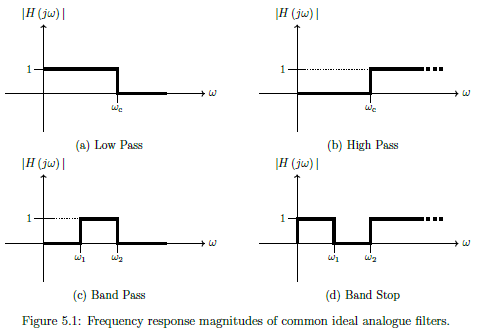

### Realisability
System starts to respond to input before input is applied. Non-zero for $t<0$.

### Causality
Output depends only on past and current inputs, not future inputs.

### Realising Filters
Realise as we seek smooth behaviour.

- Drop $h_i(t)$ for $t < 0$ ($h_i(t) u(t)$) 
  - Would not get suitable behaviour in frequency domain, as discarded 50% of system energy
- But can tolerate delays
  - So shift sinc to the right
  - Time domain shift = scaling by complex exponential in laplace
  - True in fourier transform, so delay in *time* maintains *magnitude* but changes *phase* of frequency response
- Truncate
  - As can't wait for infinity, so truncate impulse response. 
- 

### Gain $G_{dB}$ (linear $\rightarrow$ dB)
$$ G_{dB} = 20 \, log_{10}(G_{linear})$$

### Gain $G_{linear}$ (dB $\rightarrow$ linear)
$$ G_{linear} = 10 ^{\frac{G_{dB}}{20}}$$

### Transfer Function of Nth Order Butterworth Low Pass Filter
$$ H(s) = \frac{\omega_{c}^{N}}{\prod _{n=1}^{N}(s-p_n)} $$

Butterworth = Maximally flat in pass band (freq response magnitudes are flat as possible for given order)

- $p_n$ = nth pole
  -  = $j\omega{}_ce^{\frac{j\pi}{2N}(2n-1)}$
  -  = $-\omega{}_c\,sin(\frac{\pi(2n-1)}{2N}) + j\omega_c \, cos(\frac{\pi(2n-1)}{2N})$
  -  Form semi-circle to left of imaginary s-axis
-  $\omega{}_c$ = **half-power cut-off frequency**
   -  Frequency where filter gain is $G_{linear} = \frac{1}{\sqrt{2}}$ or $G_{dB} = - 3dB$

### Frequency Response of common Low pass Butterworth filter
$$ H(j\omega) = \frac{1}{\sqrt{1 + (\frac{w}{w_c})^{2N}}} $$

Increasing order improves approximation of ideal behaviour

### Normalised Frequency Response of common Low pass Butterworth filter
$$ H(j\omega) = \frac{1}{\sqrt{1 + w^{2N}}} $$

To convert *normalised frequency* form to *non-normalised* = multiply $\omega$ by the actual $\omega_c$ 

### Minimum Order for Low Pass Butterworth
$$N = \left \lceil \frac{log(\frac{10^{-\frac{G_s}{10}}-1}{10^{-\frac{G_p}{10}}-1})}{2\,log(\frac{\omega_s}{\omega_p})} \right \rceil$$

Round up as want to **over-satisfy** not **under-satisfy**

### Low pass Butterworth Cut-off frequency $\omega_c$ (Pass)
$$ \omega_c = \frac{\omega_p}{(10^{-\frac{G_p}{10}}-1)^\frac{1}{2N}} $$

Gain in dB
### Low pass Butterworth Cut-off frequency $\omega_c$ (Stop)
$$ \omega_c = \frac{\omega_s}{(10^{-\frac{G_s}{10}}-1)^\frac{1}{2N}}$$

Gain in dB

## 6 - Periodic Analogue Functions

### Exponential Representation from  Trigonometric representation
$$ e^{jx} = \cos x + j\sin x $$

### Trigonometric from exponential - Real (cos)
$$ \cos x = Re\{e^{jx}\} = \frac{e^{jx} + e^{-jx}}{2}$$

### Trigonometric from exponential - Imaginary (cos)
$$ \sin x = Im\{e^{jx}\} = \frac{e^{jx} + e^{-jx}}{2j}$$

### Fourier Series
$$ x(t) = \sum_{k=-\infty}^{\infty}X_ke^{jk\omega_0t} $$
Period signal = sum of complex exponentials.

Fundamental frequency $f_0$, such that all frequencies in signal are multiples of $f_0$.

Fundamental period $T_0 = 1/f_0$

$w_0 = 2\pi f_0 = 2\pi / T_0$

Fourier spectra **only** exist at **harmonic frequencies** (ie integer multiples of fundamental frequency)

### Fourier Coefficients
$$ X_k = \frac{1}{T_0} \int_{T_0}x(t)e^{-jk\omega_0t}dt$$

Important property of Fourier series is how is represents **real** signals $x(t)$.
- **Even** magnitude spectrum  $\rightarrow \vert X_k \vert = \vert X_{-k} \vert$
- **Odd** phase spectrum = $\rightarrow \angle X_k = -\angle X_{-k}$

### Fourier Series of Periodic Square Wave (Example)
$$ x(t) = \sum_{k=-\infty }^{\infty} \frac{A\tau}{T_0} sinc(k\omega_0\frac{\tau}{2}) e^{jk\omega_0t} $$

Where $X_k = \frac{A\tau}{T_0} sinc(k\omega_0\frac{\tau}{2})$

### Output of LTI system from Signal with multiple frequency components
$$ y(t) = \sum_{k=-\infty }^{\infty} H(jk\omega_0) X_k e^{jk\omega_0t} $$

Or in other words:

$$ Y_k = H(jk\omega_0)X_k$$

The output of an LTI system due to a signal with multiple frequency components can be found by superposition of the outputs due to the individual frequency components.
IE  system will change amplitude and phase of each frequency in the input.

### Filtering Periodic Signal (Example 6.2)
See example 6.2 below...

## 7 - Computing with Analogue Signals
***This topic isn't examined as it is MATLAB***

## 8 - Signal Conversion between Analog and Digital

### Digital Signal Processing Workflow

See diagram:

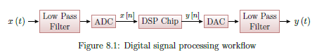

- Low pass filter applied to time-domain input signal $x(t)$ to limit frequencies
- An **analogue-to-digital converter** (ADC) samples and quantises the continuous time analogue signal to convert it to discrete time digital signal $x[n]$.
- Digital signal processing (DSP) performs operations required and generates output signal $y[n]$.
- A **digital-to-analogue converter** (DAC) uses hold operations to reconstruct an analogue signal from $y[n]$
- An output low pass filter removes high frequency components introduced by the DAC operation to give the final output $y(t)$.

### Sampling
Convert signal from continuous-time to discrete-time. Record amplitude of the analogue signal at specified times. 
Usually sampling period is fixed.

### Oversample
Sample too often, use more complexity, wasting energy

### Undersample
Not sampling often enough, get **aliasing** of our signal (multiple signals of different frequencies yield the same data when sampled.)

### Aliasing
Multiple signals of different frequencies yield the same data when sampled.

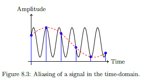

If we sample the **black** sinusoid at the times indicated with the **blue** marker, it could be mistaken for the red dashed sinusoid. This happens when *under-sampling*, and the lower signal is called the alias. The alias makes it **impossible** to recover the original data.

### Nyquist Rate
$$\omega_s = 2\omega_B$$

Minimum ant-aliasing sampling Frequency.

Frequencies above this $\omega_s \ge 2\omega_B$ remain *distinguishable*. 

### Quantisation
The mapping of **continuous** amplitude levels to a **binary** representation.

IE: $W$ bits then there are $2^W$ quantisation levels. ADC Word length $= W$.

Continuous amplitude levels are *approximated* to the nearest level (rounding). Resulting error between nearest level and actual level = **quantisation noise**

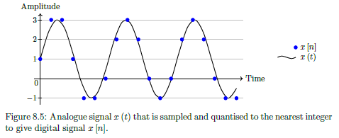

### Data Interpolation
Convert digital signal back to analogue domain, reconstruct continous signal from discrete time series of points.

### Hold Circuit
Simplest interpolation in a DAC, where amplitude of continuous-time signal matches that of the previous discrete time signal.

IE: *Hold* amplitude until the next discrete time value. Produces staircase like output.

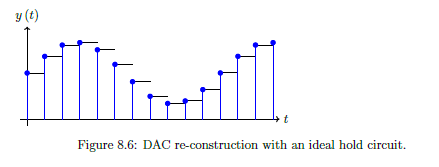

### Resolution
$$ \frac{1}{2^W} \times 100\% $$

Space between levels, often represented as a **percentage**.

For $W$-bit DAC, with uniform levels

### Dynamic range
$$ \,20log_{10}2^W \approx 6WdB$$

Range of signal amplitudes that a DAC can resolve between its smallest and largest (undistorted) values.

## 9 - Z-Transforms and LSI Systems

### LSI Rules
Linear Shift-Invariant

### Common Components of LSI Systems
For digital systems, only need 3 types of LSI circuit components.

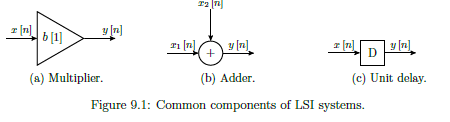

1. A multiplier **scales** the current input by a constant, i.e., $y [n] = b [1] x [n]$.
2. An adder outputs the **sum** of two or more inputs, e.g., $y [n] = x_1 [n] + x_2 [n]$.
3. A unit delay imposes a **delay** of one sample on the input, i.e, $y [n] = x [n - 1]$.

### Discrete Time Impulse Function
Impulse response is very similar in digital domain, as it is the system output when the input is an impulse.

### Impulse Response Sequence
$$ h[n] = \mathcal{F}\{\delta[n]\}$$

### LSI Output
$$y[n] = \sum _{k=-\infty}^{\infty}x[k]h[n-k] = x[n] *h[n] = h[n]*x[n]  $$

**Discrete Convolution** of input signal with the impulse response.

### Z-Transform
$$ \mathcal{Z}\{f[n]\} = F(z) = \sum _{k=0}^{\infty}f[k]z^{-k} $$

Converts discrete-time domain function $f[n]$ into complex domain function $F(z)$, in the z-domain
Assume $f[n]$ is causal, ie $f[n]= 0, \forall n < 0$

Discrete time equivalent to Laplace Transform. However can be written by *direct inspection* (as have summation instead of intergral). Inverse equally as simple.

### Z-Transform Examples
Simple examples...

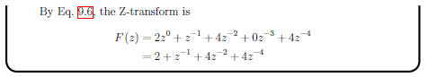

### Binomial Theorem for Inverse Z-Transform
$$ \sum _{n=0}^{\infty} a^n = \frac{1}{1-a}$$

Cannot always find inverse Z-tranform by immediate inspection, in particular if the Z-transform is written as a **ratio of polynomials of z**. Can use *Binomial theorem* to convert into single (sometimes infinite length) polynomial of $z$

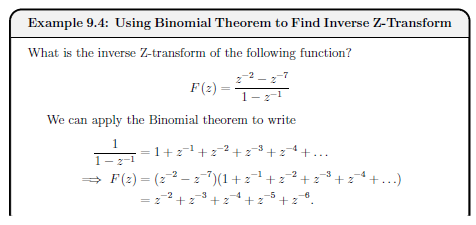

### Z-Transform Properties
Linearity, Time Shifting and Convolution

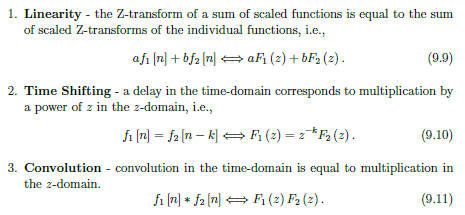

### Sample Pairs
See example

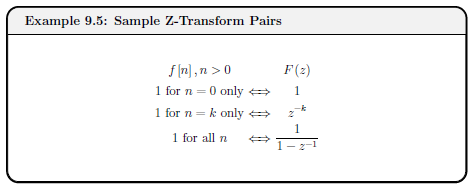

### Z-Transform of Output Signal
$$ Y(z) = \mathcal{Z}\{y[n]\} = \mathcal{Z}\{x[n]*h[n]\} = \mathcal{Z}\{x[n]\}\mathcal{Z}\{h[n]\} = X(z)H(z) \Rightarrow Y(z) = X(z) H(z)    $$

Where $H(z)$ = **Pulse Transfer Function** (as it is also the system output when the time-domain input is a unit impulse.) but by convention can refer to $H(z)$ as the **Transfer Function**

### Finding time-domain output $y[n]$ of an LSI System
Transform, product, inverse.

1. Transform $x[n]$ and $h[n]$ into z-domain
2. Find product $Y(z) = X(z)H(z)$ 
3. Taking the inverse Z-transform of $Y(z)$
   
### Difference Equation
Time domain output $y[n]$ directly as a function of time-domain input $x[n]$ as well as *previous* time-domain outputs $x[n-k]$ (ie can be feedback).

### Z-Transform Table
See table...

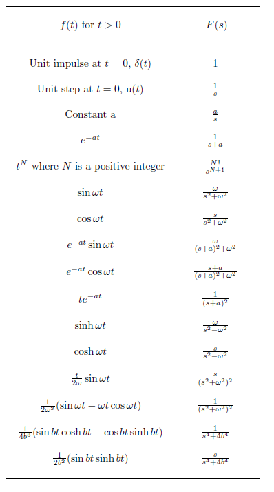

## 10 - Stability of Digital Systems

## 11 - Digital Frequency Response

## 12 - Filter Difference equations and Impulse responses

## 13 - FIR Digital Filter Design

## 14 - Discrete fourier transform and FFT

## 15 - Computing Digital Signals
***This topic isn't examined as it is MATLAB***

## 16 - Digital vs Analogue Recap

## 17 - Probabilities and random signals

## 18 - Signal estimation

## 19 - Correlation and Power spectral density

## 20 - Image Processing

