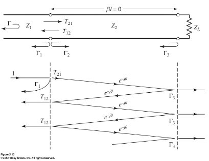
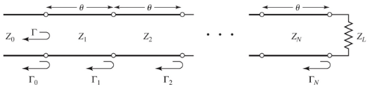

# Broadband Matching

Multi-section transformers can be used where a wider bandwith of matching is required than can be achieved by a single $\lambda / 4$ transformer.

## Small Reflections

To derive such a transformer, we start with the theory of small reflections, applied to a single-section transformer. The incident wave will partially reflect and partially transmit at the $Z_1/Z_2$ interface, which will then reflect at the load, and then reflect again at the boundary, and so on.

$$
\Gamma_1 = \frac{Z_2 -Z_1}{Z_2+Z_1} \qquad \Gamma_2 = -\Gamma_1 \qquad \Gamma_3 = \frac{Z_L - Z_2}{Z_L + Z_2}
$$

Summing the reflections/transmissions, the total reflection seen by the feedline is:

$$
\Gamma = \Gamma_1 + T_{12}T_{21}\Gamma_3 e^{-2j\theta} \sum^\infty_{n=0} \Gamma^n_2\Gamma_3^n e^{-2jn\theta}
$$

This is a geometric series, which sums to:

$$
\Gamma = \frac{\Gamma_1 + \Gamma_3 e^{-2j\theta}}{1 + \Gamma_1 \Gamma_3 e^{-2 j\theta}}
$$

## Multisection Transformer

Consider now a multisection transformer, which is just lots of small sections of transmission line of equal length

$$
\Gamma_0 = \frac{Z_1 -Z_0}{Z_1+Z_0} \qquad \Gamma_n = \frac{Z_{n+1} -Z_n}{Z_{n+1}+Z_n} \qquad \Gamma_N = \frac{Z_L -Z_N}{Z_L+Z_N}
$$

Making a few assumptions:

- Assume the differences between adjacent impedances are small
- Assume all $Z_n$ increase or decrease monotonically
- Assume $Z_L$ is real
  - $\Gamma_n$ will be real and of the same sign

The total reflection coefficient is therefore:

$$
\Gamma (\theta) = \Gamma_0 + \Gamma_1 e^{-2j \theta} + ... + \Gamma_N e{-2jN\theta}
$$

Any desired value of $\Gamma$ can be synthesised by suitably choosing $\Gamma_n$ and $N$.

## The Binomial Transformer

We show how to realise such a transformer with a maximally flat total reflection coefficient, a binomial transformer.

For an $N$-section transformer:

- Set the first $N-1$ derivatives of $|\Gamma(\theta)|$ to 0 at the center frequency $f_0$
  - Provided by a reflection coefficient of the form $\Gamma(\theta) = A(1 + e^{-2j\theta})^N$
  - Magnitude is then $|\Gamma(\theta)| = 2^N |A||\cos\theta|^N$
- To determine $A$, let $f \to 0$
  - $\theta = \beta \to 0$
  - Expression reduces to $\Gamma(0) = 2^N A = \frac{Z_L - Z_0}{Z_L + Z_0}$
  - All sections are of 0 electrical length as $f \to 0$
  - $A = 2^{-N}\frac{Z_L - Z_0}{Z_L + Z_0}$

$\Gamma(\theta) $ is expressed as a binomial series:

$$
\Gamma(\theta) = A(1 + e^{-2j\theta})^N = A \sum^N_{n=0} C^N_n e^{-2 jn \theta} \qquad \Gamma_n = A C^N_n
$$

Because we assume $\Gamma_n$ are all small, we can approximate the characteristic impedances as:

$$
\Gamma_n = \frac{Z_{n+1} -Z_n}{Z_{n+1}+Z_n} \approx \frac{1}{2} \ln \frac{Z_{n+1}}{Z_n}
$$

$$
Z_{n+1} \approx \exp \left(\ln Z_n + 2^{-N} C^N_n \ln \frac{Z_L}{Z_0}  \right)
$$

To find the bandwith of the binomial transformer, let $\Gamma_m$ be the maximum tolerated reflection coefficient over the passband.

$$
\Gamma_m = 2^N |A| \cos^N \theta_m
$$

$\theta_m < \pi/2$ is the lower edge of the passband. Therefore:

$$
\cos \theta_m = \frac{1}{2} \left(\frac{\Gamma_m}{|A|} \right)^{1/N}
$$

And the fractional bandwith:

$$
\frac{\Delta f}{f_0} = \frac{2 (f_0 - f_m)}{f_0} = 2 - \frac{4 \theta_m}{\pi}
$$
