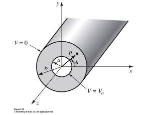

# Coaxial & Microstrip Lines

## Coaxial

- The coaxial line is a waveguide
- Unlike the rectangular waveguide, coax supports the TEM mode, as well as higher order modes
  - Field profiles for which can be found by solving the wave equations in cylindrical coordinates
- Using the cutoff frequency for the $TE_{11}$ mode, the monomode frequency can be obtained
  - The highest usable frequency before $TE_{11}$ mode starts to propagate
  - Cutoff wave number $k_c$ is approximated as $k_c = 2/(a+b)$
    - $a$, $b$ are the radii of inner and outer sheaths of cable
  - Cutoff frequency found as $k_c = 2\pi f_c / v$
    - $ v = c / \sqrt{\varepsilon_r}$
- Most common coax cables and connectors are 50 Ohm
  - Air-filled coax line is 77 Ohm
  - Max power capacity is at 30 Ohms
  - 50 Ohms is the tradeoff between the two
- 75 Ohms used in TV systems

## Microstrip Lines

- Microstrips are a conductor of length $W$ printed on a thin, grounded dielectric substance of thickness $d$ and relative permittivity $\varepsilon_r$
- If there were no dielectric substrate, then we'd have a two wire TEM line with $u_p = c$ and $\beta = k_0$.
  - We don't
  - The dielectric complicates the analysis
  - It's almost-TEM, kind of a hybrid
  - Some field lines are in the air region above the substrate, so no pure TEM wave
- Can approximate behaviour from quasi-static solutions
  - $u_p = c/\sqrt{\varepsilon_{eff}}$
  - $\beta = (\omega/c)\sqrt{\varepsilon_{eff}}$
  - $\varepsilon_{eff}$ is the effective dielectric constant of the microstrip
    - $1 < \varepsilon_{eff} < \varepsilon_r$

The effective dielectric constant can be interpreted as the dielectric constant of a homogenous medium that equivalently replaces the air and dielectric regions of the microstrip line

$$
\varepsilon_{eff} = \frac{\varepsilon_r +1 }{2 } + \frac{\varepsilon_r -1}{2} \frac{1}{\sqrt{1 + 12d/W}}
$$

The characteristic impedance can be calculated as:

$$
Z_0 =
\begin{cases}
\frac{60}{\sqrt{\varepsilon_{eff}}} \ln \left(\frac{8d}{W}+\frac{W}{4d}  \right)
&
\text{for } \frac{W}{d} \leq 1
\\\\
\frac{120 \pi}{\sqrt{\varepsilon_{eff}}(W/d + 1.393 + 0.667 \ln(W/d + 1.444)) },
&
\text{for } \frac{W}{d} \geq 1
\\
\end{cases}
$$

For a given $Z_0$ and $\varepsilon_{eff}$, we can also determine the ratio $W/d$

$$
\frac{W}{d} =
\begin{cases}
\frac{8 e^4}{e^{2A} - 2}
&
\text{for } \frac{W}{d} < 2
\\\\
\frac{2}{\pi} \left(  B -1 - \ln(2B-1) + \frac{\varepsilon_r -1}{2 \varepsilon_r} \left[ \ln(B-1) + 0.39 - \frac{0.61}{\varepsilon_r}\right]\right)
&
\text{for } \frac{W}{d} > 2
\\
\end{cases}
$$

$$
A = \frac{Z_0}{60} \sqrt{\frac{\varepsilon_r+1}{2}} + \frac{\varepsilon_r -1}{\varepsilon_r +1} \left(0.23 + \frac{0.11}{\varepsilon_r} \right)
\qquad
B = \frac{377 \pi}{2 Z_0 \sqrt{\varepsilon_r}}
$$

Again considering the microstrip as a quasi-TEM line, we can determine the attenuation due to dielectric loss $a_d$ and conductor loss $a_c$

$$
a_d = \frac{k_0 \varepsilon_r (\varepsilon_{eff}-1) \tan \delta}{2 \sqrt{\varepsilon_{eff}}(\varepsilon_r -1) }
\qquad
a_c = \frac{R_s}{Z_0 W}
$$

Where $R_s = \sqrt{\omega \mu_0 / 2 \sigma}$ is the surface resistivity of the conductor, and $\tan\delta$ the loss tangent of the dielectric. For most substrates, $a_c > a_d$.

### Waveguide Discontinuities

Transmission lines often include discontinuities to perform an electrical function. Usually, these can be represented as equivalent circuits for analysis and design. Some common microstrip discontinuities and their equivalent lumped element circuits are shown below.

## Striplines

A stripline is a planar transmission line used in microwave integrated circuits.

- Thin conducting strip of width $W$ between two wide conducting ground plates of separation $b$,
  - Between the ground plates is filled with dielectric
- Supports usual TEM mode
  - Can support higher-order modes, but can usually avoided by restricting spacing and geometry
