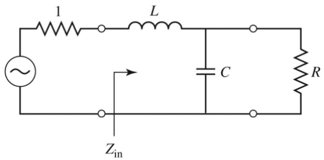
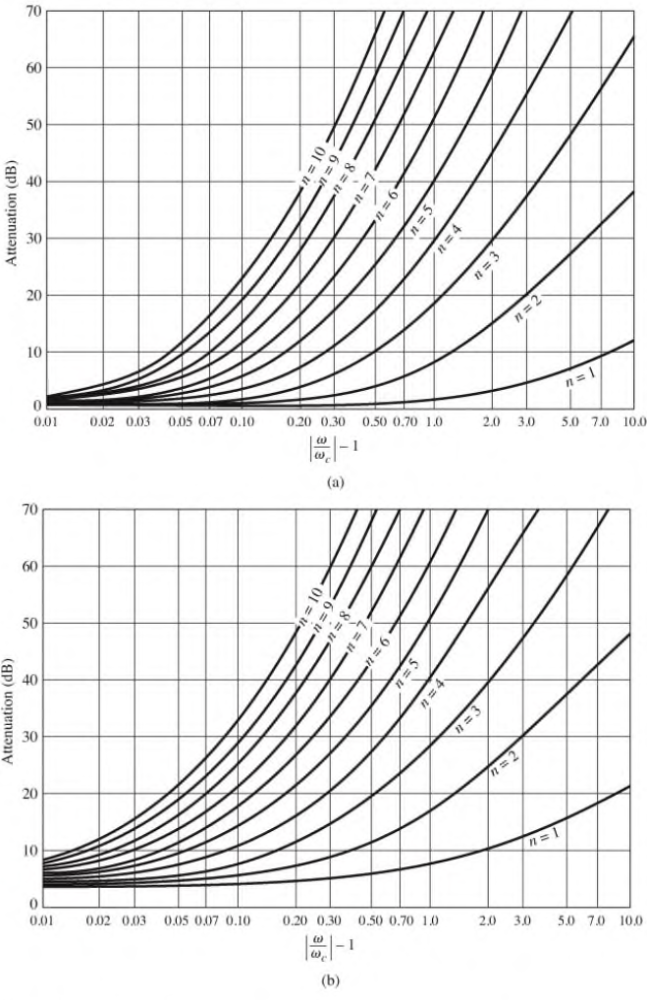
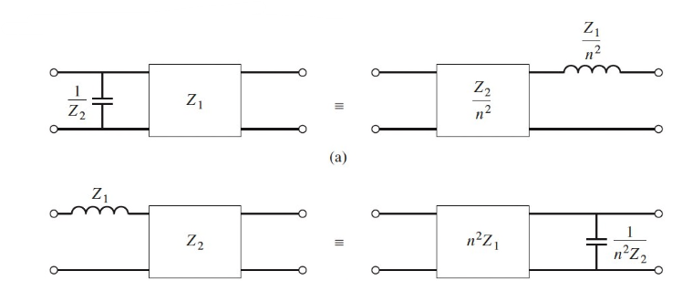

# Filters

Filters are two port networks used to control frequency response.

## Insertion Loss Method

We utilise the insertion loss method to design microwave filters.

We define a filter response by it's power loss ratio, the ratio of power available from the source to that delivered to the load.

$$
P_{LR} = \frac{P_{inc}}{P_{load}} = \frac{1}{1 - |\Gamma(\omega)|^2}
$$

The insertion loss (in dB) is then

$$
IL = 10 \log_{10} P_{LR}
$$

As $|\Gamma(\omega)|^2$ is an even function of $\omega$, it can be expressed as a polynomial in $\omega^2$:

$$
P_{LR} = 1 + \frac{M(\omega^2)}{N(\omega^2)}
$$

By choosing coefficients of $M$ and $N$, we can design filters with a specific frequency response.

### Maximally Flat Response

Also known as binomial or Butterworth response. For a given filter order, it provides the flattest response in the passband. For a low pass filter of order $N$ with cutoff frequency $\omega_c$:

$$
P_{LR} = 1+k^2 \left(\frac{\omega}{\omega_c}\right)^{2N}
$$

- At the cutoff frequency, the power loss ratio is $1+k^2$.
  - If this is chosen as the -3 dB point then $k=1$,
    - Usually the case
- The first $2N-1$ derivatives are zero at $\omega = 0$
- For $\omega \gg \omega_c$, the insertion loss increases at a rate of $20N$ dB/decade

### Equal Ripple Response

A Chebyshev polynomial $T_N(x)$ is used to specify the insertion loss:

$$
P_{LR} = 1+k^2T^2_N (\omega / \omega_c)
$$

- Results in a sharper cutoff
- Passband response will have ripples of amplitude $1+k^2$, as $T_N(x)$ oscillates between $\pm 1$ for $|x| \leq 1$
- $k^2$ determines the passband ripple level
- For large $x$, $T_N(x) \approx (2x)^{2N} / 2$
  - For $\omega \gg \omega_c$, the power loss ratio is $(k^2/4)(2\omega / \omega_c)^{2N}$
    - Increases at the same rate of $20 N$ dB per decade
- At any given $\omega$, the power loss ratio is $(2^{2N})/4$ greater than that of the binomial filter for $\omega \gg \omega_c$

### Linear Phase Response

A linear phase response in the passband is important where signal distortion is to be avoided. A sharp-cutoff response is generally incompatible with a good phase response. Linear phase response can be achieved by:

$$
\phi (\omega) = A \omega \left[ 1 + p \left(\frac{\omega}{\omega_c}\right)^{2N} \right]
$$

- $\phi (\omega)$ is the phase of the voltage transfer function of the filter
- $p$ is a constant

## Normalised Design

We can normalise impedance and frequency values to simplify the design of filters.

### Maximally Flat Response

Consider an LC circuit as shown below, with a source impedance of 1, a load impedance $R$, and a cutoff frequency normalised to 1. The desired power loss ratio will be $1+ \omega^4$ for $N=2$.

The power loss ratio of this filter can be derived from it's input impedance and reflection coefficient:

$$
P_{LR} = \frac{|Z_{in}+1|^2}{2(Z_{in} + Z^*_{in})} = 1 + \omega^4
$$

This equation solves to give $L = C = \sqrt{2}$, for the case $N=2$.

The same process can be repeated for different values of $N$ to give the element values for the ladder-type circuits show. The values are numbred from $g_0$ source impedance to $g_{N+1}$ load impedance for a filter with $N$ reactive elements alternating between series and shunt connections.

The graph shows attenuation vs normalised frequency for filter prototypes

### Equal Ripple Response

For Chebyshev polynomials, $T_N(0) = 0$ when $N$ is odd, and $T_N(0) = 0$ when even, so there are two cases for the power loss ratio depending on $N$. Considering the same LC circuit shown above, for even $N$ it can be shown that $R$ is not unity, so there will be an impedance mismatch if the load has a unity impedance, which can be corrected with a $\lambda/4$ transformer. For odd $N$ this is not an issue: it can be shown that $R=1$.

The tables for equal ripple responses depend on the passband ripple level.

### Scaling

In the prototype designs above, the source and load resistances are all unity. A source resistance of $R_0$ is obtained by multiplying all the impedances of the prototype design by $R_0$

$$
L' = R_0 L \qquad C' = C / R_0 \qquad R'_s = R_0 \qquad R'_L = R_0 R_L
$$

To change the cutoff frequency from unity to $\omega_c$, replace $\omega$ by $\omega / \omega_c$

Applying both impedance and frequency scaling, the new reactive element values are:

$$
L'_k = \frac{R_0 L_k}{\omega_c} \qquad C'_k = \frac{C_k}{R_0 \omega_c}
$$

### High Pass Transformation

The substitution $\omega \leftarrow (-\omega_c / \omega)$ is used to convert a low pass to high pass response. This maps $\omega=0 \to \pm \infty$ and vice-versa.

The impedance and frequency scaling for mapping a normalised prototype to a high pass filter are:

$$
C'_k = \frac{1}{R_o \omega_c L_k} \qquad L'_k = \frac{R_0}{\omega_c C_k}
$$

## Filter Implementation

Lumped elements are fine at low frequencies but usually don't work at RF. Richards' transformations can be used to convert lumped elements to transmission line sections:

$$
j X_L = jL \tan (\beta l) \qquad j B_c = j C\tan (\beta l)
$$

The stub length of the lines is $\lambda /8$ at $\omega_c$ with unity impedance.

The Kuroda identities can convert shunt to series. Each box represents a transmission line of the indicated characteristic impedance at length $\lambda /8$ at $\omega_c$. The inductors and capacitors represent short and open circuit stubs, respectively.

$$
n^2 = 1 + Z_2/Z_1
$$

## Stepped-Impedance Low Pass Filters

Low pass filters can be implement in microstrip using alternating sections of high and low impedance lines. For a low-pass filter prototype, the series indcutors can be replaced by high impedance line sections $Z_0 = Z_h$, and low impedance $Z_0 = Z_l$. The ratio $Z_h / Z_l$ should be as large as can possibly be fabricated. The lengths of the lines can then be determined from:

$$
\beta l = \frac{L R_0}{Z_h} \qquad \beta l = \frac{C Z_l}{R_0}
$$

Where $R_0$ is the filter impedance, and $L$ and $C$ are the normalised element values from the prototype. To obtain the best response, the lengths should be evaluted at the cutoff frequency.
