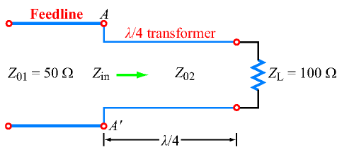
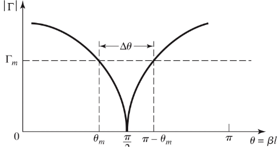
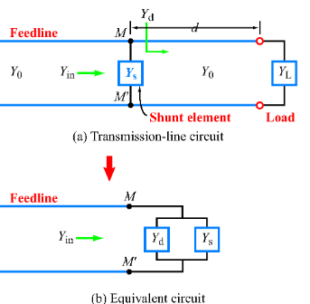

# Narrowband Matching

A transmission line of characteristic impedance $Z_0$ is matched to a load $Z_L$ when $Z_L = Z_0$: not incident waves upon the load are reflected back at the source. A **matching network** is used to achieve these conditions, placed between the load and the line. Examples of matching networks include

- The $\lambda / 4$ transformer
  - A transmission line in series of length $\lambda /4$
- A capacitor/inductor in shunt
- A short circuit stub in parallel

Note that for lines of length $l = n \lambda / 2$, since $\beta l = n \pi$, the input impedance of the line is equal to the load impedance and the line does not modify the impedance of the load to which it is connected.

$$
Z_{in} = Z(z =-l) = Z_0 \frac{Z_L +j Z_0 \tan (n \pi)}{Z_0 + j Z_L \tan (n \pi)} = Z_L
$$

## $\lambda /4$ Transformer

The input impedance of a line of length $\lambda /4$ is

$$
Z_{01} = Z_{in} = Z_{02} \frac{Z_L +j Z_{02} \tan (\pi /2)}{Z_{02} + j Z_L \tan ( \pi /2)} = \frac{Z^2_{02}}{Z_L}
$$

$$
Z_{02} = \sqrt{Z_{01}Z_L}
$$

This eliminates reflections at $A A'$ to make $Z_{01} = Z_{in}$.

$$
\Gamma = \frac{Z_{in} - Z_0}{Z_{in_} + Z_0}
$$

At the frequency for which the transformer is a perfect $\lambda / 4$, there is a perfect match, and $\Gamma = 0$. However, as we deviate from the match frequency, the performance degrades:

$$
|\Gamma| = \frac{1}{(1 + (4 Z_0 Z_L / (Z_L - Z_0)^2) \sec^2 \beta\lambda)^{1/2}}
$$

We use $\Gamma_m$ as an acceptable maximum reflection coefficent, for which the bandwith is defined:

$$
\Delta \theta = 2 \left( \frac{\pi}{2} - \theta_m \right)
$$

Solving for $\cos \theta_m$ from the above equations gives:

$$
\cos \theta_m = \frac{\Gamma_m}{\sqrt{1 - \Gamma^2_m}} \frac{2 \sqrt{Z_0 Z_L}}{|Z_L - Z_0|}
$$

Assuming TEM lines, where $f_0$ is the designed frequency, we can then link $\theta_m$ with $f_m$, the max/min frequency at which our match has an acceptable performance:

$$
\theta = \beta l = \frac{2 \pi f}{u_p} \frac{u_p}{4 f_0} = \frac{\pi f_m}{2 f_0} \qquad \theta_m = \frac{\pi f_m}{2 f_0}
$$

The fractional bandwith of a matching section (where $\cos\theta_m$ is derived above):

$$
\frac{\Delta f}{f_0} = \frac{2 (f_0 - f_m)}{f_0} = 2 - \frac{2 f_m}{f_0} = 2 - \frac{4 \theta_m}{\pi}
$$

The smaller the load mismatch, the larger the bandwidth.

## Lumped Element Matching Networks

An L-secion uses two reactive elements to match a load impedance to a transmission line. If $Z_L$ falls within the $1+jx$ circle on the Smith chart, then the left configuration is used, else the right configuration is used.

Let $Z_L = R_L + j X_L$ where $R_L > Z_0$ (inside $1+jx$ circle). For an impedance match:

$$
Z_0 = jX + \left(j B + \frac{1}{R_L + j X_L} \right)^{-1}
$$

Solving for $X$ and $B$:

$$
B = \frac{X_L \pm \sqrt{R_L/Z_0} \sqrt{R^2_L + X_L^2 - Z_0 R_L}}{R^2_L + X^2_L}
$$

$$
X = \frac{1}{B} + \frac{X_L Z_0}{R_L} - \frac{Z_0}{B R_L}
$$

Two solutions are possible, and both are physically realisable with capacitors/inductors.

Conside the alternative where $R_L < Z_0$ (outside $1+jx$ circle):

$$
\frac{1}{Z_0} = jB + \frac{1}{R_L + j(X + X_L)}
$$

$$
X = \pm \sqrt{R_L (Z_0 - R_L)} - X_L \qquad
B = \pm \frac{\sqrt{(Z_0 - R_L)/R_L}}{Z_0}
$$

## Shunt Lumped Element Matching

We use a lumped element in parallel with the load to achieve matching as shown in the figure. As the element $Y_s$ is in shunt, we work in the admittance domain.

Assuming $Z_L = R_L + j X_L$, the aim is at terminal $MM'$ to transform $R_L$ to $Z_0$, and $X_L$ to $0$. Assuming $Y_s = j B_s$ and $Y_d = G_d + jB_d$, the aim is to choose a length $d$ and value of $Y_s$ to match $Y_0$ of the feedline to $Y_{in}$, given by the sum of $Y_d$ and $Y_s$.

$$
Y_{in} = j B_s + G_d + j B_s = G_d + j(B_s + B_d)
$$

$$
G_d = Y_0 = 1/Z_0 \qquad B_s + B_d = 0
$$
