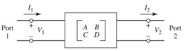
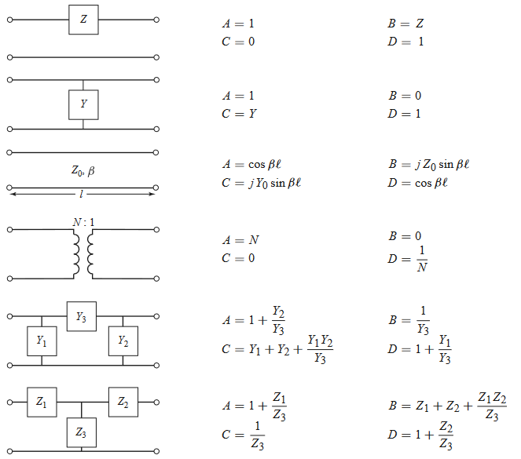

# Network Parameters

## Impedance & Admittance Parameters

- Consider an N-port microwave network
- Forward and backward voltage and current waves can be defined for TEM waves
  - Can define matrices of impedances(/admittances) to relate voltage and current port parameters to each other
- Ports may be any type of transmission line for a single propagating mode
- At a specified point on the $n_{th}$ port, a terminal place $t_n$ is defined
  - Terminal planes provide a phase reference for wave phasors
  - Equivalent incident and reflected voltage and current also defined

- At the $n_{th}$ terminal, total voltage and current are given by
  - $V_n = V_n^+ + V_n^-$
  - $I_n = I_n^+ + I_n^-$
  - Assumes coordinate along which propagation occurs is zero at terminal

The **impedance matrix** $V=ZI$ relates these voltages and currents:

$$
\begin{bmatrix}
V_1 \\ V_2 \\ \vdots \\ V_N
\end{bmatrix}
=
\begin{bmatrix}
Z_{11} & Z_{12} & \dots  & Z_{1N} \\
Z_{21} & Z_{22} & \dots  & Z_{2N} \\
\vdots & \vdots & \ddots & \vdots \\
Z_{N1} & Z_{N2} & \dots  & Z_{NN}
\end{bmatrix}
\begin{bmatrix}
I_1 \\ I_2 \\ \vdots \\ I_N
\end{bmatrix}
$$

Can similarly define an **admittance matrix** $I = YV$

$$
\begin{bmatrix}
I_1 \\ I_2 \\ \vdots \\ I_N
\end{bmatrix}
=
\begin{bmatrix}
Y_{11} & Y_{12} & \dots  & Y_{1N} \\
Y_{21} & Y_{22} & \dots  & Y_{2N} \\
\vdots & \vdots & \ddots & \vdots \\
Y_{N1} & Y_{N2} & \dots  & Y_{NN}
\end{bmatrix}
\begin{bmatrix}
V_1 \\ V_2 \\ \vdots \\ V_N
\end{bmatrix}
$$

The two matrices are inverses of each other: $Y = Z^{-1}$. Both matrices relate total port voltages and currents.

$Z_{ij}$ can be found by driving port $j$ with current $I_j$, open circuiting all other ports, and measuring the open circuit voltage at port $i$

$$
Z_{ij} = \frac{V_i}{I_j} \bigg|_{I_k=0 \; \text{for}\; k \neq j}
$$

$Z_{ii}$ is the input impedance looking into port $i$, and $Z_{ij}$ is the transfer impedance between ports $i$ and $j$.

The admittance matrix parameters are found similarly:

$$
Y_{ij} = \frac{I_i}{V_j} \bigg|_{V_k=0 \; \text{for}\; k \neq j}
$$

- If a network is reciprocal (contains no active devices), then the matrix is symmetric
  - $Y_{ij} = Y_{ji}$
  - $Z_{ij} = Z_{ji}$
- For a reciprocal lossless network, all the $Z_{ij}$ or $Y_{ij}$ elements are purely imaginary
  - $Re(Z_{mn})=0$ for any $m$ and $n$

Any two port network can be reduced to an equivalent $T$ or $\Pi$ network:

## Scattering Parameters

- Direct measurements of voltage and current become not that useful at high frequency because of waves
- The scattering matrix representation is more in line with the direct measurement of waves
- Provides a complete description of an $N$-port network, relating incident and reflected waves on ports.

The S-matrix is defined $V^- = S V^+$

$$
\begin{bmatrix}
V^-_1 \\ V^-_2 \\ \vdots \\ V^-_N
\end{bmatrix}
=
\begin{bmatrix}
S_{11} & S_{12} & \dots  & S_{1N} \\
S_{21} & S_{22} & \dots  & S_{2N} \\
\vdots & \vdots & \ddots & \vdots \\
S_{N1} & S_{N2} & \dots  & S_{NN}
\end{bmatrix}
\begin{bmatrix}
V^+_1 \\ V^+_2 \\ \vdots \\ V^+_N
\end{bmatrix}
$$

$S_{ij}$ is found by sending port $j$ an incident wave $V^+_j$ and measuring at port $i$ the reflected amplitude $V^-_i$. The incident waves on the rest of the ports are set to 0, meaning all ports are terminated in matched loads to avoid reflections.

$$
S_{ij} = \frac{V^-_i}{V_j^+} \bigg|_{V^+_k=0 \; \text{for}\; k \neq j}
$$

- $S_{ii}$ is the reflection coefficient looking into port $i$
- $S_{ij}$ is the transmission coefficient (gain) from port $i$ to $j$
- The scattering matrix for a reciprocal network is symmetric $S = S^T$
- The scattering matrix fro a lossless network is unitary $S^TS^* = I$
  - Identity

### Shifting Reference Planes

In the original network, the terminal planes are assumed to be at $z_n = 0$, where $z_n$ is measured along the lossless line feeding the $n_{th}$ port. The matrix with this set of planes is $S$. If the new reference planes are defined $z_n = l_n$, then we get a new scattering matrix defined $V'^- = S' V'^+$. From travelling waves on a lossless line:

$$
V'^+_n = V_n^+ e^{j \beta_n l_n}
\qquad
V'^-_n = V_n^- e^{j \beta_n l_n}
$$

We can use this shift to define $S'$ in terms of $S$

$$
S' =
\begin{bmatrix}
e^{-j \beta_1 l_1} & 0      & \dots  & 0 \\
0      & e^{-j \beta_2 l_2} & \dots  & 0 \\
\vdots & \vdots & \ddots & \vdots \\
0      & 0      & \dots  & e^{-j \beta_N l_N}
\end{bmatrix}
S
\begin{bmatrix}
e^{-j \beta_1 l_1} & 0      & \dots  & 0 \\
0      & e^{-j \beta_2 l_2} & \dots  & 0 \\
\vdots & \vdots & \ddots & \vdots \\
0      & 0      & \dots  & e^{-j \beta_N l_N}
\end{bmatrix}
$$

## Transmission (ABCD) Parameters

Practical microwave networks consist of a cascade connection of two or more 2-port networks. It is useful to define a 2x2 transmission, or ABCD matrix, for each 2-port network such that the transmission matrix of the cascade connection can be obtained as the product of the transmission matrices of the individual networks.

$$
\begin{bmatrix}
V_1 \\ I_1
\end{bmatrix}
=
\begin{bmatrix}
A & B \\
C & D\\
\end{bmatrix}
\begin{bmatrix}
V_2 \\ I_2
\end{bmatrix}
$$

Note the sign convention, which has $I_1$ flowing into port 1, and $I_2$ flowing out of port 2.

If two networks are cascaded, ie network 1 outputs into network 2, the transmission matrix of the cascaded network is the product of the two individually

$$
\begin{bmatrix}
V_1 \\ I_1
\end{bmatrix}
=
\begin{bmatrix}
A_1 & B_1 \\
C_1 & D_1\\
\end{bmatrix}
\begin{bmatrix}
V_2 \\ I_2
\end{bmatrix}

\qquad

\begin{bmatrix}
V_2 \\ I_2
\end{bmatrix}
=
\begin{bmatrix}
A_2 & B_2 \\
C_2 & D_2\\
\end{bmatrix}
\begin{bmatrix}
V_3 \\ I_3
\end{bmatrix}
$$

$$
\begin{bmatrix}
V_1 \\ I_1
\end{bmatrix}
=
\begin{bmatrix}
A_1 & B_1 \\
C_1 & D_1\\
\end{bmatrix}
\begin{bmatrix}
A_2 & B_2 \\
C_2 & D_2\\
\end{bmatrix}
\begin{bmatrix}
V_3 \\ I_3
\end{bmatrix}
$$

Some useful ABCD parameters for common networks are shown below

## Port Parameter Conversion Table

