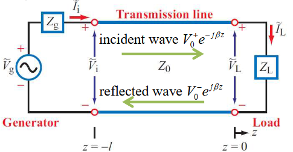

# Transmission Lines

A transmission line is a two port network that connects a source to a load

## Modes

- **Modes** descibe the field pattern of propogating waves
  - Can be found by solving Maxwell's equations in a transmission line
- In a transmission line, electric and magnetic fields are orthogonal to each other, and both orthogonal to the direction of propogation
  - This is **TEM** (Transverse Electromagnetic) mode
- A TEM transmission line is represented by two parallel wires
  - To reason about voltages and currents within it, we divide it into differential sections $\delta z$
  - Each section is represented by an equivalent lumped element circuit

- $R'$ - the combined resistance of both conductors per unit length, in $\Omega / m$
- $L'$ - the combined inductance of both conductors per unit length, in $H / m$
- $C'$ - the combined capacitance of both conductors per unit length, in $F / m$
- $G'$ - the conductance of the insulation medium between the two conductors per unit length, in $S/m$

The table below gives parameters for some common transmission lines

- Conductors have magnetic permeability $\mu_c$ and conductivity $\sigma_c$
- The insulating/spacing material has permittivity $\varepsilon$, permeability $\mu$ and conductivity $\sigma_c$
- All TEM transmission lines share the relations
  - $L'C' = \mu \varepsilon$
  - $G'/C' = \sigma/\varepsilon$
- The constant propogation constant of a line $\gamma = \alpha + j \beta = \sqrt{(R' + j \omega L')(G' + j \omega C')}$
  - $\alpha$ is the attenuation constant (Np/m)
  - $\beta$ is the phase constant (rad/m)
- The travelling wave solutions of a line are
  - $\tilde V (z) = V_0^+ e^{-\gamma z} +V_0^- e^{\gamma z}$
  - $\tilde I (z) = I_0^+ e^{-\gamma z} +I_0^- e^{\gamma z}$
  - $z$ represents position along th eline
  - $V_0^+, I_0^+$ represents the incident wave from source to load
  - $V_0^-, I_0^-$ represents the reflected wave from load to source

We therefore have the **characterisitic impedance** of the TEM transmission line:

$$
Z_0  = \frac{V^+_0}{I^+_0} = -\frac{V^-_0}{I^-_0} = \sqrt{\frac{R' + j \omega L'}{G' + j \omega C'}}
$$

Both the voltage and current waves propagate with a phase velocity $u_p = f \lambda$. The presence of the two waves propagating in opposite directions produces a standing wave.

## The Lossless Transmission Line

In most practical situations, we can assume a transmission line to be lossless:

- $R' \ll \omega L'$, and $G \ll \omega C'$
- Assume $R' = G' \approx 0$, so $\gamma = j\omega \sqrt{L' C'}$
- Therefore, as $\gamma = \alpha + j\beta$:
  - $\alpha =0$
  - $\beta = \omega \sqrt{L'C'} = \omega \sqrt{\mu \varepsilon}$
  - $Z_0 = \sqrt{L'/C'}$

This then gives velocity and wavelength:

$$
u_p = \frac{\omega}{\beta} = \frac{1}{\sqrt{L'C'}} = \frac{1}{\sqrt{\mu \varepsilon}}
\qquad
\lambda = \frac{2 \pi}{\beta} = \frac{2\pi}{\omega \sqrt{L'C'}} = \frac{1}{f \sqrt{\mu \varepsilon}}
$$

As the insulating material is usually non-magnetic, we have $\mu = \mu_0$

$$
c = \frac{1}{\sqrt{\mu_0 \varepsilon_0}}
\qquad
u_p = \frac{c}{\sqrt \varepsilon_r}
\qquad
\lambda = \frac{c}{f\sqrt{\varepsilon_r}} = \frac{\lambda_0}{\sqrt \varepsilon_r}
$$

## Voltage Reflection Coefficient

Assume a transmission line in which the signals are produced by a generator with impedance $Z_g$ and is terminated by a load impedance $Z_L$.

At any position on the line, the total voltage and current is:

$$
\tilde V (z) = V_0^+ e^{-\gamma z} +V_0^- e^{\gamma z} \qquad  \tilde I (z) = \frac{V_0^+}{Z_0} e^{-\gamma z} +\frac{V_0^-}{Z_0} e^{\gamma z}
$$

At the load at position $z=0$, the load impedance is:

$$
Z_L = \frac{\tilde V_L}{\tilde I_L}
$$

Using this we can find an expression for the ratio of backwards wave amplitude and forward wave amplitude. We obtain the equation below, the **voltage reflection coefficient**

$$
\Gamma = \frac{V_0^-}{V_0^+}= \frac{Z_L - Z_0}{Z_L + Z_0}
$$

- $Z_0$ for a lossless line is a real number, but $Z_L$ may be a complex quantity
- In general, the reflection coefficient is also complex, $\Gamma = |\gamma| \exp( j \theta_\Gamma)$
  - Note that $|\Gamma| \leq 1$, always
- A load is **matched** to a line when $Z_L = Z_0$, as then $\Gamma =0$
  - No reflection by the load $V_0^- = 0$
- If $Z_L = \infty$ then $\Gamma = 1$, then $V_0^- = V_0^+$
  - Open circuit load
- If $Z_L = 0$ then $\Gamma = -1$, then $V_0^- = -V_0^+$
  - Short circuit load

### Standing Waves

The standing wave equation gives an expression for the standing wave voltage at position $z=-l$

$$
|\tilde V (z = -l)| = |V_0^+| |(1+|\Gamma|e^{j(\theta_{\Gamma} - 2 \beta l)})|
$$

The ratio of $|\tilde V|_{max}$ to $|\tilde V|_{min}$ is called the Voltage Standing Wave Ratio, or **VSWR**. Max occurs when $e^{j(\theta_{\Gamma} - 2 \beta l)}=1$, and min occurs when $e^{j(\theta_{\Gamma} - 2 \beta l)}=-1$

## Input Impedance of Lossless Lines

The input impedance $Z_{in}$ of a transmission line is the ratio of the total voltage to the total current at any point $z = -l$ on the line

$$
Z_{in} = Z(z = -l) = \frac{\tilde V(z = -l)}{\tilde I(z = -l)} = Z_0 \frac{1 + \Gamma e ^{-j2\beta l}}{1 - \Gamma e ^{-j2\beta l}} = Z_0 \frac{Z_L + j Z_0 \tan(\beta l)}{Z_0 + j Z_L \tan(\beta l)}
$$

- For a short circuit line $Z_L = 0$, $Z_{in} = j Z_0 \tan (\beta l)$
- For an open circuit line $Z_L = \infty$, $Z_{in} = -j Z_0 \cot (\beta l)$
