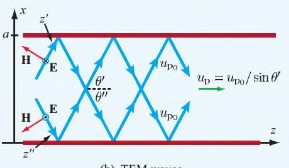

# Rectangular Waveguides

Waveguides are just rectangular tubes full of air for transmission of power waves at high frequencies. Waveguides with a single conductor support either TE or TM waves, but not TEM waves.

- **Modes** define the properties of how a wave propagates through a guide
- Modes are defined by $m$ and $n$
  - Obtained through solving the wave equations for different boundary conditions
- Mode with lowest cutoff frequency is the dominant mode
  - Dominant TM mode is $TM_{11}$
  - Dominant TE mode is $TE_{10}$

## TM Modes

### Phase Constant

A wave is travelling inside the guide along the z-direction. It's phase factor is $e^{-j\beta z}$ with:

$$
\beta = \sqrt{k^2 - k_c^2} = \sqrt{\omega^2 \mu \varepsilon - \left(\frac{m \pi}{a}\right)^2-  \left(\frac{n \pi}{a}\right)^2}
$$

### Cutoff Frequency

Corresponding to each mode there is a cutoff frequency $f_{c\, mn}$ at which $\beta = 0$. A mode can only propagate if $f > f_{c\, mn}$, as only then is $\beta$ real.

$$
f_{c\, mn} = \frac{u_{p0}}{2}\sqrt{\left(\frac{m}{a}\right)^2 + \left(\frac{n}{b}\right)^2}
$$

$u_{p0} = 1/\sqrt{\mu \varepsilon}$ is the phase velocity of a TEM wave in an unbounded medium with parameters $\mu$ and $\varepsilon$.

### Phase Velocity

$$
u_p = \frac{\omega}{\beta} = \frac{u_{p0}}{\sqrt{1- (f_{c\, mn}/f)^2}}
$$

### Wave Impedance

$$
Z_{TM} = \frac{\beta \eta}{k} = \eta \sqrt{1- \left(\frac{f_{c\, mn}}{f}\right)^2}
$$

$\eta = \sqrt{\mu/\varepsilon}$ is the intrinsic impedance of the lossless medium.

## TE Mode

All the parameters are the same as for TM mode, except for wave impedance

$$
Z_{TE} = \frac{\eta}{\sqrt{1- \left(\frac{f_{c\, mn}}{f}\right)^2}}
$$

The TE dominant mode, assuming $a>b$ where $a$ and $b$ are the width and height of the waveguide ,is $TE_{10}$ with

$$
f_{c \, 10} = \frac{1}{2a \sqrt{\mu \varepsilon}}
$$

### Zigzag Reflections

For the $TE_{10}$ mode, the field component can be expressed as the sum of two TEM plane waves, both travelling in the $+z$ direction, but zigzagging between opposite walls of the waveguide. The phase velocity of these waves is $u_{p0}$ and their direction is at angles. The phase velocity of their combination $u_p$ is that of the $TE_{10}$ mode.

$$
\theta' = \arctan \frac{\pi}{\beta a} \qquad \theta'' = -\arctan \frac{\pi}{\beta a}
$$

$$
\theta' = \arctan \frac{1}{\sqrt{(f/f_{c\,10})^2 -1}}
$$

## Table

